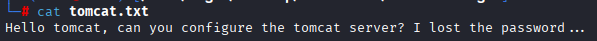
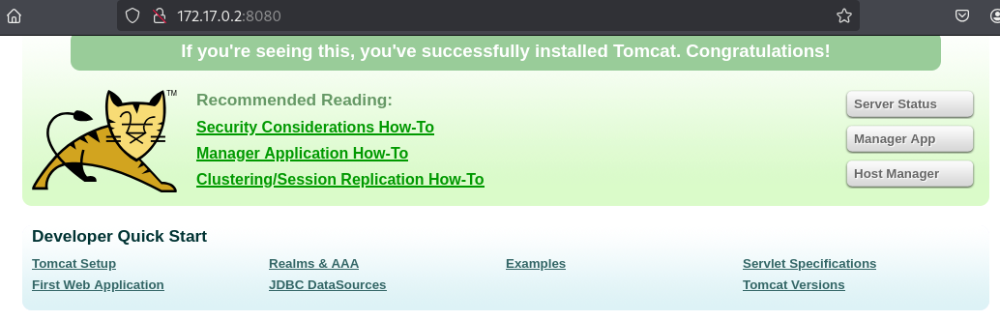
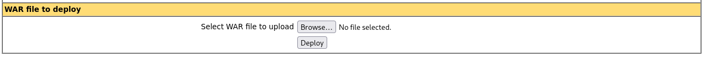
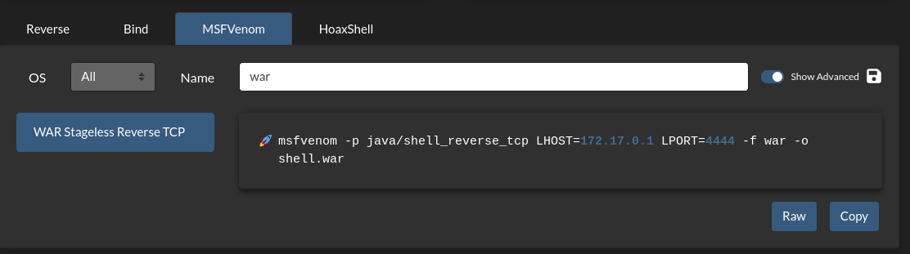
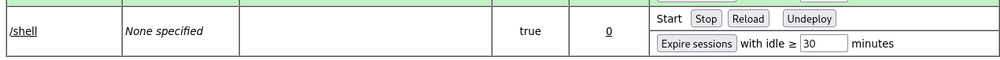
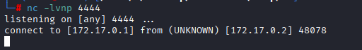

# Máquina -Pn

---

Dificultad -> Fácil

---

Empezamo viendo puertos y servicios abiertos con nmap

```shell
nmap -p- -sVC --min-rate=5000 -n -Pn 172.17.0.2
```

```shell
PORT     STATE SERVICE VERSION
21/tcp   open  ftp     vsftpd 3.0.5
| ftp-syst: 
|   STAT: 
| FTP server status:
|      Connected to ::ffff:172.17.0.1
|      Logged in as ftp
|      TYPE: ASCII
|      No session bandwidth limit
|      Session timeout in seconds is 300
|      Control connection is plain text
|      Data connections will be plain text
|      At session startup, client count was 3
|      vsFTPd 3.0.5 - secure, fast, stable
|_End of status
| ftp-anon: Anonymous FTP login allowed (FTP code 230)
|_-rw-r--r--    1 0        0              74 Apr 19  2024 tomcat.txt
8080/tcp open  http    Apache Tomcat 9.0.88
|_http-open-proxy: Proxy might be redirecting requests
|_http-favicon: Apache Tomcat
|_http-title: Apache Tomcat/9.0.88
```

Vemos que hay un ftp con el login anonymous activado, asi que entramos y encontramos un archivo de texto `tomcat.txt`


Lo descargo a mi maquina con `get tomcat.txt` y veo lo siguiente 



No encuentro nada mas en el ftp asi que entro al tomcat en el puerto 8080



No encuentro nada mas que un tomcat default asi que pruebo contraseñas default en Manager App que he encontrado en [Tomcat - HackTricks](https://book.hacktricks.wiki/en/network-services-pentesting/pentesting-web/tomcat/index.html) y encuentor que las credenciales son `tomcat:s3cr3t` 



Al parecer solo se pueden suber archivos .war, asi que buscando un poco encuentro en [RevShells](https://www.revshells.com/) el comando para hacer una revshell en war con msfvenom



Asi que lo ejecuto en mi maquina y subo el archivo.

Una vez subido, me meto al directorio /revshell mientras que escucho en mi maquina con `nc -lvnp 4444`



Y estamos dentro de la maquina



Ya unicamente hacemos [Tratamiento de la TTY](https://invertebr4do.github.io/tratamiento-de-tty/#) 


Y al parecer ya somos root
