# Máquina balufood

---

Dificultad -> Fácil

---

Primero un nmap para ver puertos abiertos

```shell
nmap -p- --open -sCV --min-rate=5000 -n -Pn 172.17.0.2
```

```shell
PORT     STATE SERVICE VERSION
22/tcp   open  ssh     OpenSSH 9.2p1 Debian 2+deb12u5 (protocol 2.0)
| ssh-hostkey: 
|   256 69:15:7d:34:74:1c:21:8a:cb:2c:a2:8c:42:a4:21:7f (ECDSA)
|_  256 a7:3a:c9:b2:ac:cf:44:77:a7:9c:ab:89:98:c7:88:3f (ED25519)
5000/tcp open  http    Werkzeug httpd 2.2.2 (Python 3.11.2)
|_http-server-header: Werkzeug/2.2.2 Python/3.11.2
|_http-title: Restaurante Balulero - Inicio
```

Puertos ssh y http, primero me meto al `5000` desde el navegador, aquí encuentro una página sobre un restaurante

 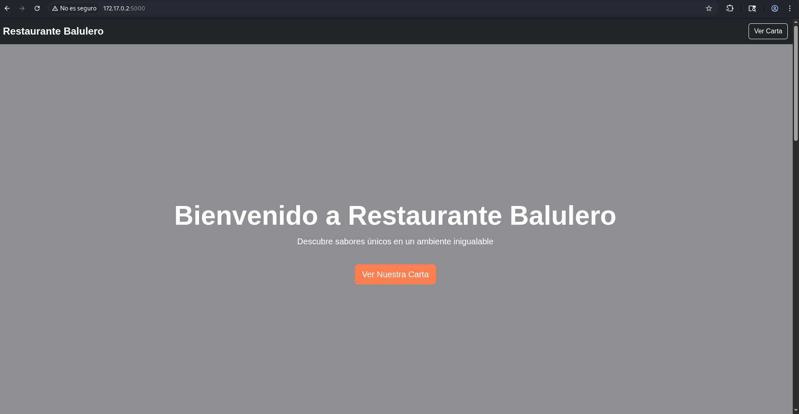

Mirando un poco, dentro del botón `Ver Carta` de arriba a la derecha, te lleva a una carta donde hay otro botón en el mismo sitio `Admin` que te lleva a un login:

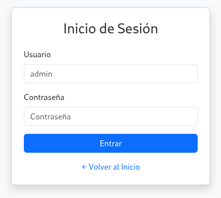

Aquí ya pone de usuario admin por defecto asi que pruebo y adivino las credenciales `admin:admin`, al iniciar sesión me lleva a una página para administrar los pedidos:

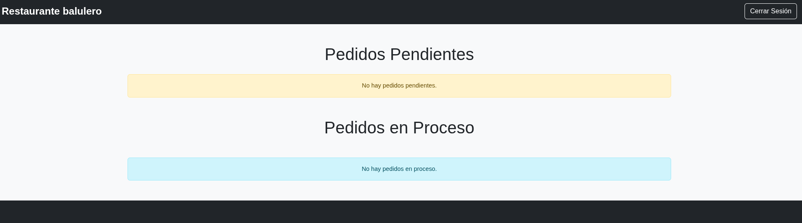

Mirando el codigo fuente (`Ctrl+U`), encuentro unas credenciales de backup `sysadmin:backup123`

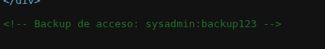

Con estas credenciales, accedo desde ssh y veo que no hay sudo

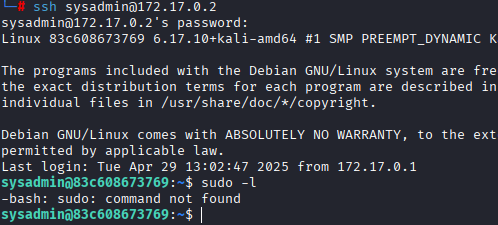

Mirando en la carpeta de `sysadmin`, dentro del programa de python donde funciona la paǵina encuentro la `secret_key` `cuidaditocuidadin` 

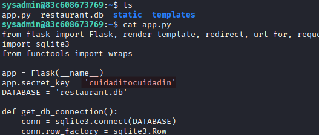

Con esta key y viendo que hay otro usuario `balulero`, pruebo a acceder a ese usuario usando la key como contraseña y consigo escalar a `balulero` 

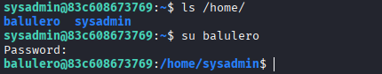

Mirando el historial de comando de `balulero`, encuentro que se a modificado el archivo `.bashrc` 

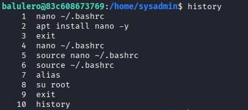

Lo abro y abajo del todo encuentro un alias `ser-root` el cual intenta convertirse en root con la contraseña `chocolate2` 

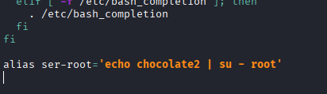

Miro los alias y lo veo ahí, intento ejecutar `ser-root` para convertirme en root pero no funciona muy bien

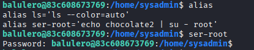

Viendo que no funciona, hago un `su` con la contraseña `chocolate2` 

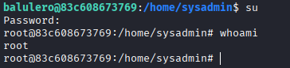

Y ahora si, somos root :)
