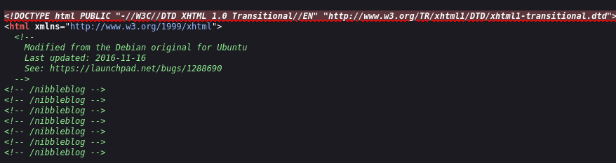
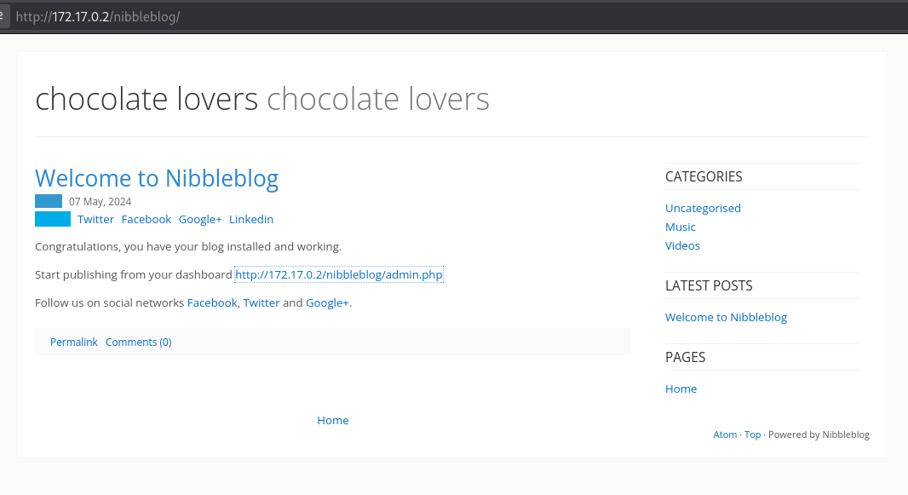
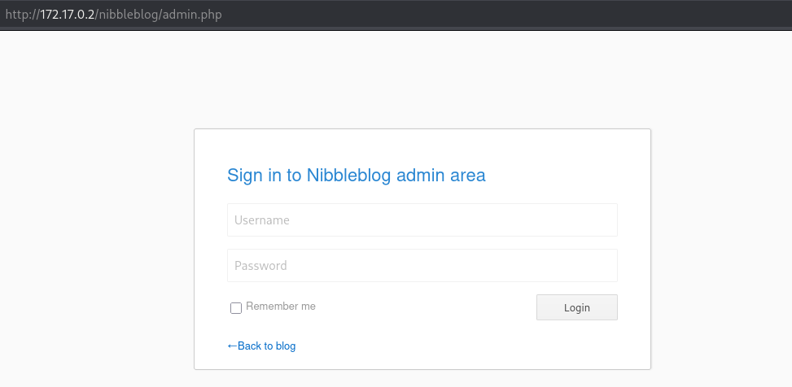
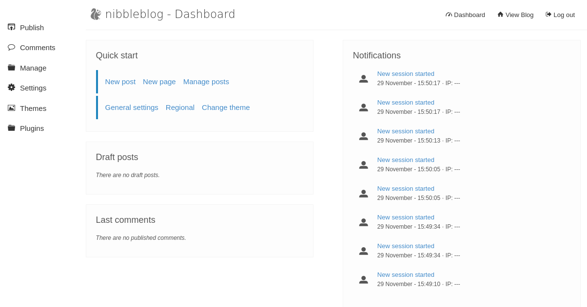
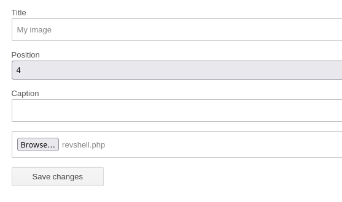
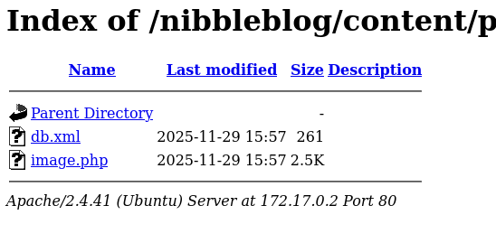
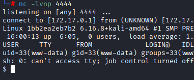
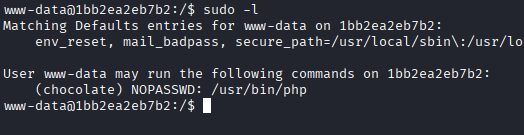
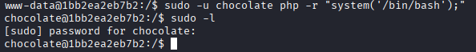
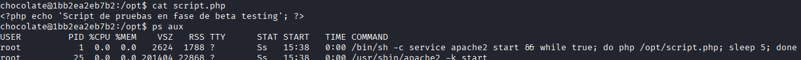

# Máquina chocolatelovers

---

Dificultad -> Fácil

---

Empezio con un nmap para ver puertos y servicios:

```shell
nmap -p- --open -sCV --min-rate=5000 -n -Pn 172.17.0.2
```

```shell
PORT   STATE SERVICE VERSION
80/tcp open  http    Apache httpd 2.4.41 ((Ubuntu))
|_http-title: Apache2 Ubuntu Default Page: It works
|_http-server-header: Apache/2.4.41 (Ubuntu)
```

Unicamente un apache default en el puerto 80

Si miro el codigo fuente encuentro el siguiente directorio:



Accedo ahí y encuentro un nibbleblog



Veo un enlace que lleva a la página de administracción con un login:



Aquí pruebo las credenciales `admin:admin` y consigo entrar:



Buscando un poco como conseguir una revhsell, encuentro que en esta versión, con el plugin my image puedes subir archivos php asi que instalo el plugin y le subo una revshell de [revshells.com](https://www.revshells.com/)



Una vez le doy a save changes, se sube la revshell, para haceder a ella, accedo a `http://172.17.0.2/nibbleblog/content/private/plugins/my_image/`:



Aquí abro `image.php` (la revshell que he subido) mientras escucho desde mi máquina en el puerto seleccionado y estamos dentro como www-data:



Antes de nada, hago [Tratamiento de la TTY](https://invertebr4do.github.io/tratamiento-de-tty/#) para operar comodamente y seguidamente un `sudo -l`:



Veo que puedo ejecutar `php` como chocolate, asi que busco en [GTFOBins](https://gtfobins.github.io/gtfobins/php/#sudo) y ejecuto `sudo -u chocolate php -r "system('/bin/bash');"` 

Ahora como chocolate hago otro `sudo -l` pero me pide contraseña



Buscando un poco, encuentro un script en /opt que si miro con `ps aux` se está ejecutando como root cada 5 segundos:



Sabdiendo esto y que puedo editar el script, simplemente lo dito para que me de permisos SUID en bash:

```shell
echo "<?php system('chmod u+s /bin/bash'); ?>"" > /opt/script.php
```

Con esto, espero a que pasen los 5 segundos para que se ejecute y hago un `bash -p` para abrir una bash sin ignorar el SUID:


Y acabamos siendo root :)
