# Máquina dance-samba

---

Dificultad -> Medio

---

```shell
nmap -p- --open -sCV --min-rate=5000 -n -Pn 172.17.0.2
```

```shell
PORT    STATE SERVICE     VERSION
21/tcp  open  ftp         vsftpd 3.0.5
| ftp-syst: 
|   STAT: 
| FTP server status:
|      Connected to ::ffff:172.17.0.1
|      Logged in as ftp
|      TYPE: ASCII
|      No session bandwidth limit
|      Session timeout in seconds is 300
|      Control connection is plain text
|      Data connections will be plain text
|      At session startup, client count was 3
|      vsFTPd 3.0.5 - secure, fast, stable
|_End of status
| ftp-anon: Anonymous FTP login allowed (FTP code 230)
|_-rw-r--r--    1 0        0              69 Aug 19  2024 nota.txt
22/tcp  open  ssh         OpenSSH 9.6p1 Ubuntu 3ubuntu13.4 (Ubuntu Linux; protocol 2.0)
| ssh-hostkey: 
|   256 a2:4e:66:7d:e5:2e:cf:df:54:39:b2:08:a9:97:79:21 (ECDSA)
|_  256 92:bf:d3:b8:20:ac:76:08:5b:93:d7:69:ef:e7:59:e1 (ED25519)
139/tcp open  netbios-ssn Samba smbd 4
445/tcp open  netbios-ssn Samba smbd 4
```

Vemos ftp, ssh y samba, en el ftp está activado el login anonymous asi que empiezo por ahi, dentro hay una nota que descargo con `get`

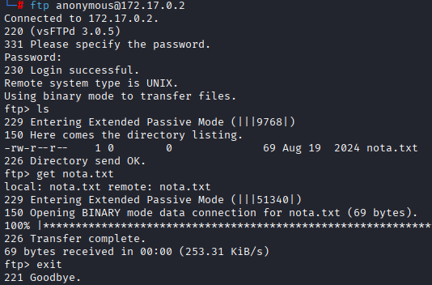

En la nota nos da pistas sobre dos posibles usuarios; Macarena y donald

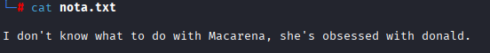

Con hydra, hago un bruteforce al ssh y ftp con esos usuarios pero nada, asi que usando `crackmapexec`(ya que hydra no soporta SMBv2) hago bruteforce al SMB:

```shell
crackmapexec smb 172.17.0.2 -u "macarena" -p /usr/share/wordlists/rockyou.txt
```

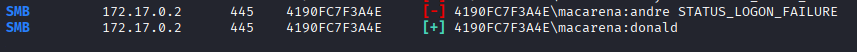

Me encuentra las credenciales `macarena:donald` 

Con estas credenciales, entro al SMB y descargo un archivo llamada user.txt

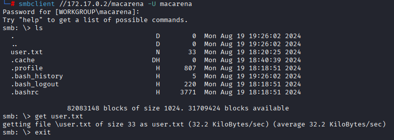

Miro su contenido y veo lo que parece un hash o una contraseña 

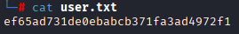

Pruebo con john y con hydra pero no encuentro nada.

Miro con smbmap y al veo que tengo permisos de escritura en macarena:


Sabiendo esto, genero y subo una clave ssh para poder conectarme sin necesidad de contraseña

Genero la clave `ssh-keygen -t rsa` 

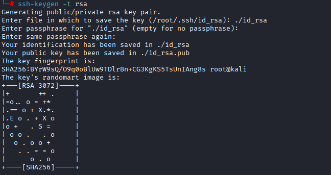

Entro al SMB, creo la carpeta .ssh `mkdir .ssh` y pongo la clave publica con el nombre de authorized_keys `put id_rsa.pub .ssh/authorized_keys` 

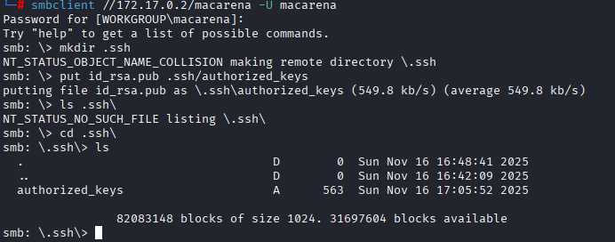

Ahora salgo del SMB y me conecto al SSH con la clave:

```shell
ssh -i sshkey macarena@172.17.0.2
```

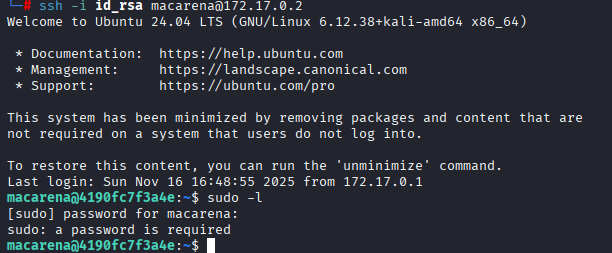

Y con esto estamos dentro de la máquina por ssh, como siempre, hago un `sudo -l` pero me pide contraseña asi que busco en los archivos

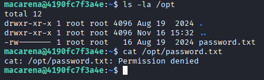

Encuentro un password.txt en /opt pero no tengo permisos para leerlo asi que sigo buscando.

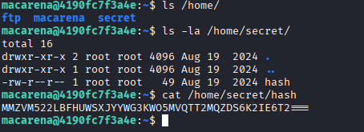

En /home encuentro una carpeta secret donde encuentro un hash, lo meto en [CyberChef](https://gchq.github.io/CyberChef/) y me dice que está en base32 y pone `supersecurepassword`

Ahora teniendo la contraseña de macarena, vuelvo ha hacer un `sudo -l` y veo el binario file

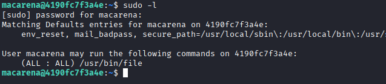

Busco en [GTFOBins](https://gtfobins.github.io/gtfobins/file/#sudo) y veo que no puedo convertirme en root pero puedo leer archivos como root asi que intento leer el contenido de /opt/password.txt:

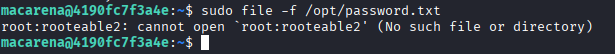

En el archivo está la contraseña de root asi que con un `su`me convierto en este

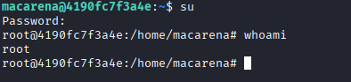
