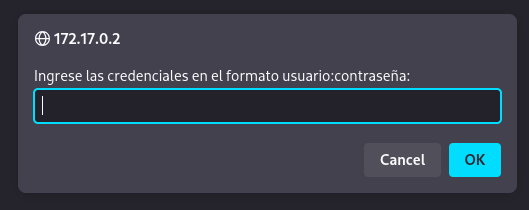
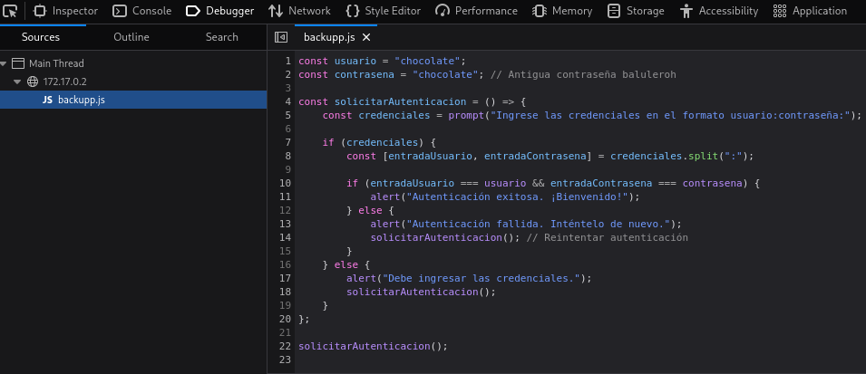
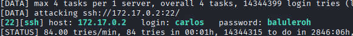
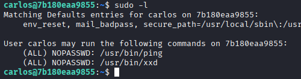
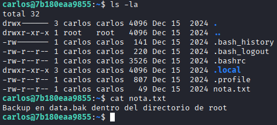
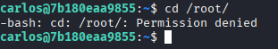
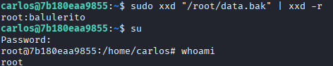

# Máquina devtools

---

Dificultad -> Medium

---

Primero realizo un nmap para ver puertos y servicios abiertos

```shell
nmap -p- --open -sV -sC -sS --min-rate=5000 -n -Pn 172.17.0.2
```

```shell
PORT   STATE SERVICE VERSION
22/tcp open  ssh     OpenSSH 9.2p1 Debian 2+deb12u3 (protocol 2.0)
| ssh-hostkey: 
|   256 4d:ea:92:ba:53:e3:b8:dc:71:95:50:19:87:6b:b2:6d (ECDSA)
|_  256 fa:77:68:76:dc:8e:b1:cd:56:5f:c1:79:89:ad:fa:78 (ED25519)
80/tcp open  http    Apache httpd 2.4.62 ((Debian))
|_http-server-header: Apache/2.4.62 (Debian)
|_http-title: \xC2\xBFQu\xC3\xA9 son las DevTools del Navegador?
MAC Address: 02:42:AC:11:00:02 (Unknown)
```

Podemos ver que está el puerto 80 y 22 abiertos por lo que accedo desde el navegador



Al entrar vemos que nos sale un mensaje donde nos pide una contraseña.

Si abrimos las devtools (Ctrl+Shift+I) y nos vamos al debugger podemos ver el script que nos pide la contraseña (backup.js) y cual es esta (chocolate:chocolate)



Tambíen se puede ver un comentario diciendo que la antigua contraseña es baluleroh.

Viendo que no encuentro nada más en el codigo fuente de la pagina y que haciendo fuzzing no encuentro nada, pruebo a hacer un ataque de fuerza bruta con hydra con la contraseña baluleroh

```shell
hydra -L /usr/share/wordlists/rockyou.txt -p baluleroh ssh://172.17.0.2 -t 4 -I
```

y efectivamente, consigo las credenciales del usuario carlos



Me conecto por ssh y ejecuto sudo -l para ver binarios que puedo ejecutar como root



Encuentro xxd y ping, me meto a [GTFOBins](https://gtfobins.github.io/) y veo que con xxd puedo leer y modificar archivos asi que busco a ver si hay algun archivo que podamos leer o editar



Encuentro una nota en la carpeta de carlos que dice que hay un backup en root/data.bak pero no podemos acceder sin root



Utlizamos el xxd para leer el archivo /root/data.bak

```shell
sudo xxd "/root/data.bak" | xxd -r
```



Y nos da la contraseña de root con la que acabamos esta máquina


