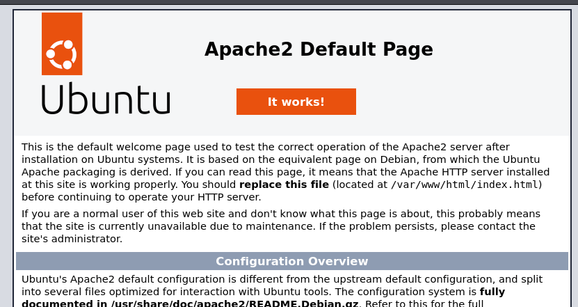
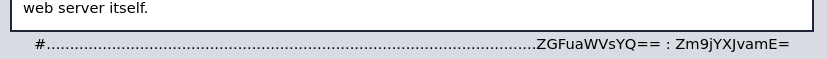
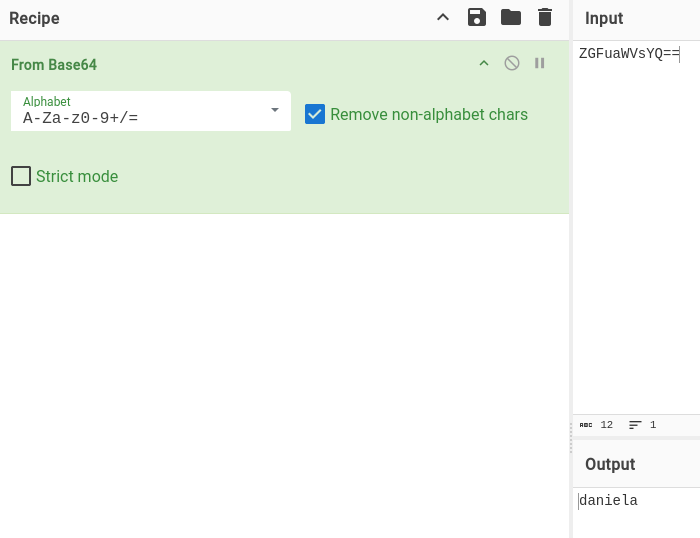
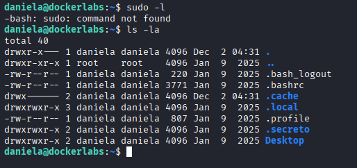
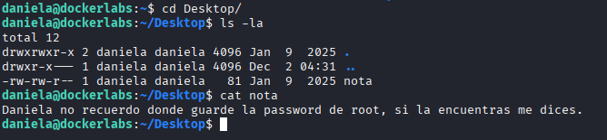
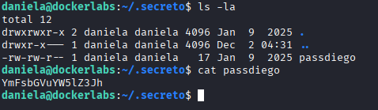
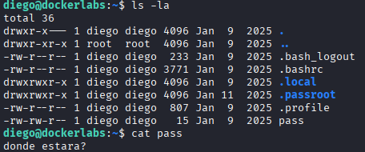
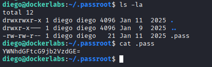
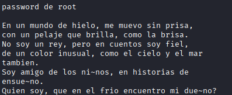
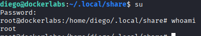

# Máquina extraviado

---

Dificultad -> Fácil

---

Empiezo con un nmap para ver puertos abiertos

```sh
nmap -p- --open -sCV --min-rate=5000 -n -Pn 172.17.0.2
```

```shell
PORT   STATE SERVICE VERSION
22/tcp open  ssh     OpenSSH 9.6p1 Ubuntu 3ubuntu13.5 (Ubuntu Linux; protocol 2.0)
| ssh-hostkey: 
|   256 cc:d2:9b:60:14:16:27:b3:b9:f8:79:10:df:a1:f3:24 (ECDSA)
|_  256 37:a2:b2:b2:26:f2:07:d1:83:7a:ff:98:8d:91:77:37 (ED25519)
80/tcp open  http    Apache httpd 2.4.58 ((Ubuntu))
|_http-server-header: Apache/2.4.58 (Ubuntu)
|_http-title: Apache2 Ubuntu Default Page: It works
```

Solo 22 y 80, accedo al 80 y veo un apache2 deafult page:



Pero si te fijas bien al final del todo aparecen unas credenciales codificadas



Para saber en que está codificado, me meto a [CyberChef](https://gchq.github.io/CyberChef/) y dando a la varíta mágica, te detecta autmáticamente base64:



Encuentro que las credenciales son: `daniela:focaroja`

Y así de facil ya estamos dentro de la máquina por ssh como daniela

Pruebo a hacer un `sudo -l` pero no hay sudo asi que me pongo a buscar archivos

Sin ir muy lejos, en la carpeta de home de daniela encuentro `Desktop` y `.secreto`:



En `Desktop` encuentro una nota diciendo que no recuerda donde guardó la contraseña de root:



Y en `.secreto` encuentro lo que parece la pass de de diego codificada en base64:

 

La vuelvo a decodificar con cyberchef y consigo la contraseña `ballenanegra` con esto y un `su diego` escalo a diego

Ahora busco en la carpeta de home de diego y encuentro algunas cosas:

Un archivo pass diciendo "donde estará"



Y un `.pass` en la carpeta `.passroot` codificado en base64 otra vez



Si lo decodifico me sale `acatampocoesta` asi que sigo buscando

Buscando un poco, encuentro que dentro de `.local/share` en el /home de diego hay un archivo llamado `.-`: 

 

Si lo leo encuentro una adivinanza para el password de root:



Después de pensar un rato y basandome en las contraseñas anteriores, encuentro la contraseña:

<details> <summary>Mostrar respuesta del acertijo</summary>osoazul</details>

Con esto y un `su`:



Consigo root :)
