# Máquina internship

---

Dificultad -> Fácil

---

Comenzamos con un nmap para listar puertos:

```shell
nmap -p- --open -sCV --min-rate=5000 -n -Pn 172.17.0.2
```

```shell
PORT   STATE SERVICE VERSION
22/tcp open  ssh     OpenSSH 9.2p1 Debian 2+deb12u4 (protocol 2.0)
| ssh-hostkey: 
|   256 35:ff:c4:8b:c4:e1:46:12:43:b9:03:a9:cf:ec:f3:0a (ECDSA)
|_  256 23:ac:95:1e:be:33:9e:ed:14:f0:45:f6:27:51:ca:ba (ED25519)
80/tcp open  http    Apache httpd 2.4.62 ((Debian))
|_http-server-header: Apache/2.4.62 (Debian)
|_http-title: GateKeeper HR | Tu Portal de Recursos Humanos
```

ssh y http con apache, accedo desde el navegador y veo lo siguiente:

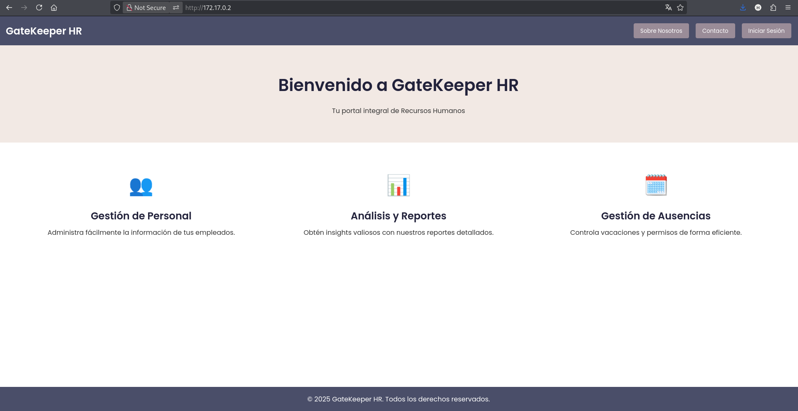

Ningún botón aquí funciona, contacto, inicar sesión, etc

Mirando un poco el codigo fuento encuentro el host `gatekeeperhr.com` asi que lo añado a `/etc/hosts/` 

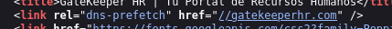

Si entro desde `gatekeeperhr.com` me devuelve la misma página, pero ahora funcionan botones como contacto y login

En el apartado de iniciar sesión viendo que poniendo una comilla simple me da un error pruebo un sqlinjection poniendo `' OR '1'='1' -- -` de usuario y contraseña

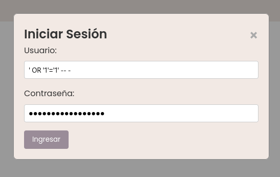

Al darle a ingresar me lleva a una página con nombre de empleados:

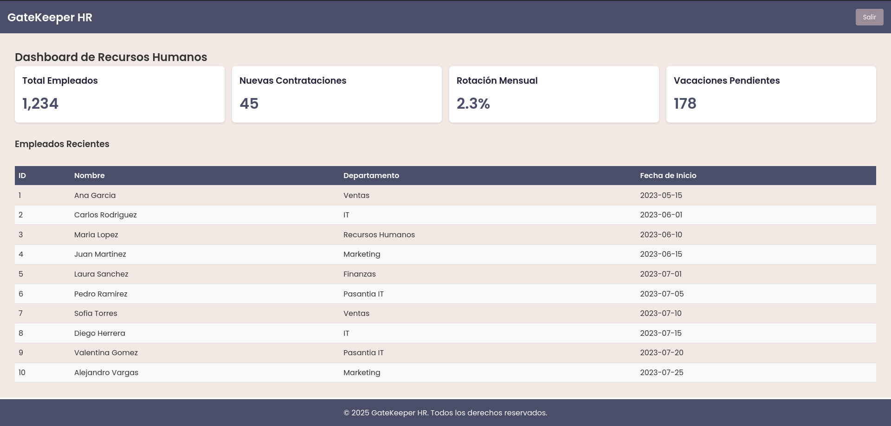

Con estos usuarios me hago 3 wordlist, una con los nombres, otra con los apellidos y otra con nombre y apellido, aqui un ejemplo:

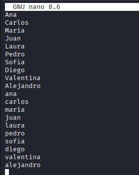

Pruebo con estos usuarios con hydra pero no encuentro nada

Con gobuster realizo fuzzing:

```sh
gobuster  dir -u http://gatekeeperhr.com/ --wordlist /usr/share/wordlists/dirbuster/directory-list-2.3-medium.txt -x php,txt,html
```

```shell
/index.html           (Status: 200) [Size: 3971]
/contact.html         (Status: 200) [Size: 3140]
/about.html           (Status: 200) [Size: 3339]
/default              (Status: 301) [Size: 322] [--> http://gatekeeperhr.com/default/]
/spam                 (Status: 301) [Size: 319] [--> http://gatekeeperhr.com/spam/]
/css                  (Status: 301) [Size: 318] [--> http://gatekeeperhr.com/css/]
/includes             (Status: 301) [Size: 323] [--> http://gatekeeperhr.com/includes/]
/js                   (Status: 301) [Size: 317] [--> http://gatekeeperhr.com/js/]
/lab                  (Status: 301) [Size: 318] [--> http://gatekeeperhr.com/lab/]
/server-status        (Status: 403) [Size: 281]
```

Mirando estos directorios, en `/spam` encuentro lo siguiente en el codigo fuente:

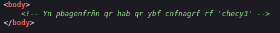

Si decodifico usando **ROT13**, me devuelve: `La contraseña de uno de los pasantes es 'purpl3'` 

Sabiendo esto, vuelvo a probar el hydra, ahora con la contraseña `purpl3`:

```shell
hydra -L users -p purpl3 ssh://172.17.0.2
```

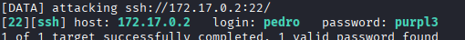

Ahora si, me encuentra las credenciales de pedro, entro por ssh como pedro y empiezo con un `sudo -l` pero no puedo ejecutar nada

Mirando archivos, encuentro una flag de pedro:

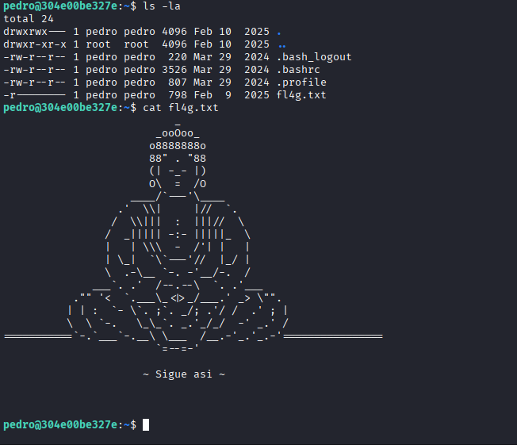

Mirando los procesos activos con `ps aux` encuentro que valentina esta ejecutando un script en `/opt` 

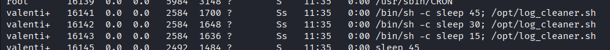

Viendo esto, edito el script con `nano /opt/log_cleaner.sh` y agrego un revshell:

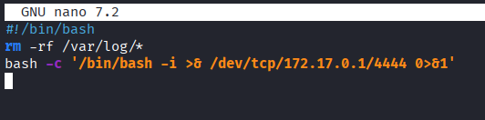

Ahora lo guardo y mientras escucho en otra terminal con netcat espero a que pase el tiempo para que se vuevla a ejecutar

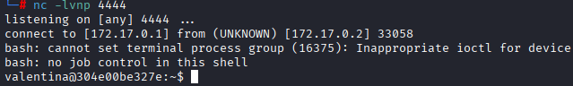

Ahora estando conectado como valentina, primero hago [Tratamiento de la TTY](https://invertebr4do.github.io/tratamiento-de-tty/#) 

Ahora, leo la flag:

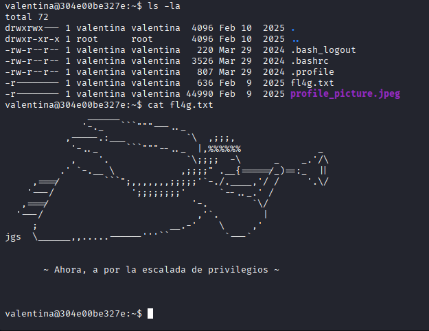

Me guardo la imagen `profile_picture.jpeg` a mi máquina, aqui, intento con `steghide` buscar archivos o mensajes ocultos:

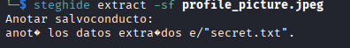

Me saca un archivo de texto, lo leo y encuntro solo la palabra `mag1ck` 

Pruebo y es la contraseña de `valentina`, ahora puedo hacer `sudo -l`:

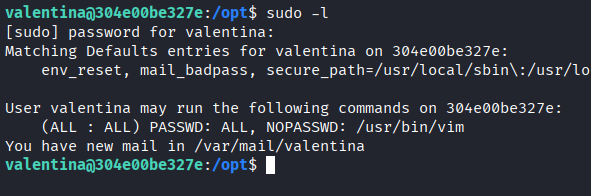

Viendo que puedo ejecuta `vim`, busco en [GTFOBins](https://gtfobins.github.io/gtfobins/vim/#sudo) y ejecuto `sudo vim -c ':!/bin/bash'`:

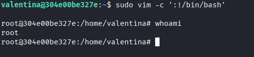

Y somos root :)
