# Máquina mirame

---

Dificultad -> Fácil

--- 

Empezamos con un nmap para ver puerto y servicios

```shell
nmap -p- --open -sV -sC -sS --min-rate=5000 -n -Pn 172.17.0.2
```

```shell
PORT   STATE SERVICE VERSION
22/tcp open  ssh     OpenSSH 9.2p1 Debian 2+deb12u3 (protocol 2.0)
| ssh-hostkey: 
|   256 2c:ea:4a:d7:b4:c3:d4:e2:65:29:6c:12:c4:58:c9:49 (ECDSA)
|_  256 a7:a4:a4:2e:3b:c6:0a:e4:ec:bd:46:84:68:02:5d:30 (ED25519)
80/tcp open  http    Apache httpd 2.4.61 ((Debian))
|_http-server-header: Apache/2.4.61 (Debian)
|_http-title: Login Page
MAC Address: 02:42:AC:11:00:02 (Unknown)
```

Encontramos los puertos 22 y 80 asi que accedo desde el navegador

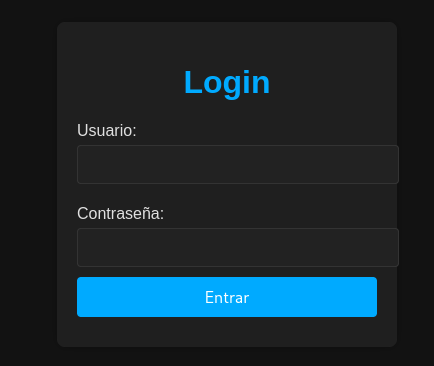

Veo un panel de inicio de sesión asi que pruebo a ver si hay sql injection poniendo ' de usuario y cualquier cosa como contraseña

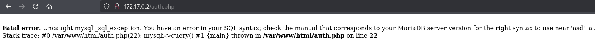

Da un error de sql asi que si que es vulnerable a sql injection.

Utilizo la herramienta de sqlmap para ver las bases de datos

```shell
sqlmap -u "http://172.17.0.2"  --forms --batch --dbs
```

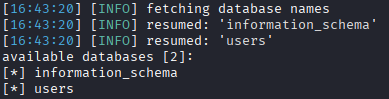

Miro la las tablas de la base de datos user

```shell
sqlmap -u "http://172.17.0.2"  --forms --batch -D users --tables
```

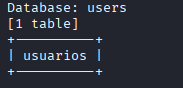

Miro la tabla usuarios

```shell
sqlmap -u "http://172.17.0.2"  --forms --batch -D users -T usuarios --dump
```

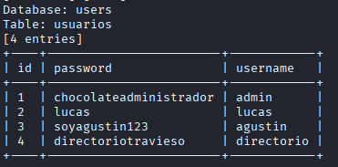

Encuentro varias credenciales que si pruebo en la pagina me llevan a una pagina para ver el clima que no me sirve de mucho

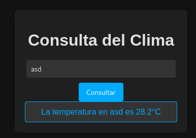

Veo que en las credenciales hay un usuario directorio con la contraseña directoriotravieso asi que pruebo a poner la contraseña en la url

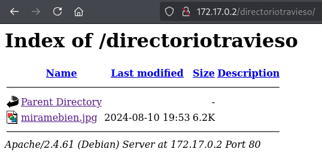

Encuentro una imagen de unos ojos que puedo descargar


La descargo y busco a ver si hay alguna información en los metadatos

```she
exiftool miramebien.jpg
```

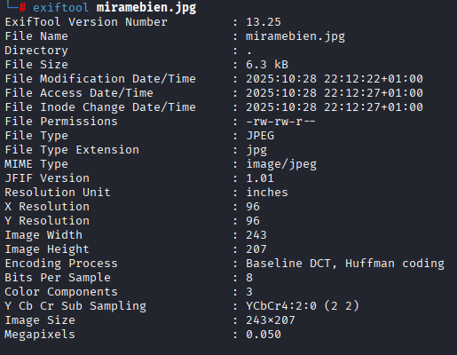

No veo nada interesante asi que miro si hay algun archivo oculto con estenografía

```shell
steghide extract -sf miramebien.jpg
```

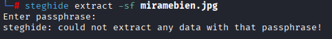

No encuentro nada sin una frase asi que seguramente tenga una, asi que pruebo a crackearla

```shell
stegseek --crack miramebien.jpg
```

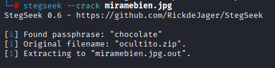

Encuentro un zip llamado ocultito.zip que se ha guardado como miramebien.jpg.out asi que lo extraigo y miro que tiene 

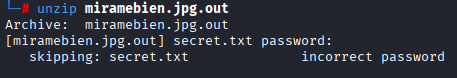

Al parecer el zip también tiene una contraseña asi que vuelvo a intentar crackerla con john y zip2john

```shell
zip2john miramebien.jpg.out > miramebien.john
```

```shell
john miramebien.john
```

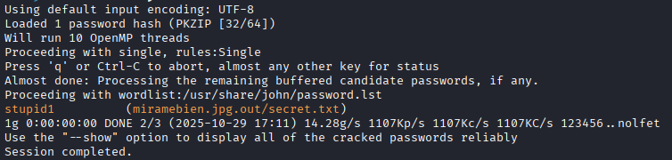

Y como se puede ver encuentra la contraseña stupid1 asi que extraigo secret.txt y miro su contenido

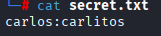

Me da unas credenciales que parecen de ssh asi que me conecto y estamos dentro.

Intento escalar privilegios con sudo -l pero no funciona

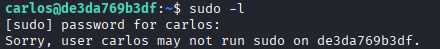

Asi que busco binarios con permisos SUID y encuentro find

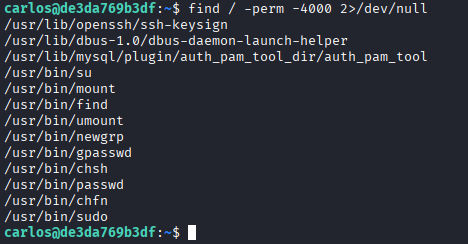

Con esto, me dirijo a [GTFOBins](https://gtfobins.github.io/), busco el binario find y ejecuto el comando

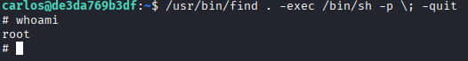

Y finalmente consigo ser root en esta máquina.
