# Máquina move

---

Dificultad -> Fácil

---

Empezamos con nmap para ver puertos y servicios

```shell
nmap -p- --open -sCV -sT --min-rate=50000 -n -Pn 172.17.0.2
```

```shell
PORT     STATE SERVICE VERSION
21/tcp   open  ftp     vsftpd 3.0.3
| ftp-anon: Anonymous FTP login allowed (FTP code 230)
|_drwxrwxrwx    1 0        0            4096 Mar 29  2024 mantenimiento [NSE: writeable]
| ftp-syst: 
|   STAT: 
| FTP server status:
|      Connected to ::ffff:172.17.0.1
|      Logged in as ftp
|      TYPE: ASCII
|      No session bandwidth limit
|      Session timeout in seconds is 300
|      Control connection is plain text
|      Data connections will be plain text
|      At session startup, client count was 1
|      vsFTPd 3.0.3 - secure, fast, stable
|_End of status
22/tcp   open  ssh     OpenSSH 9.6p1 Debian 4 (protocol 2.0)
| ssh-hostkey: 
|   256 77:0b:34:36:87:0d:38:64:58:c0:6f:4e:cd:7a:3a:99 (ECDSA)
|_  256 1e:c6:b2:91:56:32:50:a5:03:45:f3:f7:32:ca:7b:d6 (ED25519)
80/tcp   open  http    Apache httpd 2.4.58 ((Debian))
|_http-server-header: Apache/2.4.58 (Debian)
|_http-title: Apache2 Debian Default Page: It works
3000/tcp open  http    Grafana http
|_http-trane-info: Problem with XML parsing of /evox/about
| http-robots.txt: 1 disallowed entry 
|_/
| http-title: Grafana
|_Requested resource was /login
```

Vemos un ftp con login anonymous activado, asi que empezamos por ahí.

Encuentro una carpeta con un archivo .kdbx (Keepass Database XML)

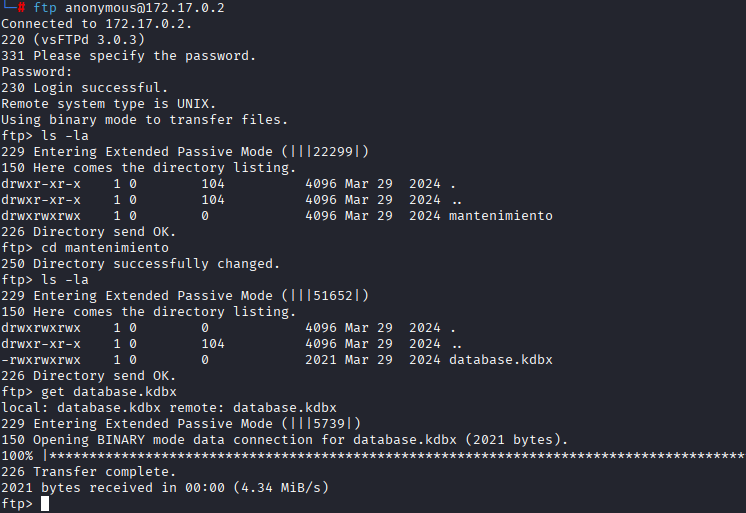

Lo descargo pero está cifrado, asi que intento crackearlo con `john`y `keepass2john` pero da un error diciendo que esta version no esta soportada

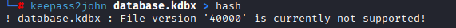

Viendo que no hay mucho mas que hacer en el ftp, hacedo desde la web al puerto `80` donde solo veo un apache2 default page asi que hago fuzzing con gobuster:

```shell
gobuster dir -u http://172.17.0.2 -w /usr/share/wordlists/dirbuster/directory-list-2.3-medium.txt -x js,txt,php,html -t 64
```

```shell
/index.html           (Status: 200) [Size: 10701]
/maintenance.html     (Status: 200) [Size: 63]
/server-status        (Status: 403) [Size: 275]
```

Encuentro un /maintenance.html donde entro y encuentro lo siguiente

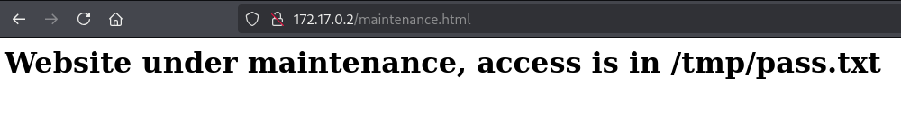

Me dice que la pagina esta en mantenimiento y el acceso esta en /tmp/pass.txt, pero no lo podemos acceder desde el navegador.

No encuentro nada mas en el puerto 80 asi que voy al 3000 donde estaba el Grafana.

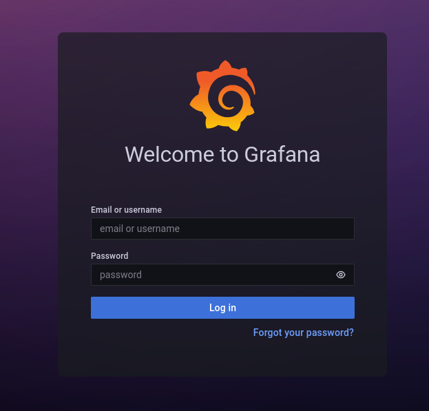

No encuentro mucho, pero buscando con `searchsploit grafana` encuentro que versiones anteriores a la 8.3.0 se pueden leer archivos 

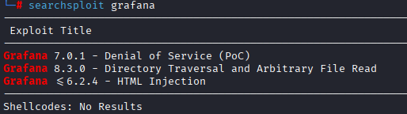

Miro con `whatweb` la version y efectivamente es la 8.3.0

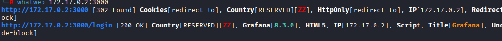

Sabiendo esto, descargo el exploit con `searchsploit -m multiple/webapps/50581.py`

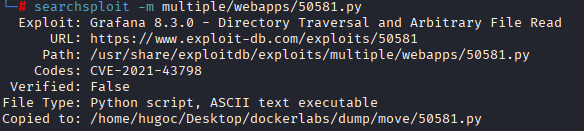

Lo ejectuo y leo el archivo de /tmp/pass.txt del que hablaba antes

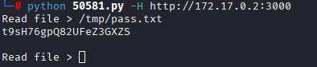

Obtengo la contraseña pero no se el usuario asi que pruebo a leer /etc/passwd para ver los usuarios

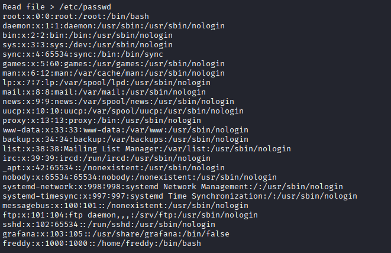

Encuentro a un tal freddy y con este usuario y la contraseña de /tmp/pass.txt me conecto por ssh

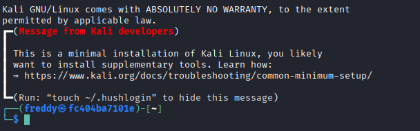

Y estamos dentro de lo que parece una instalacción mínima de kali.

Como siempre hago un `sudo -l`


Veo que puedo ejecutar un script en /opt/ como root.

En el script no hay nada interesante pero lo podemos editar asi que simplemente poniendo `echo 'import os; os.system("/bin/bash")' > /opt/maintenance.py` y ejecutandolo con sudo:

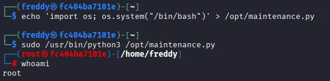

Somos root :)
