# Máquina race

---

Dificultad -> Medio

---

Empiezo con un nmap para ver los puertos accesibles

```shell
nmap -p- --open -sCV --min-rate=5000 -n -Pn 172.17.0.2
```

```shell
PORT     STATE SERVICE VERSION
22/tcp   open  ssh     OpenSSH 10.0p2 Debian 7 (protocol 2.0)
5000/tcp open  http    Werkzeug httpd 3.1.4 (Python 3.13.5)
|_http-server-header: Werkzeug/3.1.4 Python/3.13.5
|_http-title: SaaS Dashboard - Free Tier
```

Vemos ssh y http en el 5000, entro desde el navegador y encuentro lo siguiente:

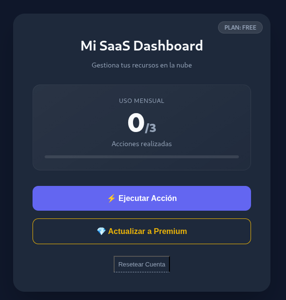

Una aplicación de gestión de recursos donde solo puedo hacer 3 veces una "Acción"

Para explotar esto y conseguir hacer más acciones de las que nos permiten, nos metemos a burpsuite y intereceptamos la petición cuando le damos a Ejecutar Acción

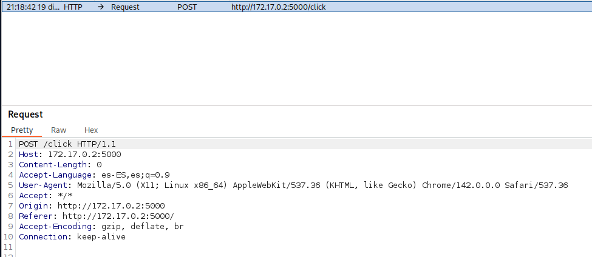

Con `Ctrl+R` lo mandamos al repeater, y en este, creo un grupo con la petición y le doy a duplicate tab 10 veces, luego, le doy a Send group (parallel) para enviar todas a la vez

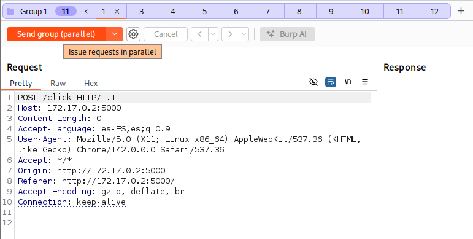

Al enviar tantas peticiones a la vez, a la página no le da tiempo a cargar todas a la vez y nos da todas como correctas, ahora si volvemos a la página vemos que nos ha dado todas como buenas y hemos superado el límite

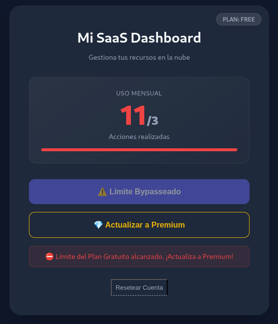

Una vez completado, sale un popup con una credenciales para el siguiente nivel

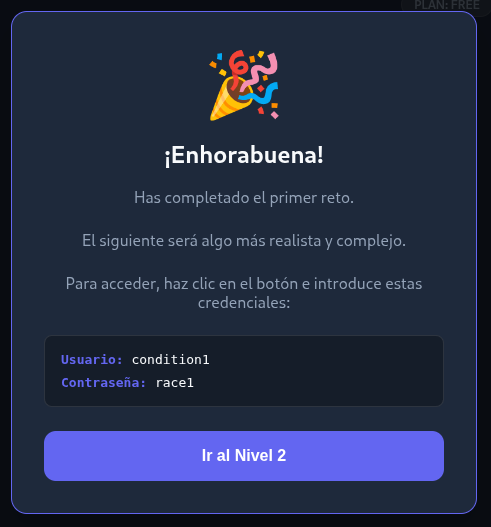

En el siguiente nivel, tenemos más de lo mismo pero con un cupón

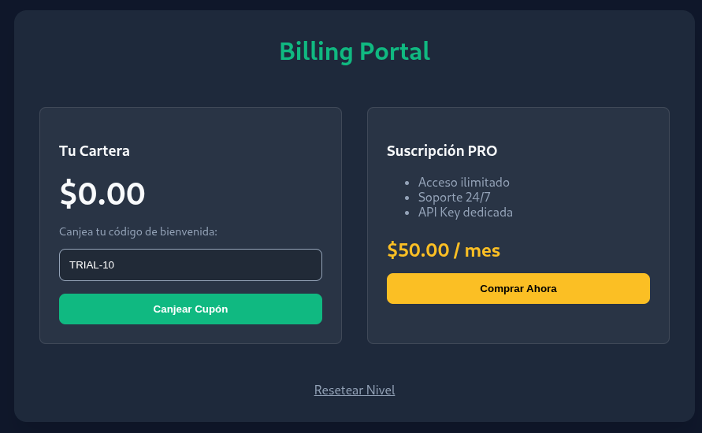

De vuelta, voy a burpsuite, intercepto la petición, la mando al repeater y la duplico 10 veces, al volver a la página, se ve que el cupón se ha canjeado 11 veces y nos ha dado 110 dolares

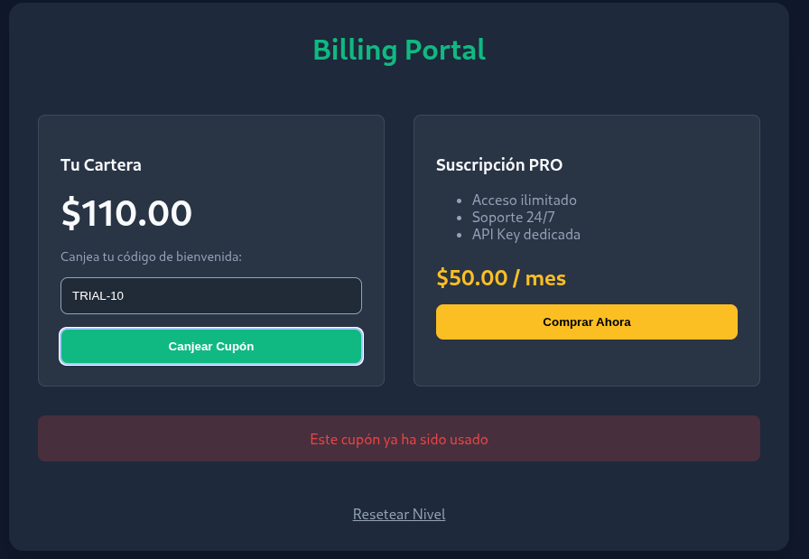

Le damos a Comprar Supscripción PRO y nos da la credenciales para el siguiente nivel

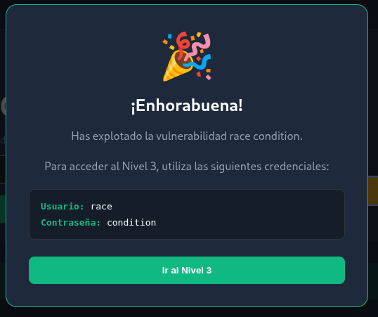

Volvemos a tener lo mismo, pero ahora con una página de compra de BTC

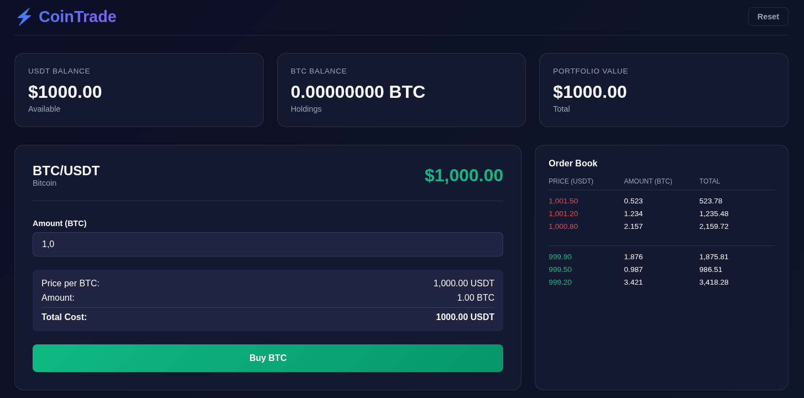

Vuelvo ha hacer lo mismo con el botón de Buy BTC y envio 11 peticiones a la vez, si ahora vuelvo a la página, se puede ver que he comprado el BTC 11 veces sin tener dinero suficiente

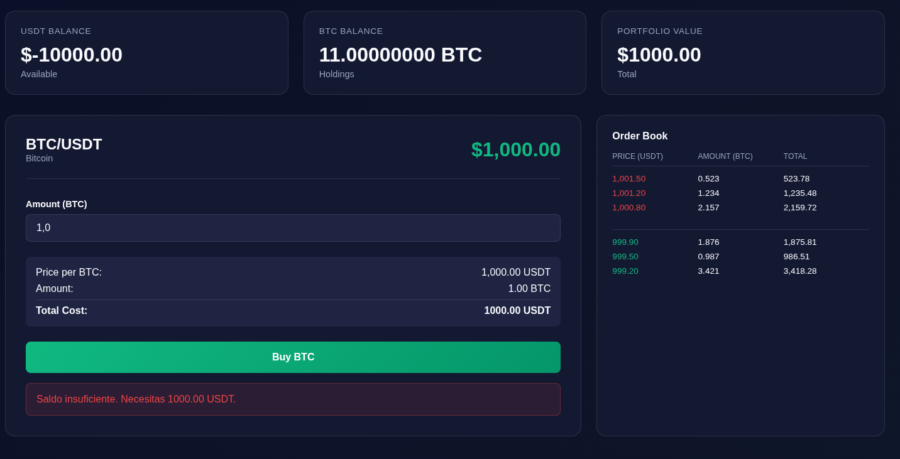

Después de completar todos los niveles, vuelve a salir otro popup con las credenciales para conectarse por SSH:

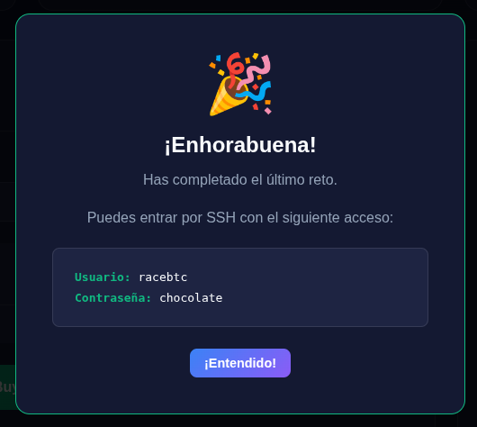

Entro por ssh y veo que hay un archivo `privesc_exploit.sh`, lo ejecuto:

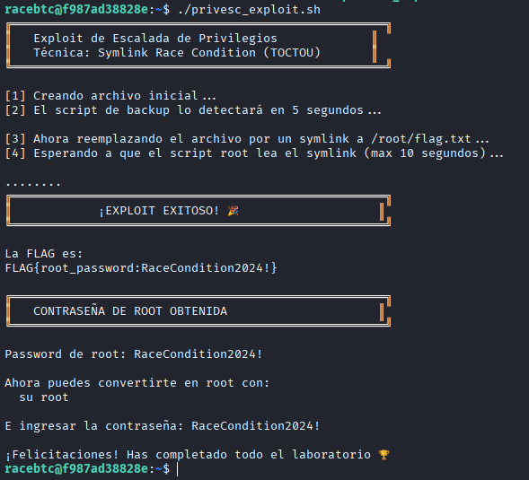

Y directamente me da las credenciales de root.

Con ellas, escalo a root y leo la flag

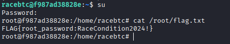


