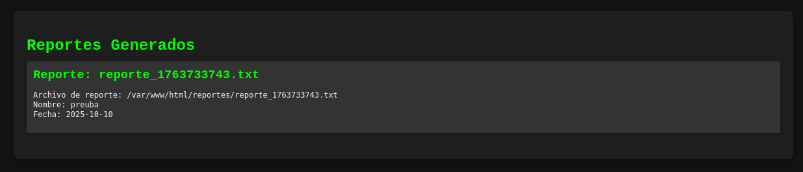
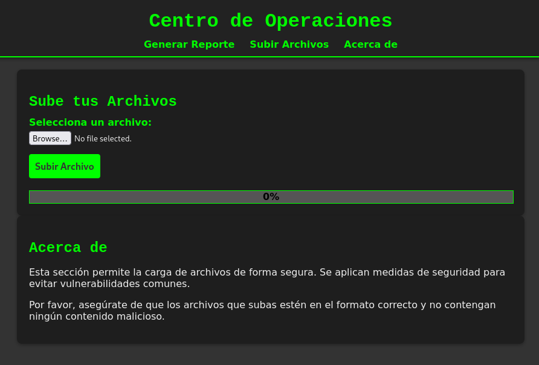
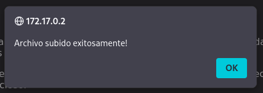
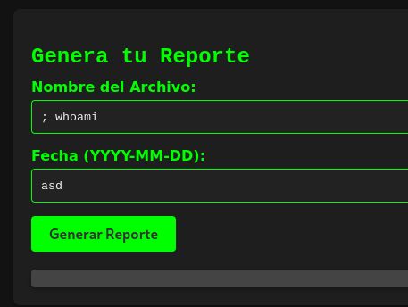
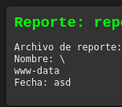
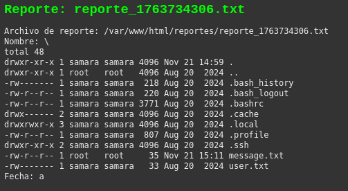
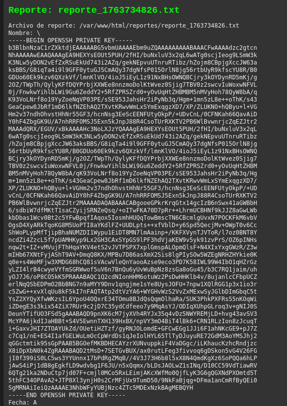
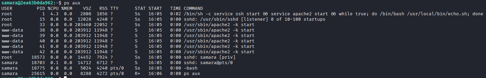
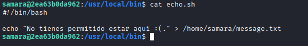
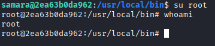

# Máquina vulnvault

---

Dificultada -> Fácil

---

Primero, hacemos un nmap para ver puertos abiertos

```shell
nmap -p- --open -sCV --min-rate=5000 -n -Pn 172.17.0.2
```

```shell
PORT   STATE SERVICE VERSION
22/tcp open  ssh     OpenSSH 9.6p1 Ubuntu 3ubuntu13.4 (Ubuntu Linux; protocol 2.0)
| ssh-hostkey: 
|   256 f5:4f:86:a5:d6:14:16:67:8a:8e:b6:b6:4a:1d:e7:1f (ECDSA)
|_  256 e6:86:46:85:03:d2:99:70:99:aa:70:53:40:5d:90:60 (ED25519)
80/tcp open  http    Apache httpd 2.4.58 ((Ubuntu))
|_http-title: Generador de Reportes - Centro de Operaciones
|_http-server-header: Apache/2.4.58 (Ubuntu)
```

Vemos puertos 80 y 22, asi que entramos a la página web

En la página veo que puedo generar un reporte


Pruebo a generar uno para ver lo que hace




Solo me crea un txt asi que antes de seguir con esto, voy a ver la parte donde pone Subir archivos a ver si podemos subir una revshell


Subo un txt para probar pero no encuentro ningun sitio donde pueda ver el archivo incluso haciendo fuzzing 



Viendo que donde subir archivo no podemos hacer mucho, vuelvo a generar reporte, probando a poner comandos como nombre del archivo encuentro que si pongo `; comando` puedo ejecutar comando de manera remota (RCE)





Viendo esto, intento mandarle una revshell pero no soy capaz así que me pongo a buscar en la máquina con ls

Encuentro un usuario `samara` y veo que dentro tiene 2 archivos txt:



El `user.txt` no lo puedo y el `message.txt` solo dice `No tienes permitido estar aqui :(.` 

Veo que también hay un `.ssh` asi que intento leer la clave ssh de samara



Consigo la clave, asi que la copio a un archivo en mi máquina, le doy permisos `chmod 600 id_rsa` y me conecto con `ssh -i id_rsa samara@172.17.0.2`

Ahora, estando dentro de la máquina, hago un `sudo -l` pero no existe `sudo`, también busco por permiso SUID pero no encuentro nada.

Buscando un poco, con `ps aux`, veo los procesos activos y encuentro algo:



En el primero proceso, se está ejecutando un script de bash en `/usr/local/bin/echo.sh` repetidamente, vamos a verlo:



No parece tener nada interesante, pero lo podemos editar, lo edito para quitarle la contraseña al usuario root con `echo 'passwd -d root' > echo.sh` y ahora si hago un su root:



Somos root sin necesidad de contraseña :)
